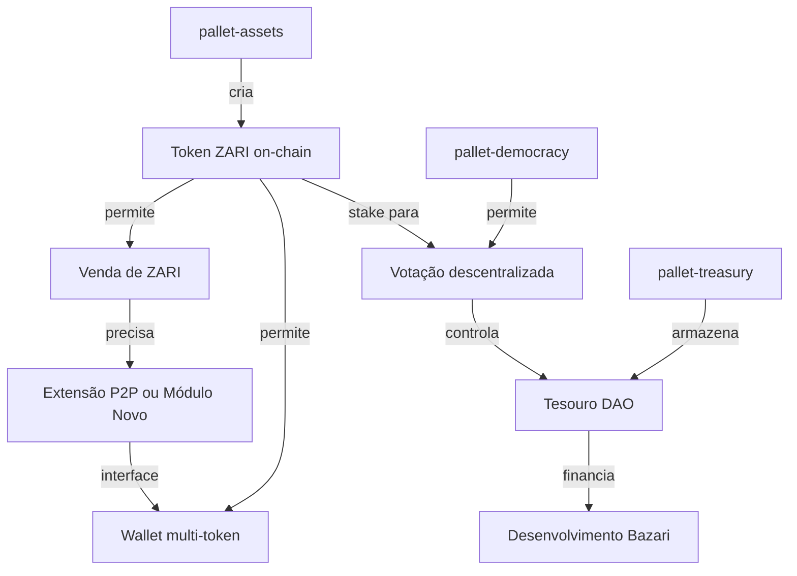

# Análise de Demanda - Token ZARI e DAO Bazari

**Data:** 26 de Outubro de 2025
**Versão:** 1.0
**Status:** Análise Completa - Aguardando Aprovação para Implementação

---

## 📋 Índice

1. [Resumo Executivo](#resumo-executivo)
2. [Demanda Original](#demanda-original)
3. [Estado Atual dos Projetos](#estado-atual-dos-projetos)
4. [Análise Técnica](#análise-técnica)
5. [Arquitetura Proposta](#arquitetura-proposta)
6. [Pontos Críticos e Melhorias](#pontos-críticos-e-melhorias)
7. [Roadmap de Implementação](#roadmap-de-implementação)
8. [Riscos e Mitigações](#riscos-e-mitigações)
9. [Decisões Requeridas](#decisões-requeridas)

---

## 🎯 Resumo Executivo

### Objetivo
Criar o **token ZARI** como moeda de governança e especulativa, lançar uma **DAO inicial**, e implementar um **sistema de venda do token** para financiar o desenvolvimento da Bazari.

### Definição do ZARI
- **Token de Governança**: Poder de voto na DAO
- **Token de Valorização**: Ativo especulativo/investimento
- **Funding Mechanism**: Financiamento descentralizado do projeto

### Estado Atual
- ✅ **Blockchain funcionando** (BazariChain com Substrate)
- ✅ **Sistema P2P operacional** (câmbio BZR ↔ Fiat)
- ✅ **Wallet client-side** funcional
- ❌ **Sem governança descentralizada** (apenas Sudo)
- ❌ **Sem pallet de assets** multi-token
- ❌ **Token ZARI não existe**

### Recomendação Principal
**Usar o módulo P2P existente como base**, criando uma seção especial de "Ofertas Oficiais da DAO" para venda inicial de ZARI, minimizando impacto e reutilizando código testado.

---

## 📝 Demanda Original

### Contexto
Após definir o ZARI como token de governança (separado do BZR que é moeda popular/economia real), surgiu a necessidade de:

1. Criar o token on-chain
2. Lançar estrutura DAO básica
3. Vender ZARI para financiar a Bazari
4. Decidir: usar P2P existente ou criar módulo separado?

### Questão Central
> "Podemos utilizar o câmbio P2P já estruturado ou temos que criar um módulo separado para venda de ZARI?"

---

## 🔍 Estado Atual dos Projetos

### A. Projeto bazari-chain (`/root/bazari-chain`)

#### Estrutura Atual

**Runtime Substrate:**
- **Consensus**: Aura (PoA) + GRANDPA (Finality)
- **Block Time**: 6 segundos
- **Validators**: 2 fixos (Alice, Bob) - **CENTRALIZADO**
- **Token Nativo**: UNIT (não nomeado como BZR ainda)
  - Type: `u128` (128-bit)
  - Decimals: 12 (1 UNIT = 10^12 plancks)
  - Existential Deposit: 1 MILLI_UNIT

**Pallets Customizados Implementados:**

1. **pallet-stores** (Index 9)
   - Gerenciamento de lojas marketplace
   - 11 storage items
   - 7 dispatchables
   - Backend: pallet-uniques (NFTs para lojas)
   - Limites: 64 lojas/owner, 5 operadores/loja

2. **pallet-bazari-identity** (Index 11)
   - Perfis soulbound (não-transferíveis)
   - Sistema de reputação (i32, pode ser negativo)
   - Tiers: Bronze (0-99), Prata (100-499), Ouro (500-999), Diamante (1000+)
   - Badge system (max 50/profile)
   - Handles únicos com cooldown de 30 dias
   - 11 dispatchables

3. **pallet-universal-registry** (Index 10 - Opcional)
   - IPFS HEAD tracking
   - Simple key-value store
   - Feature flag: "with-universal-registry"

**Pallets FRAME Padrão:**
- System, Timestamp, Aura, Grandpa
- Balances (token nativo)
- TransactionPayment
- Sudo (⚠️ **CENTRALIZADO**)
- Uniques (NFTs)

#### ❌ O Que NÃO Existe

**Governança:**
- ❌ `pallet-democracy` (votação)
- ❌ `pallet-collective` (conselho)
- ❌ `pallet-conviction-voting`
- ❌ `pallet-referenda`
- ❌ `pallet-treasury` (tesouro)
- ❌ Qualquer sistema DAO

**Multi-Token:**
- ❌ `pallet-assets` (para criar ZARI separado)
- Apenas token nativo (UNIT) via `pallet-balances`

**Descentralização:**
- ⚠️ Governança centralizada via `Sudo`
- ⚠️ Apenas 2 validadores fixos

---

### B. Projeto bazari (`/root/bazari`)

#### Módulos Econômicos Implementados

**1. Sistema de Wallet (100% Client-Side)**

**Localização:** `apps/web/src/modules/wallet/`

**Funcionalidades:**
- Geração de seed phrase (24 palavras BIP39)
- Derivação de chaves sr25519
- Criptografia forte:
  - PBKDF2 (100.000 iterações)
  - AES-GCM para vault
- Assinatura de transações local
- **Sem custódia de chaves no servidor**

**Arquivos-chave:**
- `crypto.store.ts` - Vault criptografado
- `keyring.ts` - Gerenciamento de chaves Substrate
- `PinService.tsx` - Autenticação com PIN

**Estado:**
- ✅ Funcional e testado
- ✅ Suporta apenas BZR (token nativo)
- ⚠️ Precisa adaptação para multi-token (BZR + ZARI)

---

**2. Sistema P2P/Câmbio**

**Localização:**
- Backend: `apps/api/src/routes/p2p.ts` (1.343 linhas)
- Frontend: `apps/web/src/modules/p2p/`
- Database: Prisma models em `packages/database/prisma/schema.prisma`

**Funcionalidades Atuais:**
- Troca BZR ↔ Fiat (BRL, USD, EUR, etc.)
- Sistema de ofertas (buy/sell)
- Matching automático
- Escrow on-chain
- Chat integrado
- Sistema de reputação
- Disputa/arbitragem

**Fluxo Completo:**

1. **Criação de Oferta**
   - Vendedor cria oferta (quantidade BZR + preço fiat)
   - Oferta publicada no marketplace

2. **Aceite de Ordem**
   - Comprador aceita oferta
   - BZR bloqueado em escrow on-chain
   - Status: `PENDING`

3. **Pagamento Fiat**
   - Comprador marca pagamento como enviado
   - Status: `PAYMENT_SENT`

4. **Confirmação**
   - Vendedor confirma recebimento fiat
   - BZR liberado do escrow para comprador
   - Status: `COMPLETED`
   - Reputação atualizada para ambos

5. **Disputa (se necessário)**
   - Qualquer parte pode abrir disputa
   - Admin/arbitragem resolve
   - Escrow liberado conforme decisão

**Estados da Ordem:**
```typescript
enum P2POrderStatus {
  PENDING          // Aguardando pagamento
  PAYMENT_SENT     // Comprador marcou pago
  COMPLETED        // Finalizada
  CANCELLED        // Cancelada
  DISPUTED         // Em disputa
  EXPIRED          // Expirada (timeout)
  REFUNDED         // Reembolsada
  ARBITRATION      // Em arbitragem
}
```

**Modelos Prisma:**
```prisma
model P2POffer {
  id            String   @id @default(uuid())
  userId        String
  type          String   // 'BUY' ou 'SELL'
  assetSymbol   String   // 'BZR'
  fiatCurrency  String   // 'BRL', 'USD', etc.
  pricePerUnit  Decimal
  minAmount     Decimal
  maxAmount     Decimal
  totalAmount   Decimal
  availableAmount Decimal
  paymentMethods Json   // PIX, TED, PayPal, etc.
  terms         String?
  isActive      Boolean  @default(true)

  orders        P2POrder[]
  user          User      @relation(fields: [userId], references: [id])

  createdAt     DateTime  @default(now())
  updatedAt     DateTime  @updatedAt
}

model P2POrder {
  id              String         @id @default(uuid())
  offerId         String
  buyerId         String
  sellerId        String
  amount          Decimal
  fiatAmount      Decimal
  pricePerUnit    Decimal
  fiatCurrency    String
  status          P2POrderStatus
  paymentMethod   String
  escrowTxHash    String?        // Hash da tx de escrow on-chain
  releaseTxHash   String?        // Hash da tx de release
  expiresAt       DateTime
  completedAt     DateTime?
  disputeReason   String?

  offer           P2POffer       @relation(fields: [offerId], references: [id])
  buyer           User           @relation("P2PBuyer", fields: [buyerId], references: [id])
  seller          User           @relation("P2PSeller", fields: [sellerId], references: [id])
  messages        P2PMessage[]

  createdAt       DateTime       @default(now())
  updatedAt       DateTime       @updatedAt
}
```

**API Endpoints Principais:**
- `POST /api/p2p/offers` - Criar oferta
- `GET /api/p2p/offers` - Listar ofertas
- `POST /api/p2p/orders` - Aceitar oferta (criar ordem)
- `PUT /api/p2p/orders/:id/payment-sent` - Marcar pagamento enviado
- `PUT /api/p2p/orders/:id/confirm` - Confirmar recebimento
- `POST /api/p2p/orders/:id/dispute` - Abrir disputa
- `POST /api/p2p/orders/:id/cancel` - Cancelar ordem

**Integração Blockchain:**
- Escrow via `bazari-chain`
- Transações assinadas no client
- Hash armazenado em `escrowTxHash`

**Estado:**
- ✅ Funcional e testado em produção
- ✅ Sistema robusto com 8 estados
- ✅ Chat, reputação, disputa completos
- ⚠️ **Atualmente apenas BZR ↔ Fiat**
- ⚠️ Precisa extensão para suportar ZARI

---

**3. Sistema de Autenticação**

**Localização:** `apps/web/src/modules/auth/`

**Método:** SIWS (Sign In With Substrate)

**Fluxo:**
1. Usuário cria/importa wallet
2. Assina mensagem de challenge com chave privada
3. Backend valida assinatura
4. Cria sessão + JWT
5. Minting de NFT profile on-chain (pallet-bazari-identity)

**Arquivos-chave:**
- `session.ts` - Gerenciamento de sessão
- `api.ts` - Endpoints de autenticação
- `crypto.store.ts` - Vault de chaves

**Estado:**
- ✅ Funcional
- ✅ Sem custódia de chaves
- ✅ NFT profile mintado automaticamente

---

**4. Infraestrutura DAO (Preparação)**

**Localização:** `apps/api/src/routes/dao.ts` (básico)

**Funcionalidades Atuais:**
- ❌ Ainda não implementado completamente
- Estrutura de database preparada:

```prisma
model DAOProposal {
  id          String   @id @default(uuid())
  title       String
  description String
  proposerId  String
  type        String   // 'TREASURY', 'GOVERNANCE', 'PARAMETER'
  status      String   // 'ACTIVE', 'PASSED', 'REJECTED', 'EXECUTED'
  votesFor    Int      @default(0)
  votesAgainst Int     @default(0)
  startDate   DateTime
  endDate     DateTime
  executionTx String?

  proposer    User     @relation(fields: [proposerId], references: [id])
  votes       DAOVote[]

  createdAt   DateTime @default(now())
  updatedAt   DateTime @updatedAt
}

model DAOVote {
  id         String      @id @default(uuid())
  proposalId String
  voterId    String
  vote       String      // 'FOR', 'AGAINST', 'ABSTAIN'
  weight     Int         // Peso do voto (baseado em stake de ZARI)

  proposal   DAOProposal @relation(fields: [proposalId], references: [id])
  voter      User        @relation(fields: [voterId], references: [id])

  createdAt  DateTime    @default(now())
}
```

**Estado:**
- ⚠️ Estrutura preparada mas não ativa
- ⚠️ Sem integração com blockchain
- ⚠️ Votação off-chain (não validada on-chain)

---

## 📊 Análise Técnica

### Gaps Identificados

#### 1. **Blockchain Layer** (bazari-chain)

**Critical:**
- ❌ Sem `pallet-assets` - não há como criar ZARI separado do token nativo
- ❌ Sem `pallet-treasury` - não há tesouro on-chain para DAO
- ❌ Sem `pallet-democracy` - não há votação descentralizada
- ❌ Governança centralizada (Sudo)

**Important:**
- ⚠️ Apenas 2 validadores (PoA centralizado)
- ⚠️ Token nativo chamado UNIT, não BZR

**Nice to Have:**
- `pallet-collective` (conselho)
- `pallet-conviction-voting` (votação ponderada)
- `pallet-referenda` (referendos)

---

#### 2. **Backend Layer** (bazari API)

**Critical:**
- ❌ Sem endpoints para ZARI (compra, consulta de saldo, histórico)
- ❌ P2P atual apenas suporta BZR ↔ Fiat
- ❌ DAO não integrado com blockchain

**Important:**
- ⚠️ Estrutura DAO preparada mas inativa
- ⚠️ Sem sistema de staking de ZARI
- ⚠️ Sem cálculo de peso de voto baseado em stake

---

#### 3. **Frontend Layer** (bazari web)

**Critical:**
- ❌ Wallet não suporta multi-token (só BZR)
- ❌ Sem UI para comprar ZARI
- ❌ Sem visualização de saldo ZARI

**Important:**
- ⚠️ Sem interface de governança/votação
- ⚠️ Sem staking UI
- ⚠️ Sem visualização de propostas DAO

---

### Dependências Técnicas



---

## 🏗️ Arquitetura Proposta

### Decisão Arquitetural Principal

**Recomendação: Híbrido - Extensão do P2P + Módulo Específico**

**Justificativa:**
1. ✅ Reutiliza código testado (P2P)
2. ✅ Mantém filosofia descentralizada
3. ✅ Permite controle especial para oferta oficial DAO
4. ✅ Menor impacto no código existente
5. ✅ Caminho progressivo (MVP rápido → Evolução)

---

### Camadas da Solução

#### **Layer 1: Blockchain (bazari-chain)**

**Mudanças Necessárias:**

1. **Adicionar pallet-assets**
   ```rust
   // runtime/Cargo.toml
   pallet-assets = { version = "4.0.0-dev", default-features = false }

   // runtime/src/lib.rs
   impl pallet_assets::Config for Runtime {
       type RuntimeEvent = RuntimeEvent;
       type Balance = Balance;
       type AssetId = u32;
       type Currency = Balances;
       // ...
   }
   ```

2. **Criar Asset ZARI no Genesis**
   ```rust
   // genesis_config_presets.rs
   assets: AssetsConfig {
       assets: vec![
           // ZARI (Asset ID 1)
           (
               1,                           // AssetId
               get_account_id_from_seed::<sr25519::Public>("DAO Treasury"), // Owner
               true,                        // is_sufficient
               1_000_000_000_000,          // min_balance (1 ZARI com 12 decimals)
           ),
       ],
       metadata: vec![
           (
               1,                           // AssetId
               b"ZARI".to_vec(),           // name
               b"ZARI".to_vec(),           // symbol
               12,                          // decimals
           ),
       ],
       accounts: vec![
           // 25% do supply inicial para o tesouro DAO
           (
               1,                           // AssetId
               get_account_id_from_seed::<sr25519::Public>("DAO Treasury"),
               5_250_000_000_000_000_000,  // 5.25M ZARI (25% de 21M)
           ),
           // 10% para fundadores (com vesting)
           (
               1,
               get_account_id_from_seed::<sr25519::Public>("Founders"),
               2_100_000_000_000_000_000,  // 2.1M ZARI (10%)
           ),
       ],
   }
   ```

3. **Adicionar pallet-treasury**
   ```rust
   impl pallet_treasury::Config for Runtime {
       type PalletId = TreasuryPalletId;
       type Currency = Balances; // ou Assets para ZARI
       type ApproveOrigin = EnsureRoot<AccountId>; // Temporário, depois Council
       type RejectOrigin = EnsureRoot<AccountId>;
       type RuntimeEvent = RuntimeEvent;
       // ...
   }
   ```

4. **Adicionar pallet-democracy (Fase 2)**
   ```rust
   impl pallet_democracy::Config for Runtime {
       type WeightInfo = pallet_democracy::weights::SubstrateWeight<Runtime>;
       type RuntimeEvent = RuntimeEvent;
       type Scheduler = Scheduler;
       type Preimages = Preimage;
       type Currency = Balances;
       // Votação ponderada por stake de ZARI
       // ...
   }
   ```

**Timeline:**
- Fase 1 (MVP): `pallet-assets` + `pallet-treasury` + Genesis ZARI
- Fase 2 (DAO): `pallet-democracy` + `pallet-collective`

---

#### **Layer 2: Backend (bazari API)**

**Opção Recomendada: Extensão do P2P**

**Mudanças no P2P:**

1. **Estender modelos Prisma:**
   ```prisma
   model P2POffer {
     // ... campos existentes ...
     assetSymbol   String   // 'BZR' ou 'ZARI'
     offerType     String   // 'REGULAR' ou 'DAO_OFFICIAL'
     daoControlled Boolean  @default(false)
     // ...
   }
   ```

2. **Criar endpoint específico DAO:**
   ```typescript
   // apps/api/src/routes/zari.ts (NOVO)

   // POST /api/zari/dao-offer
   // Cria oferta oficial da DAO para venda de ZARI
   // Apenas admin/DAO pode criar
   router.post('/dao-offer', requireAdmin, async (req, res) => {
     const { pricePerUnit, totalAmount, phases } = req.body;

     // Valida se DAO tem ZARI suficiente
     const daoBalance = await getZARIBalance(DAO_ADDRESS);
     if (daoBalance < totalAmount) {
       return res.status(400).json({ error: 'Insufficient DAO treasury' });
     }

     // Cria oferta especial
     const offer = await prisma.p2POffer.create({
       data: {
         userId: DAO_USER_ID,
         type: 'SELL',
         assetSymbol: 'ZARI',
         fiatCurrency: 'BZR', // Aceita BZR como pagamento
         pricePerUnit,
         totalAmount,
         availableAmount: totalAmount,
         offerType: 'DAO_OFFICIAL',
         daoControlled: true,
         // ...
       },
     });

     return res.json(offer);
   });

   // POST /api/zari/buy
   // Usuário compra ZARI da oferta oficial
   router.post('/buy', requireAuth, async (req, res) => {
     const { amount } = req.body;
     const userId = req.user.id;

     // Busca oferta oficial ativa
     const daoOffer = await prisma.p2POffer.findFirst({
       where: {
         assetSymbol: 'ZARI',
         offerType: 'DAO_OFFICIAL',
         isActive: true,
       },
     });

     if (!daoOffer) {
       return res.status(404).json({ error: 'No active DAO offer' });
     }

     // Calcula custo em BZR
     const costBZR = amount * daoOffer.pricePerUnit;

     // Verifica saldo BZR do usuário
     const userBalanceBZR = await getBZRBalance(req.user.address);
     if (userBalanceBZR < costBZR) {
       return res.status(400).json({ error: 'Insufficient BZR balance' });
     }

     // Cria ordem de compra
     const order = await prisma.p2POrder.create({
       data: {
         offerId: daoOffer.id,
         buyerId: userId,
         sellerId: DAO_USER_ID,
         amount,
         fiatAmount: costBZR,
         fiatCurrency: 'BZR',
         pricePerUnit: daoOffer.pricePerUnit,
         status: 'PENDING',
         paymentMethod: 'BZR_TRANSFER',
         expiresAt: new Date(Date.now() + 24 * 60 * 60 * 1000), // 24h
       },
     });

     // IMPORTANTE: Executa transação on-chain
     // 1. Lock BZR do comprador
     // 2. Transfer ZARI da DAO para comprador
     // 3. Transfer BZR do comprador para tesouro DAO
     const txHash = await executeZARIPurchase({
       buyerAddress: req.user.address,
       amount,
       costBZR,
     });

     // Atualiza ordem com hash
     await prisma.p2POrder.update({
       where: { id: order.id },
       data: {
         status: 'COMPLETED',
         escrowTxHash: txHash,
         completedAt: new Date(),
       },
     });

     return res.json({ order, txHash });
   });
   ```

3. **Worker para sync de saldos:**
   ```typescript
   // apps/api/src/workers/zari-sync.ts (NOVO)

   // Sincroniza saldos ZARI do blockchain para database
   async function syncZARIBalances() {
     const users = await prisma.user.findMany({
       where: { address: { not: null } },
     });

     for (const user of users) {
       const balance = await getZARIBalance(user.address);

       await prisma.user.update({
         where: { id: user.id },
         data: { zariBalance: balance },
       });
     }
   }

   // Roda a cada 5 minutos
   setInterval(syncZARIBalances, 5 * 60 * 1000);
   ```

**Módulo Alternativo (se não usar P2P):**

Se decidir criar módulo separado:

```typescript
// apps/api/src/routes/zari-sale.ts

// Sistema de fases de venda
interface SalePhase {
  name: string;
  pricePerZARI: number; // em BZR
  totalZARI: number;
  soldZARI: number;
  startDate: Date;
  endDate: Date;
  restrictions?: {
    minPurchase?: number;
    maxPurchase?: number;
    whitelistOnly?: boolean;
  };
}

// POST /api/zari-sale/phases
// Admin cria fases de venda
router.post('/phases', requireAdmin, createSalePhase);

// POST /api/zari-sale/purchase
// Usuário compra ZARI
router.post('/purchase', requireAuth, purchaseZARI);

// GET /api/zari-sale/status
// Status atual da venda
router.get('/status', getSaleStatus);
```

**Vantagens Extensão P2P:**
- ✅ Reusa código testado
- ✅ Mesmo fluxo de escrow/segurança
- ✅ Chat e suporte já funcionam
- ✅ Menor desenvolvimento

**Vantagens Módulo Separado:**
- ✅ Controle total do fluxo
- ✅ UI especializada
- ✅ Fases de venda progressivas
- ✅ KYC/whitelist mais fácil

---

#### **Layer 3: Frontend (bazari web)**

**Mudanças Necessárias:**

1. **Wallet Multi-Token:**
   ```typescript
   // apps/web/src/modules/wallet/multi-token.ts (NOVO)

   interface TokenBalance {
     symbol: 'BZR' | 'ZARI';
     balance: string;
     decimals: number;
     assetId?: number; // Para ZARI (Asset ID 1)
   }

   export async function getTokenBalances(address: string): Promise<TokenBalance[]> {
     const api = await getPolkadotApi();

     // Saldo BZR (token nativo)
     const bzrBalance = await api.query.system.account(address);

     // Saldo ZARI (asset ID 1)
     const zariBalance = await api.query.assets.account(1, address);

     return [
       {
         symbol: 'BZR',
         balance: bzrBalance.data.free.toString(),
         decimals: 12,
       },
       {
         symbol: 'ZARI',
         balance: zariBalance.unwrapOr({ balance: 0 }).balance.toString(),
         decimals: 12,
         assetId: 1,
       },
     ];
   }
   ```

2. **UI de Compra ZARI:**
   ```tsx
   // apps/web/src/pages/ZARIPurchasePage.tsx (NOVO)

   export function ZARIPurchasePage() {
     const [amount, setAmount] = useState('');
     const [bzrCost, setBzrCost] = useState('0');
     const [daoOffer, setDaoOffer] = useState<DAOOffer | null>(null);

     // Carrega oferta oficial ativa
     useEffect(() => {
       fetch('/api/zari/dao-offer/active')
         .then(res => res.json())
         .then(setDaoOffer);
     }, []);

     // Calcula custo em BZR
     useEffect(() => {
       if (daoOffer && amount) {
         const cost = parseFloat(amount) * daoOffer.pricePerUnit;
         setBzrCost(cost.toFixed(2));
       }
     }, [amount, daoOffer]);

     const handlePurchase = async () => {
       try {
         // Compra ZARI
         const response = await fetch('/api/zari/buy', {
           method: 'POST',
           headers: { 'Content-Type': 'application/json' },
           body: JSON.stringify({ amount: parseFloat(amount) }),
         });

         const { order, txHash } = await response.json();

         toast.success(`Compra confirmada! TX: ${txHash}`);

         // Atualiza saldo
         await refreshBalances();
       } catch (error) {
         toast.error('Erro na compra: ' + error.message);
       }
     };

     return (
       <Card>
         <CardHeader>
           <CardTitle>💎 Adquirir ZARI - Token de Governança</CardTitle>
           <CardDescription>
             Oferta Oficial da DAO Bazari
           </CardDescription>
         </CardHeader>
         <CardContent>
           {daoOffer && (
             <div className="space-y-4">
               <div className="p-4 bg-primary/10 rounded-lg">
                 <p className="text-sm text-muted-foreground">Preço Atual</p>
                 <p className="text-2xl font-bold">
                   {daoOffer.pricePerUnit} BZR/ZARI
                 </p>
               </div>

               <div>
                 <Label>Quantidade ZARI</Label>
                 <Input
                   type="number"
                   value={amount}
                   onChange={(e) => setAmount(e.target.value)}
                   placeholder="Ex: 100"
                 />
               </div>

               <div className="p-3 bg-muted rounded">
                 <p className="text-sm">Custo Total</p>
                 <p className="text-xl font-semibold">{bzrCost} BZR</p>
               </div>

               <Button
                 onClick={handlePurchase}
                 disabled={!amount || parseFloat(amount) <= 0}
                 className="w-full"
               >
                 Comprar ZARI
               </Button>

               <div className="text-xs text-muted-foreground">
                 <p>✓ Transação on-chain segura</p>
                 <p>✓ ZARI creditado instantaneamente</p>
                 <p>✓ Sem taxas adicionais</p>
               </div>
             </div>
           )}
         </CardContent>
       </Card>
     );
   }
   ```

3. **Atualização do Wallet UI:**
   ```tsx
   // apps/web/src/modules/wallet/pages/WalletHome.tsx

   // Adicionar aba para ZARI
   <Tabs defaultValue="bzr">
     <TabsList>
       <TabsTrigger value="bzr">
         BZR - Economia Popular
       </TabsTrigger>
       <TabsTrigger value="zari">
         ZARI - Governança
       </TabsTrigger>
     </TabsList>

     <TabsContent value="bzr">
       {/* UI atual de BZR */}
     </TabsContent>

     <TabsContent value="zari">
       <Card>
         <CardHeader>
           <CardTitle>💎 ZARI - Token de Governança</CardTitle>
           <CardDescription>
             Participe das decisões da DAO Bazari
           </CardDescription>
         </CardHeader>
         <CardContent>
           <div className="text-center py-6">
             <p className="text-sm text-muted-foreground mb-2">Saldo ZARI</p>
             <p className="text-4xl font-bold">
               {formatBalance(zariBalance, 12)} ZARI
             </p>
           </div>

           <div className="space-y-2">
             <Button className="w-full" asChild>
               <Link to="/zari/purchase">
                 💰 Adquirir ZARI
               </Link>
             </Button>

             <Button variant="outline" className="w-full" asChild>
               <Link to="/dao/proposals">
                 🗳️ Ver Propostas DAO
               </Link>
             </Button>

             <Button variant="outline" className="w-full" asChild>
               <Link to="/zari/stake">
                 🔒 Fazer Staking
               </Link>
             </Button>
           </div>
         </CardContent>
       </Card>
     </TabsContent>
   </Tabs>
   ```

---

## ⚠️ Pontos Críticos e Melhorias

### 1. **Descentralização da Blockchain**

**Problema Atual:**
- Apenas 2 validadores fixos (Alice, Bob)
- Governança centralizada via Sudo
- PoA (Proof of Authority) - não é permissionless

**Impacto no ZARI:**
- ⚠️ Token de "governança" em chain centralizado é contraditório
- ⚠️ Risco de percepção negativa do mercado
- ⚠️ Validadores podem censurar transações

**Solução Recomendada:**

**Fase 1 (Curto Prazo - 1-2 meses):**
- Adicionar mais validadores (mínimo 7-10)
- Migrar de Aura para Babe (PoS)
- Implementar rotação de validadores

**Fase 2 (Médio Prazo - 3-6 meses):**
- Remover Sudo completamente
- Implementar pallet-staking
- Validadores eleitos pela comunidade

**Implementação:**
```rust
// runtime/Cargo.toml
pallet-babe = { version = "4.0.0-dev", default-features = false }
pallet-staking = { version = "4.0.0-dev", default-features = false }
pallet-session = { version = "4.0.0-dev", default-features = false }

// runtime/src/lib.rs
impl pallet_staking::Config for Runtime {
    type Currency = Balances;
    type UnixTime = Timestamp;
    type CurrencyToVote = sp_staking::currency_to_vote::U128CurrencyToVote;
    // Validadores eleitos por stake de ZARI
    type ElectionProvider = ElectionProviderMultiPhase;
    // ...
}
```

**Prioridade:** 🔴 **CRÍTICA** - Resolver antes do lançamento público de ZARI

---

### 2. **Segurança do Tesouro DAO**

**Problema Atual:**
- 25% do supply ZARI (5.25M) ficará no tesouro
- Com Sudo, uma única chave controla tudo
- Risco de hack/perda de chave = perda total

**Solução Recomendada:**

**Multi-Sig Temporário (Fase 1):**
```rust
// Usar pallet-multisig para proteção inicial
impl pallet_multisig::Config for Runtime {
    type RuntimeEvent = RuntimeEvent;
    type RuntimeCall = RuntimeCall;
    type Currency = Balances;
    type DepositBase = ConstU128<1_000_000_000_000>; // 1 BZR
    type DepositFactor = ConstU128<100_000_000_000>; // 0.1 BZR
    type MaxSignatories = ConstU32<10>;
    // ...
}
```

**Configuração:**
- 7 signatários (5 fundadores + 2 validadores confiáveis)
- Threshold: 5 de 7 (71%)
- Todas transações do tesouro precisam de 5 assinaturas

**Council DAO (Fase 2):**
```rust
impl pallet_collective::Config<CouncilCollective> for Runtime {
    type RuntimeOrigin = RuntimeOrigin;
    type Proposal = RuntimeCall;
    type RuntimeEvent = RuntimeEvent;
    type MotionDuration = ConstU32<100800>; // ~7 dias
    type MaxProposals = ConstU32<100>;
    type MaxMembers = ConstU32<13>;
    // ...
}
```

**Prioridade:** 🔴 **CRÍTICA** - Implementar antes de mint de ZARI

---

### 3. **Tokenomics do ZARI**

**Análise da Proposta Original:**

| Rodada | Destinatário | % | Preço (BZR) | Bloqueio | Total ZARI |
|--------|--------------|---|-------------|----------|------------|
| Fase 1 | Fundadores | 10% | 0,10 | 6 meses | 2,1M |
| Fase 2 | Comunidade | 20% | 0,25-0,50 | Nenhum | 4,2M |
| Fase 3 | Parcerias | 10% | 0,75-1,00 | 3 meses | 2,1M |
| Tesouro | DAO | 25% | - | - | 5,25M |
| Staking | Recompensas | 15% | - | Progressivo | 3,15M |
| Reservas | SubDAOs | 20% | - | - | 4,2M |
| **TOTAL** | | **100%** | | | **21M** |

**Problemas Identificados:**

1. **Supply Fixo vs Inflação:**
   - 15% para staking rewards (3.15M ZARI)
   - Se distribuído, não há inflação
   - Se precisar de mais rewards futuramente, precisa mint

**Recomendação:**
- Supply inicial: 21M (fixo)
- Inflation rate: 0% inicial
- DAO pode votar para criar inflação futura (ex: 2% ao ano para staking)

2. **Preço Progressivo:**
   - Fase 2: 0,25-0,50 BZR (100% de aumento)
   - Fase 3: 0,75-1,00 BZR (300% vs fase inicial)

**Problema:** Pode ser percebido como "pump" artificial

**Recomendação Melhor:**
```
Fase 1 (Fundadores): 0,10 BZR - 2,1M ZARI
Fase 2A (Early Community): 0,25 BZR - 2,1M ZARI
Fase 2B (Community): 0,35 BZR - 2,1M ZARI
Fase 3 (Parcerias): 0,50 BZR - 2,1M ZARI
```
- Aumento mais gradual (25%-40% entre fases)
- Mais transparente
- Preço final ainda valoriza early adopters

3. **Vesting/Bloqueio:**

**Problema:** Fundadores com apenas 6 meses podem vender tudo rapidamente

**Recomendação:**
```
Fundadores:
- Cliff: 6 meses (não pode vender nada)
- Vesting linear: 24 meses (4% liberado por mês após cliff)
- Total: 30 meses para unlock completo

Parcerias:
- Cliff: 3 meses
- Vesting linear: 12 meses
- Total: 15 meses

Comunidade (Fase 2):
- Sem bloqueio (liquidez imediata)
```

**Prioridade:** 🟡 **IMPORTANTE** - Definir antes do lançamento

---

### 4. **Compliance e Regulação**

**Risco:** Venda de token pode ser considerada security (oferta de investimento)

**Problemas Potenciais:**
- ⚠️ SEC (EUA) pode classificar ZARI como security
- ⚠️ Brasil: CVM pode exigir regulamentação
- ⚠️ Europa: MiCA (Markets in Crypto-Assets)

**Recomendações:**

1. **Utility Token Defense:**
   - Enfatizar uso de ZARI para governança
   - Não prometer retornos financeiros
   - Documento claro: "ZARI é utility token, não investimento"

2. **KYC/AML (Opcional):**
   - Para vendas >$1.000: KYC básico
   - Blacklist de países OFAC
   - Registro de transações para compliance

3. **Disclaimers Legais:**
   ```
   "ZARI é um token de utilidade para governança da DAO Bazari.
   Não representa investimento, participação acionária ou promessa de lucro.
   A compra de ZARI é para fins de participação na governança descentralizada."
   ```

4. **Consultar Advogado:**
   - ⚠️ **CRÍTICO**: Consultar advogado especializado em crypto antes do lançamento
   - Estruturar venda para minimizar risco regulatório

**Prioridade:** 🔴 **CRÍTICA** - Resolver antes de qualquer venda pública

---

### 5. **Auditoria de Segurança**

**Riscos:**
- Smart contracts (pallets) podem ter bugs
- Risco de exploits (ex: mint infinito, double-spend)
- Tesouro DAO pode ser drenado

**Recomendação:**

1. **Audit Interno (Mínimo):**
   - Review completo dos pallets customizados
   - Testes unitários 100% coverage
   - Testes de integração
   - Fuzzing

2. **Audit Externo (Ideal):**
   - Contratar empresa de auditoria (ex: Trail of Bits, Halborn)
   - Custo: $20k-$50k
   - Timeline: 2-4 semanas
   - Bug bounty program após audit

**Checklist de Segurança:**
- [ ] pallet-assets configurado corretamente
- [ ] Permissions de mint/burn restritas
- [ ] Treasury multi-sig implementado
- [ ] Rate limiting em endpoints de compra
- [ ] Testes de stress (1000+ transações/segundo)
- [ ] Monitoring e alertas configurados

**Prioridade:** 🔴 **CRÍTICA** - Audit mínimo antes de mainnet

---

### 6. **Escalabilidade e Performance**

**Problema Atual:**
- Block time: 6 segundos
- Throughput: ~100 tx/bloco
- Capacidade: ~16 tx/segundo

**Projeção de Demanda:**
- Venda ZARI: potencialmente milhares de transações simultâneas
- P2P + ZARI + operações normais: pico de 50+ tx/s

**Recomendações:**

1. **Otimizações Imediatas:**
   - Aumentar `BlockWeights` no runtime
   - Configurar `TransactionPriority` (ZARI purchases com prioridade)

2. **Médio Prazo:**
   - Considerar block time menor (3-4 segundos)
   - Paralelização de execução (pallet-multithreading)

3. **Longo Prazo:**
   - Migração para parachain (Polkadot/Kusama)
   - Shared security + 2-3 segundo block time

**Prioridade:** 🟡 **IMPORTANTE** - Monitorar e otimizar conforme uso

---

### 7. **User Experience (UX)**

**Problemas Identificados:**

1. **Complexidade para Usuário Comum:**
   - "Asset ID 1" é técnico demais
   - "Staking" pode não ser claro
   - "Governança" é abstrato

**Solução:**
- UI simplificada com linguagem clara
- Tooltips explicativos
- Wizard de onboarding para ZARI

2. **Dois Tokens na Mesma Wallet:**
   - Risco de confundir BZR com ZARI
   - Usuário pode enviar para endereço errado

**Solução:**
- Cores diferentes (BZR: azul, ZARI: roxo/dourado)
- Ícones distintos
- Confirmação dupla em transfers

3. **Falta de Educação:**
   - Usuário não entende diferença BZR vs ZARI
   - Não sabe por que deve comprar ZARI

**Solução:**
- Página de FAQ/documentação
- Vídeos explicativos
- Tooltip em cada seção

**Prioridade:** 🟢 **NICE TO HAVE** - Mas melhora adoção significativamente

---

## 🚀 Roadmap de Implementação

### Fase 0: Preparação (1-2 semanas)

**Decisões Necessárias:**
- [ ] Confirmar tokenomics (distribuição, preços, vesting)
- [ ] Definir: Extensão P2P ou Módulo Separado?
- [ ] Consultar advogado sobre regulação
- [ ] Aprovar orçamento para audit (se aplicável)

**Entregas:**
- [ ] Documento de tokenomics final
- [ ] Legal opinion sobre compliance
- [ ] Plano de audit

---

### Fase 1: MVP Blockchain (2-3 semanas)

**bazari-chain:**
1. [ ] Adicionar `pallet-assets` ao runtime
2. [ ] Configurar Asset ZARI (ID 1, 12 decimals)
3. [ ] Criar genesis com supply inicial (21M ZARI)
4. [ ] Distribuir no genesis:
   - [ ] 25% → Tesouro DAO (multi-sig temporário)
   - [ ] 10% → Fundadores (com vesting)
   - [ ] 20% → Venda Fase 2 (endereço controlado)
   - [ ] 45% → Reservas (endereços separados)
5. [ ] Implementar multi-sig para tesouro (5-of-7)
6. [ ] Testes unitários completos
7. [ ] Deploy em testnet (Rococo/local)

**Entregas:**
- [ ] Runtime compilado com ZARI
- [ ] Genesis spec com distribuição
- [ ] Testnet rodando

---

### Fase 2: MVP Backend (1-2 semanas)

**bazari API:**

**Opção A - Extensão P2P:**
1. [ ] Atualizar models Prisma:
   - [ ] `P2POffer.assetSymbol` suporta 'ZARI'
   - [ ] `P2POffer.offerType` ('REGULAR' | 'DAO_OFFICIAL')
   - [ ] `User.zariBalance` (campo cache)
2. [ ] Criar `/api/zari/dao-offer` (admin only)
3. [ ] Criar `/api/zari/buy` (compra direta)
4. [ ] Worker de sync de saldos ZARI
5. [ ] Adaptar escrow on-chain para ZARI
6. [ ] Testes de integração

**Opção B - Módulo Separado:**
1. [ ] Criar `/api/zari-sale/*` endpoints
2. [ ] Models para fases de venda
3. [ ] Lógica de preço progressivo
4. [ ] Sistema de whitelist (opcional)
5. [ ] Integração blockchain (transfer ZARI)
6. [ ] Testes

**Entregas:**
- [ ] API funcional para compra de ZARI
- [ ] Documentação de endpoints
- [ ] Testes passando

---

### Fase 3: MVP Frontend (2-3 semanas)

**bazari web:**
1. [ ] Wallet multi-token:
   - [ ] `getZARIBalance(address)`
   - [ ] `transferZARI(to, amount)`
   - [ ] UI de seleção BZR vs ZARI
2. [ ] Página `/zari/purchase`:
   - [ ] Interface de compra
   - [ ] Cálculo de preço em tempo real
   - [ ] Confirmação de transação
3. [ ] Dashboard de saldo:
   - [ ] Exibir BZR e ZARI separados
   - [ ] Histórico de compras ZARI
4. [ ] Atualizar WalletHome:
   - [ ] Tabs BZR / ZARI
   - [ ] Botão "Adquirir ZARI"
5. [ ] Mobile responsive
6. [ ] Testes E2E (Playwright)

**Entregas:**
- [ ] Interface funcional de compra
- [ ] Wallet com suporte dual-token
- [ ] App em staging

---

### Fase 4: Governança Básica (3-4 semanas)

**bazari-chain:**
1. [ ] Adicionar `pallet-treasury`
2. [ ] Adicionar `pallet-democracy` (simplificado)
3. [ ] Configurar votação ponderada por ZARI stake
4. [ ] Remover Sudo (migrar para Council temporário)

**bazari API + web:**
1. [ ] Endpoints de propostas:
   - [ ] `POST /api/dao/proposals`
   - [ ] `POST /api/dao/proposals/:id/vote`
   - [ ] `GET /api/dao/proposals` (listar)
2. [ ] Interface de governança:
   - [ ] Página `/dao/proposals`
   - [ ] Criar proposta
   - [ ] Votar (ponderado por ZARI)
   - [ ] Ver resultados
3. [ ] Staking básico:
   - [ ] Lock ZARI para aumentar peso de voto
   - [ ] UI de staking

**Entregas:**
- [ ] DAO funcional on-chain
- [ ] Interface de votação
- [ ] Primeiras propostas testadas

---

### Fase 5: Auditoria e Segurança (2-4 semanas)

1. [ ] Audit interno completo:
   - [ ] Code review de todos pallets
   - [ ] Testes de segurança
   - [ ] Penetration testing
2. [ ] Audit externo (se budget permitir):
   - [ ] Contratar empresa
   - [ ] Correção de bugs encontrados
   - [ ] Re-audit
3. [ ] Bug bounty program:
   - [ ] Publicar programa
   - [ ] Recompensas em ZARI
4. [ ] Monitoring:
   - [ ] Alertas de transações suspeitas
   - [ ] Dashboard de saúde da chain

**Entregas:**
- [ ] Relatório de audit
- [ ] Correções aplicadas
- [ ] Sistema de monitoring ativo

---

### Fase 6: Descentralização (1-2 meses - paralelo)

1. [ ] Adicionar validadores:
   - [ ] Recrutamento de validadores confiáveis
   - [ ] Staking de validadores
   - [ ] Rotação automática
2. [ ] Migrar de Aura para Babe:
   - [ ] Implementar `pallet-babe`
   - [ ] Implementar `pallet-staking`
   - [ ] Migration script
3. [ ] Remover Sudo completamente:
   - [ ] Transferir poderes para Council
   - [ ] Votação da comunidade para decisões

**Entregas:**
- [ ] Mínimo 7 validadores ativos
- [ ] PoS funcionando
- [ ] Sudo removido

---

### Fase 7: Lançamento Público (1 semana)

1. [ ] Marketing:
   - [ ] Whitepaper ZARI publicado
   - [ ] Anúncios em redes sociais
   - [ ] Parcerias divulgadas
2. [ ] Deploy de produção:
   - [ ] Mainnet final
   - [ ] Frontend em produção
   - [ ] APIs estáveis
3. [ ] Venda Fase 2 (Comunidade):
   - [ ] Abertura de compras
   - [ ] Suporte 24/7
   - [ ] Monitoring intensivo
4. [ ] Primeiras propostas DAO:
   - [ ] Comunidade cria propostas
   - [ ] Votações abertas
   - [ ] Execução on-chain

**Entregas:**
- [ ] ZARI disponível para compra pública
- [ ] DAO operacional
- [ ] Sistema estável

---

### Timeline Total: **3-4 meses**

```
Mês 1:  Fase 0 + Fase 1 + Fase 2
Mês 2:  Fase 3 + Fase 4
Mês 3:  Fase 5 + Fase 6 (paralelo)
Mês 4:  Fase 7 (lançamento)
```

---

## ⚠️ Riscos e Mitigações

### Risco 1: Problemas Técnicos na Venda

**Cenário:** Sistema de compra ZARI falha durante pico de demanda

**Probabilidade:** Média
**Impacto:** Alto (perda de receita, má reputação)

**Mitigação:**
- Load testing antes do lançamento (simular 10.000 compras simultâneas)
- Rate limiting por IP/usuário
- Queue system para processar compras
- Infra escalável (Kubernetes auto-scaling)
- Comunicação clara se houver delay

---

### Risco 2: Exploits de Segurança

**Cenário:** Bug no pallet-assets permite mint infinito de ZARI

**Probabilidade:** Baixa (se auditado)
**Impacto:** Crítico (colapso do token)

**Mitigação:**
- Audit completo antes de mainnet
- Testes de fuzzing
- Bug bounty program
- Circuit breaker: pausar mints se comportamento anômalo
- Seguro on-chain (se disponível)

---

### Risco 3: Problemas Regulatórios

**Cenário:** CVM/SEC classifica ZARI como security e exige registro

**Probabilidade:** Média
**Impacto:** Alto (pode forçar shutdown ou multas)

**Mitigação:**
- Consultar advogado crypto antes de lançar
- Estruturar como utility token
- KYC/AML para vendas grandes
- Disclaimers legais claros
- Operar em jurisdições crypto-friendly

---

### Risco 4: Falta de Adoção

**Cenário:** Comunidade não compra ZARI, venda falha

**Probabilidade:** Média
**Impacto:** Alto (sem funding, projeto trava)

**Mitigação:**
- Marketing forte (whitepaper, influencers, parcerias)
- Preço atrativo (early bird discount)
- Utilidade clara: governança + staking rewards
- Roadmap transparente
- Demonstrar progresso constante

---

### Risco 5: Centralização Persistente

**Cenário:** Não consegue descentralizar suficiente antes do lançamento

**Probabilidade:** Alta (complexo tecnicamente)
**Impacto:** Médio (reputação, contradiz propósito)

**Mitigação:**
- Comunicar claramente: "DAO em progressão"
- Fase 0: Multi-sig (descentralização parcial)
- Fase 1: Council eleito
- Fase 2: Votação 100% descentralizada
- Transparência total sobre validadores

---

## 📋 Decisões Requeridas

### Decisão 1: Modelo de Venda

**Opções:**

**A) Extensão do P2P** (Recomendado)
- ✅ Reusa código testado
- ✅ Menor desenvolvimento
- ✅ Filosofia descentralizada
- ❌ Menos controle sobre UX específica

**B) Módulo Separado**
- ✅ UX especializada
- ✅ Fases de venda mais fáceis
- ✅ Whitelist/KYC integrado
- ❌ Mais desenvolvimento
- ❌ Código duplicado

**Recomendação:** **Opção A** (Extensão P2P)

**Por quê?**
- Mais rápido (1-2 semanas vs 3-4)
- Aproveita segurança já testada
- Mantém consistência com filosofia Bazari

---

### Decisão 2: Tokenomics Final

**Confirmar:**
- [ ] Supply total: 21M ZARI?
- [ ] Distribuição (% para cada grupo)
- [ ] Preços por fase
- [ ] Vesting periods
- [ ] Inflação futura (sim/não)?

**Sugestão de ajuste:**

| Grupo | % | Vesting | Preço |
|-------|---|---------|-------|
| Fundadores | 10% | 6 meses cliff + 24 meses linear | 0,10 BZR |
| Comunidade Fase 2A | 10% | Nenhum | 0,25 BZR |
| Comunidade Fase 2B | 10% | Nenhum | 0,35 BZR |
| Parcerias | 10% | 3 meses cliff + 12 meses linear | 0,50 BZR |
| Tesouro DAO | 25% | - | - |
| Staking Rewards | 15% | Distribuição progressiva | - |
| Reservas | 20% | Lock 12 meses | - |

---

### Decisão 3: Prioridade de Descentralização

**Quando remover Sudo?**

**Opção A:** Antes da venda de ZARI
- ✅ Mais coerente (governança real)
- ❌ Mais arriscado (se der problema, não tem admin)

**Opção B:** Depois da venda, progressivamente
- ✅ Mais seguro (pode reverter bugs)
- ❌ Menos coerente (vender "governança" em sistema centralizado)

**Recomendação:** **Opção C (Híbrido)**
- Antes da venda: Implementar multi-sig (5-of-7)
- 3 meses após venda: Council eleito
- 6 meses após venda: Remover Sudo completamente

---

### Decisão 4: Orçamento para Audit

**Opções:**

**A) Audit externo completo ($30k-$50k)**
- ✅ Máxima segurança
- ✅ Credibilidade
- ❌ Alto custo

**B) Audit interno + Bug Bounty ($5k-$10k)**
- ✅ Mais barato
- ✅ Community-driven
- ❌ Menos credibilidade

**C) Sem audit (não recomendado)**
- ❌ Alto risco
- ❌ Reputação comprometida

**Recomendação:** **Opção B** como mínimo, **Opção A** se budget permitir

---

### Decisão 5: Timeline

**Quando lançar?**

**Opção A:** MVP rápido (6-8 semanas)
- ✅ Funding mais cedo
- ❌ Menos features
- ❌ Maior risco técnico

**Opção B:** Completo (3-4 meses)
- ✅ Mais robusto
- ✅ Governança real
- ❌ Funding demorado

**Recomendação:** **Opção B** (3-4 meses)

**Por quê?**
- ZARI é fundação do projeto - precisa estar certo
- Compliance e segurança não podem ser apressados
- Comunidade valoriza produto bem feito

---

## 📄 Próximos Passos

### Imediato (Esta Semana)

1. **Revisar este documento** com time/stakeholders
2. **Aprovar decisões** (tokenomics, modelo de venda, timeline)
3. **Consultar advogado** sobre compliance
4. **Definir orçamento** (audit, infra, marketing)

### Semana 1-2 (Fase 0)

1. **Documentar tokenomics final** em whitepaper
2. **Criar especificação técnica detalhada**
3. **Configurar ambiente de dev** (testnet local)
4. **Kickoff com time de desenvolvimento**

### Mês 1 (Fases 1-2)

1. **Desenvolver MVP blockchain** (pallet-assets + ZARI)
2. **Desenvolver MVP backend** (API de compra)
3. **Testes intensivos**
4. **Deploy em testnet pública**

---

## 📚 Documentos Relacionados

Criados nesta análise:

1. **Este documento** - Análise completa de demanda
2. `/root/bazari/docs/fase001-final/zari/02-TOKENOMICS-ZARI.md` - (A criar)
3. `/root/bazari/docs/fase001-final/zari/03-TECHNICAL-SPEC.md` - (A criar)
4. `/root/bazari/docs/fase001-final/zari/04-LEGAL-COMPLIANCE.md` - (A criar)
5. `/root/bazari/docs/fase001-final/zari/05-SECURITY-AUDIT-PLAN.md` - (A criar)

Documentos já existentes (referência):

- `/root/bazari/ECONOMIC_SYSTEMS_MAPPING.md` - Sistema econômico atual
- `/root/bazari-chain/README.md` - Documentação da blockchain

---

## ✅ Conclusão

### Viabilidade: **ALTA** ✅

A implementação do token ZARI e DAO Bazari é **totalmente viável** com a infraestrutura atual, seguindo as seguintes premissas:

1. ✅ **Blockchain pronta** - Substrate funcional, precisa apenas de pallets adicionais
2. ✅ **Backend robusto** - Sistema P2P pode ser extendido com baixo impacto
3. ✅ **Frontend adaptável** - Wallet já suporta blockchain, precisa multi-token
4. ⚠️ **Descentralização** - Principal gap, mas solucionável em fases

### Recomendação Final

**Aprovar implementação seguindo:**

1. **Modelo:** Extensão do P2P (Opção A)
2. **Timeline:** 3-4 meses (robusto e seguro)
3. **Tokenomics:** Ajustar vesting e preços (sugestões acima)
4. **Segurança:** Audit mínimo interno + bug bounty
5. **Descentralização:** Progressiva (multi-sig → council → total)

### Valor Esperado

Com 20% do supply vendido (4,2M ZARI) a preço médio de 0,30 BZR:

**Funding potencial: 1,26M BZR**

Se 1 BZR = R$ 0,50 (estimativa conservadora):
**R$ 630.000** em funding inicial

Suficiente para:
- Contratar 2-3 desenvolvedores full-time (6 meses)
- Audit de segurança profissional
- Marketing e parcerias
- Infra e operações

---

**Documento preparado por:** Claude (Anthropic)
**Para:** Kleber - Fundador Bazari
**Data:** 26 de Outubro de 2025
**Versão:** 1.0 - Análise Completa

---

*Este documento é confidencial e destinado exclusivamente para planejamento interno da Bazari.*
