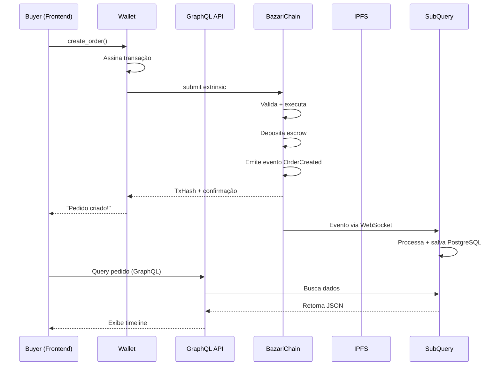
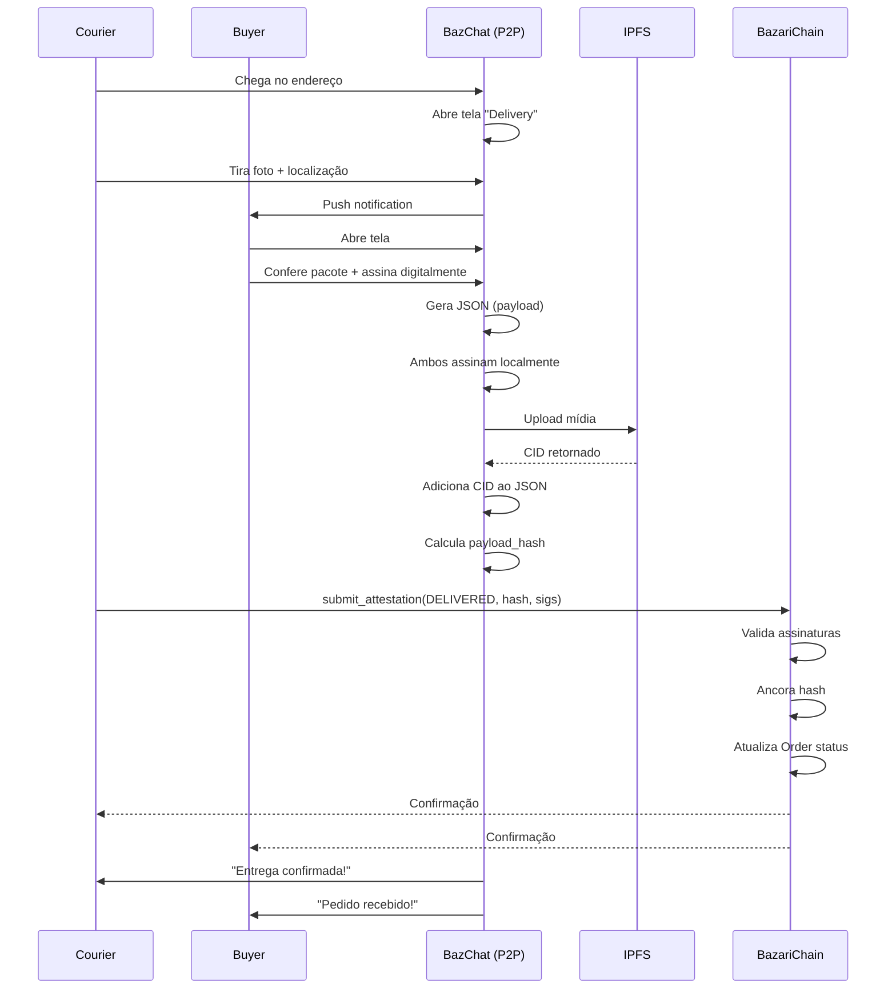

# Bazari - Documento Executivo
## 05. Arquitetura e Implementação Técnica

---

## Índice
1. [Stack Tecnológico](#1-stack-tecnológico)
2. [Arquitetura em Camadas](#2-arquitetura-em-camadas)
3. [Pallets Substrate Detalhados](#3-pallets-substrate-detalhados)
4. [Schemas e Estruturas de Dados](#4-schemas-e-estruturas-de-dados)
5. [Fluxos de Dados](#5-fluxos-de-dados)
6. [Infraestrutura e Deploy](#6-infraestrutura-e-deploy)
7. [Segurança e Auditoria](#7-segurança-e-auditoria)

---

## 1. Stack Tecnológico

### 1.1 Blockchain Layer

| Componente | Tecnologia | Justificativa |
|------------|-----------|---------------|
| **Blockchain Framework** | Substrate (Rust) | Modularidade, performance, interoperabilidade Polkadot |
| **Consensus** | GRANDPA + BABE | Finalidade rápida (~12s), segurança provada |
| **Smart Contracts** | Native Pallets (não ink!) | Melhor performance e integração |
| **Storage** | RocksDB | Otimizado para key-value, usado pelo Substrate |

### 1.2 Application Layer

| Componente | Tecnologia | Justificativa |
|------------|-----------|---------------|
| **Frontend Web** | Next.js + React + TypeScript | SSR, performance, type safety |
| **Mobile** | React Native + Expo | Code sharing, rapid prototyping |
| **Desktop** | Tauri (Rust + Web) | Leve, seguro, cross-platform |
| **State Management** | Zustand / Jotai | Simples, performático, TypeScript-first |
| **Blockchain Client** | Polkadot.js API | Padrão do ecossistema Substrate |

### 1.3 Infrastructure Layer

| Componente | Tecnologia | Justificativa |
|------------|-----------|---------------|
| **P2P Messaging** | libp2p + gossipsub | Padrão Polkadot, battle-tested |
| **File Storage** | IPFS + Filecoin | Descentralizado, immutable, incentivado |
| **Indexing** | SubQuery / The Graph | Query rápida de dados on-chain |
| **Database Off-Chain** | PostgreSQL + Redis | Caching, analytics, busca full-text |
| **API Gateway** | GraphQL (Apollo) | Flexible queries, cache inteligente |

---

## 2. Arquitetura em Camadas

```
┌─────────────────────────────────────────────────────────────────┐
│                     LAYER 1: USER INTERFACE                     │
├─────────────────────────────────────────────────────────────────┤
│  Web App (Next.js)  │  Mobile (RN)  │  Desktop (Tauri)         │
│  • Marketplace UI   │  • BazChat    │  • Full Node            │
│  • DAO Dashboard    │  • Wallet     │  • Dev Tools            │
└───────────────────────────┬─────────────────────────────────────┘
                            │
┌───────────────────────────▼─────────────────────────────────────┐
│                  LAYER 2: APPLICATION SERVICES                  │
├─────────────────────────────────────────────────────────────────┤
│  ┌────────────┐  ┌────────────┐  ┌────────────┐               │
│  │  GraphQL   │  │  SubQuery  │  │   IPFS     │               │
│  │   API      │  │  Indexer   │  │  Gateway   │               │
│  └─────┬──────┘  └─────┬──────┘  └─────┬──────┘               │
│        │                │                │                      │
│  ┌─────▼────────────────▼────────────────▼──────┐              │
│  │         PostgreSQL + Redis Cache             │              │
│  └──────────────────────┬───────────────────────┘              │
└─────────────────────────┼─────────────────────────────────────┘
                          │
┌─────────────────────────▼─────────────────────────────────────┐
│                  LAYER 3: BLOCKCHAIN RUNTIME                   │
├─────────────────────────────────────────────────────────────────┤
│                    BazariChain (Substrate)                      │
│  ┌───────────────────────────────────────────────────────────┐ │
│  │  Pallets:                                                 │ │
│  │  • pallet-order       • pallet-escrow                     │ │
│  │  • pallet-attestation • pallet-fulfillment                │ │
│  │  • pallet-affiliate   • pallet-reputation                 │ │
│  │  • pallet-dispute     • pallet-dao                        │ │
│  │  • pallet-p2p         • pallet-fee                        │ │
│  └───────────────────────────────────────────────────────────┘ │
│                                                                 │
│  Runtime APIs: RPC, WebSocket, Offchain Workers                │
└───────────────────────────┬─────────────────────────────────────┘
                            │
┌───────────────────────────▼─────────────────────────────────────┐
│                LAYER 4: CONSENSUS & NETWORKING                  │
├─────────────────────────────────────────────────────────────────┤
│  GRANDPA (finality) + BABE (block production)                   │
│  libp2p (peer discovery, gossip, sync)                          │
│  RocksDB (persistent storage)                                   │
└─────────────────────────────────────────────────────────────────┘
```

---

## 3. Pallets Substrate Detalhados

### 3.1 pallet-order

**Responsabilidade**: Ciclo de vida completo do pedido.

```rust
// Storage
#[pallet::storage]
pub type Orders<T: Config> = StorageMap<
    _,
    Blake2_128Concat,
    OrderId,
    OrderData<T::AccountId, T::BlockNumber, BalanceOf<T>>,
>;

#[pallet::storage]
pub type OrderHistory<T: Config> = StorageMap<
    _,
    Blake2_128Concat,
    OrderId,
    BoundedVec<StateTransition<T::BlockNumber>, T::MaxHistoryEntries>,
>;

// Estruturas
pub struct OrderData<AccountId, BlockNumber, Balance> {
    pub buyer: AccountId,
    pub seller: AccountId,
    pub courier: Option<AccountId>,
    pub product_id: ProductId,
    pub quantity: u32,
    pub price: Balance,
    pub escrow_amount: Balance,
    pub status: OrderStatus,
    pub created_at: BlockNumber,
    pub updated_at: BlockNumber,
    pub affiliate_path: Option<AffiliatePath>,
}

pub enum OrderStatus {
    Created,
    Accepted,
    CourierAssigned,
    HandoffCompleted,
    InTransit,
    Delivered,
    Finalized,
    Disputed,
    Cancelled,
}

// Extrinsics principais
#[pallet::call]
impl<T: Config> Pallet<T> {
    #[pallet::weight(10_000)]
    pub fn create_order(
        origin: OriginFor<T>,
        seller: T::AccountId,
        product_id: ProductId,
        quantity: u32,
        escrow_amount: BalanceOf<T>,
        affiliate_path: Option<AffiliatePath>,
    ) -> DispatchResult {
        let buyer = ensure_signed(origin)?;

        // Valida produto existe
        ensure!(
            pallet_product::Products::<T>::contains_key(product_id),
            Error::<T>::ProductNotFound
        );

        // Cria order
        let order_id = Self::next_order_id();
        let order = OrderData {
            buyer: buyer.clone(),
            seller: seller.clone(),
            courier: None,
            product_id,
            quantity,
            price: escrow_amount,
            escrow_amount,
            status: OrderStatus::Created,
            created_at: <frame_system::Pallet<T>>::block_number(),
            updated_at: <frame_system::Pallet<T>>::block_number(),
            affiliate_path,
        };

        Orders::<T>::insert(order_id, order);

        // Deposita escrow
        pallet_escrow::Pallet::<T>::deposit(buyer.clone(), order_id, escrow_amount)?;

        // Evento
        Self::deposit_event(Event::OrderCreated {
            order_id,
            buyer,
            seller,
            amount: escrow_amount,
        });

        Ok(())
    }

    #[pallet::weight(5_000)]
    pub fn accept_order(
        origin: OriginFor<T>,
        order_id: OrderId,
    ) -> DispatchResult {
        let seller = ensure_signed(origin)?;

        Orders::<T>::try_mutate(order_id, |maybe_order| {
            let order = maybe_order.as_mut().ok_or(Error::<T>::OrderNotFound)?;
            ensure!(order.seller == seller, Error::<T>::NotSeller);
            ensure!(order.status == OrderStatus::Created, Error::<T>::InvalidStatus);

            order.status = OrderStatus::Accepted;
            order.updated_at = <frame_system::Pallet<T>>::block_number();

            Self::deposit_event(Event::OrderAccepted { order_id, seller });
            Ok(())
        })
    }

    #[pallet::weight(20_000)]
    pub fn finalize(
        origin: OriginFor<T>,
        order_id: OrderId,
    ) -> DispatchResult {
        ensure_signed(origin)?; // Pode ser chamado por qualquer um (permissionless)

        let order = Orders::<T>::get(order_id).ok_or(Error::<T>::OrderNotFound)?;
        ensure!(order.status == OrderStatus::Delivered, Error::<T>::InvalidStatus);

        // Valida quórum PoC
        pallet_attestation::Pallet::<T>::validate_quorum(order_id)?;

        // Split escrow
        pallet_escrow::Pallet::<T>::split(
            order_id,
            &order.seller,
            &order.courier.unwrap(),
            order.affiliate_path.as_ref(),
        )?;

        // Atualiza reputações
        pallet_reputation::Pallet::<T>::increment_seller_score(&order.seller, 10)?;
        pallet_reputation::Pallet::<T>::increment_courier_score(&order.courier.unwrap(), 10)?;

        // Atualiza status
        Orders::<T>::mutate(order_id, |maybe_order| {
            if let Some(order) = maybe_order {
                order.status = OrderStatus::Finalized;
                order.updated_at = <frame_system::Pallet<T>>::block_number();
            }
        });

        Self::deposit_event(Event::OrderFinalized { order_id });
        Ok(())
    }
}
```

---

### 3.2 pallet-escrow

**Responsabilidade**: Gerenciar fundos bloqueados até finalização.

```rust
#[pallet::storage]
pub type Locks<T: Config> = StorageMap<
    _,
    Blake2_128Concat,
    OrderId,
    BalanceOf<T>,
>;

#[pallet::storage]
pub type Releases<T: Config> = StorageMap<
    _,
    Blake2_128Concat,
    OrderId,
    BoundedVec<(T::AccountId, BalanceOf<T>), T::MaxSplits>,
>;

#[pallet::call]
impl<T: Config> Pallet<T> {
    pub fn deposit(
        depositor: T::AccountId,
        order_id: OrderId,
        amount: BalanceOf<T>,
    ) -> DispatchResult {
        // Transfere de depositor para conta do pallet (reserve)
        <pallet_balances::Pallet<T> as ReservableCurrency<_>>::reserve(
            &depositor,
            amount,
        )?;

        Locks::<T>::insert(order_id, amount);

        Self::deposit_event(Event::EscrowDeposited { order_id, depositor, amount });
        Ok(())
    }

    pub fn split(
        order_id: OrderId,
        seller: &T::AccountId,
        courier: &T::AccountId,
        affiliate_path: Option<&AffiliatePath>,
    ) -> DispatchResult {
        let escrow_amount = Locks::<T>::get(order_id).ok_or(Error::<T>::NoEscrow)?;

        let mut releases = BoundedVec::new();
        let mut remaining = escrow_amount;

        // Calcula fees
        let fee_config = pallet_fee::Pallet::<T>::config();
        let dao_fee = escrow_amount * fee_config.dao_fee_percent / 10000;
        let treasury_fee = escrow_amount * fee_config.treasury_percent / 10000;

        // Calcula comissões de afiliados
        let affiliate_total = if let Some(path) = affiliate_path {
            pallet_affiliate::Pallet::<T>::calculate_splits(order_id, path)?
        } else {
            0u32.into()
        };

        remaining = remaining
            .saturating_sub(dao_fee)
            .saturating_sub(treasury_fee)
            .saturating_sub(affiliate_total);

        // Split principal (após descontar tudo)
        let order = pallet_order::Orders::<T>::get(order_id).unwrap();
        let frete = order.frete_amount; // assumindo que existe
        let seller_amount = remaining.saturating_sub(frete);

        releases.try_push((seller.clone(), seller_amount)).ok();
        releases.try_push((courier.clone(), frete)).ok();

        Releases::<T>::insert(order_id, releases.clone());

        // Executa transferências
        for (recipient, amount) in releases.iter() {
            <pallet_balances::Pallet<T> as ReservableCurrency<_>>::unreserve(
                recipient,
                *amount,
            );
        }

        // Remove lock
        Locks::<T>::remove(order_id);

        Self::deposit_event(Event::EscrowSplit { order_id });
        Ok(())
    }
}
```

---

### 3.3 pallet-attestation

**Responsabilidade**: Ancora provas (hashes) e valida signatários.

```rust
#[pallet::storage]
pub type Attestations<T: Config> = StorageDoubleMap<
    _,
    Blake2_128Concat, OrderId,
    Blake2_128Concat, OrderStep,
    AttestationData<T::AccountId, T::BlockNumber>,
>;

pub struct AttestationData<AccountId, BlockNumber> {
    pub payload_hash: H256,
    pub signers: Vec<(AccountId, Signature)>,
    pub timestamp: BlockNumber,
    pub metadata: BoundedVec<u8, ConstU32<256>>,
}

#[pallet::call]
impl<T: Config> Pallet<T> {
    #[pallet::weight(15_000)]
    pub fn submit_attestation(
        origin: OriginFor<T>,
        order_id: OrderId,
        step: OrderStep,
        payload_hash: H256,
        signatures: Vec<(T::AccountId, Signature)>,
        metadata: Option<Vec<u8>>,
    ) -> DispatchResult {
        let submitter = ensure_signed(origin)?;

        // Valida que submitter é um dos signers
        ensure!(
            signatures.iter().any(|(acc, _)| acc == &submitter),
            Error::<T>::NotASigner
        );

        // Valida assinaturas
        for (account, sig) in &signatures {
            Self::verify_signature(account, &payload_hash, sig)?;
        }

        // Valida signers corretos para o step
        Self::validate_signers_for_step(order_id, &step, &signatures)?;

        // Ancora
        let attestation = AttestationData {
            payload_hash,
            signers: signatures,
            timestamp: <frame_system::Pallet<T>>::block_number(),
            metadata: metadata.unwrap_or_default().try_into().unwrap_or_default(),
        };

        Attestations::<T>::insert(order_id, step, attestation);

        // Atualiza status do pedido
        Self::update_order_status(order_id, step)?;

        Self::deposit_event(Event::AttestationSubmitted { order_id, step, payload_hash });
        Ok(())
    }

    pub fn validate_quorum(order_id: OrderId) -> DispatchResult {
        // Valida que existem attestations necessárias
        ensure!(
            Attestations::<T>::contains_key(order_id, OrderStep::HandoffSellerToCourier),
            Error::<T>::MissingHandoffProof
        );
        ensure!(
            Attestations::<T>::contains_key(order_id, OrderStep::DeliveredCourierToBuyer),
            Error::<T>::MissingDeliveryProof
        );

        // Valida signers corretos
        let handoff = Attestations::<T>::get(order_id, OrderStep::HandoffSellerToCourier).unwrap();
        let delivery = Attestations::<T>::get(order_id, OrderStep::DeliveredCourierToBuyer).unwrap();

        let order = pallet_order::Orders::<T>::get(order_id).unwrap();

        // Handoff deve ter Seller + Courier
        ensure!(
            handoff.signers.iter().any(|(acc, _)| acc == &order.seller),
            Error::<T>::SellerNotSignedHandoff
        );
        ensure!(
            handoff.signers.iter().any(|(acc, _)| acc == &order.courier.unwrap()),
            Error::<T>::CourierNotSignedHandoff
        );

        // Delivery deve ter Courier + Buyer
        ensure!(
            delivery.signers.iter().any(|(acc, _)| acc == &order.courier.unwrap()),
            Error::<T>::CourierNotSignedDelivery
        );
        ensure!(
            delivery.signers.iter().any(|(acc, _)| acc == &order.buyer),
            Error::<T>::BuyerNotSignedDelivery
        );

        Ok(())
    }
}
```

---

## 4. Schemas e Estruturas de Dados

### 4.1 JSON do HandoffProof (Off-Chain)

```json
{
  "version": "1.0.0",
  "order_id": "0x1a2b3c4d5e6f7890abcdef1234567890",
  "step": "HANDOFF_SELLER_TO_COURIER",
  "timestamp": "2025-10-28T10:15:00.000Z",
  "geo": {
    "lat": -23.550520,
    "lon": -46.633308,
    "accuracy_meters": 5,
    "provider": "gps"
  },
  "media": [
    {
      "type": "photo",
      "cid": "QmHandoffPhoto123...",
      "description": "Pacote lacrado com número de série visível",
      "hash": "blake2b:0xabc..."
    }
  ],
  "product_condition": {
    "seal": "intact",
    "seal_number": "SEAL-12345",
    "weight_kg": 1.2,
    "dimensions_cm": [30, 20, 10],
    "notes": "Caixa em perfeito estado"
  },
  "device_attestation": {
    "platform": "iOS",
    "app_version": "1.2.3",
    "integrity_token": "eyJhbGciOiJFUzI1NiIsInR5cCI6IkpXVCJ9..."
  },
  "signers": [
    {
      "role": "Seller",
      "account_id": "5SellerABC123...",
      "signature": "0xabcdef1234567890...",
      "signature_method": "sr25519",
      "signed_at": "2025-10-28T10:15:05.000Z"
    },
    {
      "role": "Courier",
      "account_id": "5CourierDEF456...",
      "signature": "0x1234567890abcdef...",
      "signature_method": "sr25519",
      "signed_at": "2025-10-28T10:15:08.000Z"
    }
  ],
  "nonce": "random_nonce_xyz789",
  "schema_hash": "0x..."
}
```

**Hash Ancorado On-Chain**:
```rust
let payload_hash = blake2_256(&json_bytes);
// Resultado: 0xabc123def456... (32 bytes)
```

---

### 4.2 Merkle Proof de Afiliados

```json
{
  "campaign_id": "0xCampaign123",
  "path": [
    {
      "account_id": "5Affiliate1...",
      "level": 1,
      "commission_rate": 0.025
    },
    {
      "account_id": "5Affiliate2...",
      "level": 2,
      "commission_rate": 0.0125
    }
  ],
  "merkle_proof": {
    "root": "0xRootHash...",
    "siblings": [
      "0xSibling1Hash...",
      "0xSibling2Hash..."
    ],
    "path_indices": [0, 1]
  }
}
```

**Validação On-Chain**:
```rust
fn verify_merkle_proof(
    leaf: H256,
    root: H256,
    siblings: &[H256],
    path_indices: &[u8],
) -> bool {
    let mut computed_hash = leaf;
    for (sibling, &index) in siblings.iter().zip(path_indices) {
        computed_hash = if index == 0 {
            blake2_256(&[computed_hash.as_bytes(), sibling.as_bytes()].concat())
        } else {
            blake2_256(&[sibling.as_bytes(), computed_hash.as_bytes()].concat())
        };
    }
    computed_hash == root
}
```

---

## 5. Fluxos de Dados

### 5.1 Criação de Order (Sequência Completa)



---

### 5.2 Co-Assinatura de DeliveryProof



---

## 6. Infraestrutura e Deploy

### 6.1 Arquitetura de Deploy (Produção)

```
┌──────────────────────────────────────────────────────────────┐
│                        FRONTEND                              │
├──────────────────────────────────────────────────────────────┤
│  Vercel (Web)  │  App Store/Play Store (Mobile)             │
│  • Next.js SSR │  • React Native bundle                      │
│  • Edge CDN    │  • OTA updates (Expo)                       │
└────────────┬─────────────────────────────────────────────────┘
             │
             ▼
┌──────────────────────────────────────────────────────────────┐
│                        API LAYER                             │
├──────────────────────────────────────────────────────────────┤
│  AWS/GCP - Kubernetes Cluster                                │
│  ┌────────────┐  ┌────────────┐  ┌────────────┐             │
│  │  GraphQL   │  │  SubQuery  │  │  IPFS      │             │
│  │  Gateway   │  │  Indexer   │  │  Gateway   │             │
│  │  (Apollo)  │  │  (Node.js) │  │  (Kubo)    │             │
│  └────────────┘  └────────────┘  └────────────┘             │
│         │              │                │                    │
│  ┌──────▼──────────────▼────────────────▼──────┐            │
│  │         PostgreSQL (RDS) + Redis             │            │
│  └──────────────────────────────────────────────┘            │
└────────────┬─────────────────────────────────────────────────┘
             │
             ▼
┌──────────────────────────────────────────────────────────────┐
│                    BLOCKCHAIN NODES                          │
├──────────────────────────────────────────────────────────────┤
│  Validator Nodes (3+ geograficamente distribuídos)           │
│  • AWS us-east-1                                             │
│  • GCP europe-west1                                          │
│  • Azure asia-southeast1                                     │
│                                                              │
│  Full Nodes (Archive) - 2+ para consulta histórica          │
│  RPC Nodes (Load-balanced) - 5+ para API pública            │
└──────────────────────────────────────────────────────────────┘
```

---

### 6.2 DevOps e CI/CD

```yaml
# .github/workflows/deploy-chain.yml
name: Deploy BazariChain

on:
  push:
    branches: [main]
    paths: ['bazari-chain/**']

jobs:
  build-and-deploy:
    runs-on: ubuntu-latest
    steps:
      - uses: actions/checkout@v3

      - name: Build runtime WASM
        run: |
          cd bazari-chain
          cargo build --release

      - name: Run tests
        run: cargo test --all

      - name: Build Docker image
        run: |
          docker build -t bazari-chain:${{ github.sha }} .
          docker tag bazari-chain:${{ github.sha }} bazari-chain:latest

      - name: Push to registry
        run: |
          docker push ghcr.io/bazari/chain:${{ github.sha }}

      - name: Deploy to testnet
        run: |
          kubectl set image deployment/bazari-validator \\
            bazari-chain=ghcr.io/bazari/chain:${{ github.sha }}

      - name: Health check
        run: |
          curl -X POST https://testnet-rpc.bazari.network \\
            -H "Content-Type: application/json" \\
            -d '{"jsonrpc":"2.0","method":"system_health","params":[],"id":1}'
```

---

## 7. Segurança e Auditoria

### 7.1 Vetores de Ataque e Mitigações

| Vetor | Risco | Mitigação |
|-------|-------|-----------|
| **Reentrância** | Alto | Checks-Effects-Interactions pattern; Status flags |
| **Overflow/Underflow** | Médio | Rust safe math (saturating ops); Testes extensivos |
| **Assinaturas forjadas** | Alto | Verificação criptográfica (sr25519/ed25519); Nonces |
| **Replay attacks** | Médio | Nonces únicos; Timestamps; Order IDs |
| **Front-running** | Médio | Commit-reveal para disputas; Timelock antes de execução |
| **Sybil (spam contas)** | Alto | Stake mínimo; Reputação; Rate limiting |
| **51% attack** | Baixo | Múltiplos validators; Slashing alto; Custo > ganho |
| **DDoS RPC** | Médio | Rate limiting; Load balancer; Cloudflare |

---

### 7.2 Checklist de Auditoria

**Antes do Mainnet**:

- [ ] Auditoria formal de smart contracts (Trail of Bits / OpenZeppelin)
- [ ] Fuzzing de pallets (cargo-fuzz)
- [ ] Testes de carga (1000+ tps simulados)
- [ ] Penetration testing (white-hat hackers)
- [ ] Code review por Substrate experts
- [ ] Bug bounty program (HackerOne)
- [ ] Testnet público por 6+ meses
- [ ] Revisão de criptografia (assinaturas, hashes)
- [ ] Análise de economia de tokens (simulations)
- [ ] Disaster recovery plan testado

---

## Conclusão

A arquitetura Bazari é **modular, escalável e segura por design**. Cada camada tem responsabilidades claras, e a comunicação entre elas é padronizada.

**Próximo passo**: Entender o roadmap de implementação em 3 fases e as evoluções futuras (ZK-PoD, BLS, IA).

---

## Próximo Documento

- **[06-roadmap-evolucao.md](./06-roadmap-evolucao.md)**: Roadmap completo de 3 fases e visão de longo prazo

---

**Bazari** — Arquitetura técnica sólida para o futuro do comércio descentralizado.
