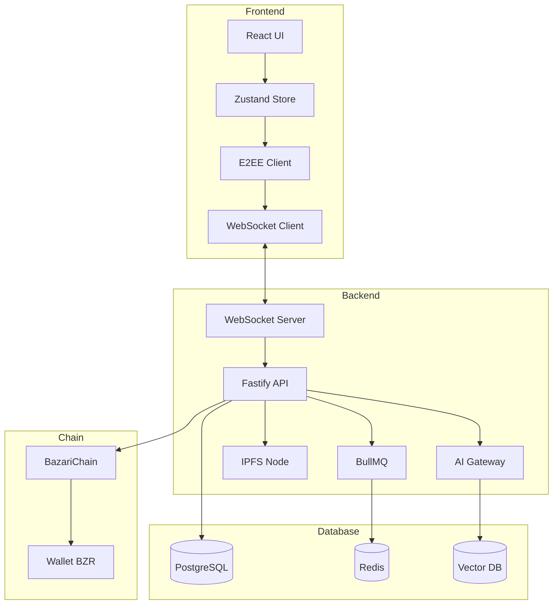

# Especificação Técnica: BazChat - Hub Social e Comercial

**Versão**: 1.0.0
**Data**: 2025-10-12
**Status**: Documento de Planejamento
**Repositórios**: `~/bazari` (monorepo), `~/bazari-chain` (blockchain)

---

## 📋 Índice

1. [Visão Geral](#visão-geral)
2. [Princípios de Implementação](#princípios-de-implementação)
3. [Arquitetura de Alto Nível](#arquitetura-de-alto-nível)
4. [Roadmap de Implementação](#roadmap-de-implementação)
5. [Fases de Desenvolvimento](#fases-de-desenvolvimento)
6. [Dependências e Integrações](#dependências-e-integrações)
7. [Considerações de Segurança](#considerações-de-segurança)

---

## 1. Visão Geral

### 1.1 Objetivo

O **BazChat** é o hub de comunicação e comércio descentralizado da Bazari, onde:
- 💬 **Comunicação**: Mensagens E2EE (texto, áudio, vídeo), grupos, canais
- 🛒 **Comércio**: Vendas diretas com checkout em BZR, propostas, split automático
- 🤝 **Reputação**: Score on-chain, selo de confiança NFT
- 🤖 **IA Local**: Tradução, STT, TTS, resumos (modelos OSS on-prem)
- 💰 **Monetização**: Comissões automáticas, afiliados, microtrabalhos, cashback

### 1.2 Diferenciais Estratégicos

| Diferencial | Impacto |
|-------------|---------|
| Comunicação + Economia + Identidade unificados | Nenhum app oferece isso |
| Câmbio P2P + pagamento em BZR nativo | Economia soberana |
| Vendas 1-para-1 no chat | "Conversou, vendeu" |
| IA open-source on-prem | Privacidade e soberania |
| Reputação on-chain | Antifrágil e transparente |

---

## 2. Princípios de Implementação

### 2.1 Não Regredir

- ✅ **Preservar funcionalidades existentes**: Posts, feed, perfis, lojas, wallet
- ✅ **Não duplicar código**: Reutilizar componentes UI, services, hooks
- ✅ **Seguir padrões existentes**: Estrutura de pastas, naming, tipos

### 2.2 Padrões do Projeto

```
Estrutura atual (preservar):
/apps
  /api (Fastify + Prisma + Polkadot API)
  /web (React + Vite + Tailwind + Zustand)
  /ai-gateway (NOVO - microserviço OSS)
/packages
  /siws-utils (autenticação)
  /chain-client (NOVO - SDK BazariChain)
  /shared-types (NOVO - tipos compartilhados)
```

### 2.3 Stack Tecnológico

**Backend (apps/api)**
- Fastify + WebSocket (`ws` ou `@fastify/websocket`)
- Prisma (PostgreSQL)
- IPFS (kubo-rpc-client já instalado)
- BullMQ + Redis (já instalado)
- Polkadot API (já instalado)

**Frontend (apps/web)**
- React 18 + TypeScript
- Zustand (state management)
- Tailwind + Radix UI
- IndexedDB (idb já instalado)

**IA (apps/ai-gateway - NOVO)**
- Fastify
- vLLM (Llama 3)
- NLLB/Seamless (tradução)
- Whisper (STT)
- Coqui-TTS (TTS)
- Qdrant/pgvector (embeddings)

**Criptografia E2EE**
- libsodium (`libsodium-wrappers`)
- X3DH + Double Ratchet (implementação simplificada ou `@wireapp/proteus`)

---

## 3. Arquitetura de Alto Nível



---

## 4. Roadmap de Implementação

### Visão Geral das Fases

| Fase | Descrição | Complexidade | Tempo Estimado |
|------|-----------|--------------|----------------|
| **0** | Preparação e Infraestrutura | Baixa | 4-6h |
| **1** | Chat Básico (DM texto) | Média | 8-12h |
| **2** | Mídia e Grupos | Alta | 12-16h |
| **3** | Comércio no Chat | Alta | 16-20h |
| **4** | IA Local (OSS) | Alta | 12-16h |
| **5** | Monetização Avançada | Média | 8-12h |
| **6** | WebRTC (Voz/Vídeo) | Alta | 12-16h |
| **7** | Funcionalidades Sociais | Média | 8-12h |
| **8** | Polimento e Otimização | Média | 8-12h |

**Total estimado**: 88-122 horas (~11-15 dias úteis)

---

## 5. Fases de Desenvolvimento

---

# FASE 0: Preparação e Infraestrutura

**Prioridade**: Crítica
**Complexidade**: Baixa
**Tempo estimado**: 4-6 horas

## 📋 Contexto

Preparar a base para o BazChat sem afetar o código existente. Criar estruturas, tipos, configurações e dependências necessárias.

## 🎯 Objetivos

1. Adicionar dependências necessárias
2. Criar estrutura de pastas
3. Definir tipos TypeScript compartilhados
4. Configurar variáveis de ambiente
5. Criar migrations Prisma

## 📦 Requisitos

### 1. Adicionar Dependências

**apps/api/package.json**
```json
{
  "dependencies": {
    "@fastify/websocket": "^10.0.0",
    "ws": "^8.16.0",
    "libsodium-wrappers": "^0.7.13"
  },
  "devDependencies": {
    "@types/ws": "^8.5.10",
    "@types/libsodium-wrappers": "^0.7.14"
  }
}
```

**apps/web/package.json**
```json
{
  "dependencies": {
    "libsodium-wrappers": "^0.7.13"
  },
  "devDependencies": {
    "@types/libsodium-wrappers": "^0.7.14"
  }
}
```

### 2. Criar Estrutura de Pastas

**Backend (apps/api/src)**
```
apps/api/src/
├── chat/
│   ├── ws/
│   │   ├── server.ts          # WebSocket server setup
│   │   ├── handlers.ts        # Message handlers
│   │   └── events.ts          # Pub/sub events
│   ├── routes/
│   │   ├── chat.threads.ts    # GET /chat/threads
│   │   ├── chat.messages.ts   # GET/POST /chat/messages
│   │   ├── chat.upload.ts     # POST /chat/upload (mídia)
│   │   ├── chat.groups.ts     # Grupos (fase 2)
│   │   ├── chat.orders.ts     # Propostas/checkout (fase 3)
│   │   └── chat.settings.ts   # Políticas comissão (fase 3)
│   ├── services/
│   │   ├── chat.ts            # Business logic
│   │   ├── encryption.ts      # E2EE helpers
│   │   ├── ipfs.ts            # Upload mídia
│   │   ├── commission.ts      # Split payments (fase 3)
│   │   └── reputation.ts      # Score on-chain (fase 3)
│   └── domain/
│       ├── types.ts           # Tipos core
│       └── events.ts          # Event types
```

**Frontend (apps/web/src)**
```
apps/web/src/
├── pages/
│   └── chat/
│       ├── ChatInboxPage.tsx        # Lista de threads
│       ├── ChatThreadPage.tsx       # Conversa específica
│       └── ChatSettingsPage.tsx     # Configurações (fase 5)
├── components/chat/
│   ├── ChatComposer.tsx             # Input de mensagem
│   ├── MessageBubble.tsx            # Renderizar mensagem
│   ├── MessageList.tsx              # Lista de mensagens
│   ├── ThreadItem.tsx               # Item da inbox
│   ├── ChatMediaPreview.tsx         # Preview de mídia (fase 2)
│   ├── ProposalCard.tsx             # Proposta de venda (fase 3)
│   ├── CheckoutButton.tsx           # Botão pagar (fase 3)
│   └── SystemEvent.tsx              # Eventos do sistema
├── hooks/
│   ├── useChat.ts                   # Zustand store + WS
│   └── useChatEncryption.ts         # E2EE hooks
└── lib/
    ├── chat/
    │   ├── crypto.ts                # X3DH/DR wrapper
    │   ├── websocket.ts             # WS client
    │   └── ipfs.ts                  # IPFS client
    └── config/chat.ts               # Flags e limites
```

### 3. Tipos TypeScript Compartilhados

**packages/shared-types/src/chat.ts** (NOVO package)
```typescript
// Tipos de mensagem
export type MessageType =
  | "text" | "audio" | "image" | "file" | "video"
  | "proposal" | "checkout" | "payment" | "system";

export type ThreadKind = "dm" | "store" | "order" | "group";

// Thread
export interface ChatThread {
  id: string;
  kind: ThreadKind;
  participants: string[];           // profileIds
  orderId?: string;
  groupId?: string;
  lastMessageAt: number;
  unreadCount: number;
  metadata?: Record<string, any>;
  createdAt: number;
  updatedAt: number;
}

// Mensagem
export interface ChatMessage {
  id: string;
  threadId: string;
  from: string;                     // profileId
  type: MessageType;
  ciphertext: string;               // E2EE payload
  mediaCid?: string;                // IPFS CID
  meta?: Record<string, any>;       // itens/total/split/txHash
  createdAt: number;
  deliveredAt?: number;
  readAt?: number;
  replyTo?: string;                 // messageId
  editedAt?: number;
}

// WebSocket envelopes
export interface WsClientMsg {
  op: "send" | "ack" | "presence" | "typing" | "read";
  data: any;
}

export interface WsServerMsg {
  op: "message" | "receipt" | "presence" | "typing" | "system";
  data: any;
}

// Proposta de venda (Fase 3)
export interface Proposal {
  id: string;
  threadId: string;
  items: ProposalItem[];
  subtotal: string;                 // BZR
  shipping?: { method: string; price: string };
  total: string;                    // BZR
  commissionPercent: number;
  status: "draft" | "sent" | "accepted" | "expired" | "paid";
  expiresAt?: string;
  createdAt: string;
}

export interface ProposalItem {
  sku: string;
  name: string;
  qty: number;
  price: string;                    // BZR
}

// Comissão (Fase 3)
export interface Commission {
  saleId: string;
  storeId: number;
  buyer: string;                    // profileId
  seller: string;                   // profileId
  promoter?: string;                // profileId
  amount: string;                   // BZR
  percent: number;
  status: "pending" | "paid" | "reversed";
  receiptNftCid?: string;
}

// Políticas da loja
export interface StoreCommissionPolicy {
  storeId: number;
  mode: "open" | "followers" | "affiliates";
  percent: number;                  // 0-20
  minReputation?: number;
  dailyCommissionCap?: string;      // BZR
}
```

### 4. Configuração de Ambiente

**apps/api/.env** (adicionar)
```env
# BazChat
CHAT_WS_PORT=8081
CHAT_WS_MAX_CONN=5000
CHAT_RATE_LIMIT_RPM=120
CHAT_MAX_MEDIA_MB=50
CHAT_COMMISSION_MAX_PERCENT=20

# IPFS (já deve existir)
IPFS_API_URL=http://localhost:5001

# AI Gateway (Fase 4)
AI_GATEWAY_URL=http://localhost:8000

# Chain (já deve existir)
CHAIN_WS=ws://localhost:9944
TREASURY_ADDR=5GrwvaEF5zXb26Fz9rcQpDWS57CtERHpNehXCPcNoHGKutQY
BAZARI_FEE_BPS=100  # 1%
```

**apps/web/.env** (adicionar)
```env
# BazChat
VITE_CHAT_WS_URL=ws://localhost:8081
VITE_CHAT_E2EE_ENABLED=true
VITE_CHAT_MAX_MEDIA_MB=50
```

**apps/api/src/config/env.ts** (estender existente)
```typescript
// Adicionar ao env existente
export const chatConfig = {
  wsPort: Number(process.env.CHAT_WS_PORT ?? 8081),
  wsMaxConn: Number(process.env.CHAT_WS_MAX_CONN ?? 5000),
  rateLimitRpm: Number(process.env.CHAT_RATE_LIMIT_RPM ?? 120),
  maxMediaMb: Number(process.env.CHAT_MAX_MEDIA_MB ?? 50),
  commissionMaxPercent: Number(process.env.CHAT_COMMISSION_MAX_PERCENT ?? 20),
  ipfsApiUrl: process.env.IPFS_API_URL!,
  aiGatewayUrl: process.env.AI_GATEWAY_URL,
  chainWs: process.env.CHAIN_WS!,
  treasuryAddr: process.env.TREASURY_ADDR!,
  bazariFeesBps: Number(process.env.BAZARI_FEE_BPS ?? 100),
};
```

**apps/web/src/lib/config/chat.ts** (NOVO)
```typescript
export const chatConfig = {
  wsUrl: import.meta.env.VITE_CHAT_WS_URL || "ws://localhost:8081",
  e2ee: import.meta.env.VITE_CHAT_E2EE_ENABLED !== "false",
  media: {
    maxMB: Number(import.meta.env.VITE_CHAT_MAX_MEDIA_MB || 50),
    accept: ["image/*", "video/*", "audio/*", "application/pdf"],
  },
  rateLimit: {
    dmsPerMinute: 20,
    mediaPerMinute: 5,
  },
  proposals: {
    allowCounterOffer: true,
    expiresHours: 48,
  },
  checkout: {
    currency: "BZR",
    showP2PShortcut: true,
  },
  commissions: {
    defaultPercent: 5,
    modes: ["open", "followers", "affiliates"] as const,
    defaultMode: "open" as const,
  },
} as const;
```

### 5. Migrations Prisma

**apps/api/prisma/migrations/YYYYMMDD_add_chat_tables/migration.sql**

```sql
-- ChatThread
CREATE TABLE "ChatThread" (
  "id" TEXT NOT NULL PRIMARY KEY,
  "kind" TEXT NOT NULL,
  "participants" TEXT[] NOT NULL,
  "orderId" TEXT,
  "groupId" TEXT,
  "lastMessageAt" BIGINT NOT NULL,
  "metadata" JSONB,
  "createdAt" BIGINT NOT NULL,
  "updatedAt" BIGINT NOT NULL
);

CREATE INDEX "ChatThread_participants_idx" ON "ChatThread"("participants");
CREATE INDEX "ChatThread_lastMessageAt_idx" ON "ChatThread"("lastMessageAt" DESC);
CREATE INDEX "ChatThread_kind_idx" ON "ChatThread"("kind");

-- ChatMessage
CREATE TABLE "ChatMessage" (
  "id" TEXT NOT NULL PRIMARY KEY,
  "threadId" TEXT NOT NULL REFERENCES "ChatThread"("id") ON DELETE CASCADE,
  "fromProfile" TEXT NOT NULL,
  "type" TEXT NOT NULL,
  "ciphertext" TEXT NOT NULL,
  "mediaCid" TEXT,
  "meta" JSONB,
  "createdAt" BIGINT NOT NULL,
  "deliveredAt" BIGINT,
  "readAt" BIGINT,
  "replyTo" TEXT,
  "editedAt" BIGINT
);

CREATE INDEX "ChatMessage_threadId_createdAt_idx" ON "ChatMessage"("threadId", "createdAt" DESC);
CREATE INDEX "ChatMessage_fromProfile_idx" ON "ChatMessage"("fromProfile");
CREATE INDEX "ChatMessage_type_idx" ON "ChatMessage"("type");

-- ChatGroup (Fase 2)
CREATE TABLE "ChatGroup" (
  "id" TEXT NOT NULL PRIMARY KEY,
  "name" TEXT NOT NULL,
  "description" TEXT,
  "avatarUrl" TEXT,
  "kind" TEXT NOT NULL DEFAULT 'community',
  "isPublic" BOOLEAN NOT NULL DEFAULT false,
  "adminIds" TEXT[] NOT NULL,
  "memberIds" TEXT[] NOT NULL,
  "maxMembers" INTEGER DEFAULT 500,
  "metadata" JSONB,
  "createdAt" BIGINT NOT NULL
);

CREATE INDEX "ChatGroup_adminIds_idx" ON "ChatGroup"("adminIds");
CREATE INDEX "ChatGroup_memberIds_idx" ON "ChatGroup"("memberIds");
CREATE INDEX "ChatGroup_kind_idx" ON "ChatGroup"("kind");
CREATE INDEX "ChatGroup_isPublic_idx" ON "ChatGroup"("isPublic");

-- Proposal (Fase 3)
CREATE TABLE "ChatProposal" (
  "id" TEXT NOT NULL PRIMARY KEY,
  "threadId" TEXT NOT NULL REFERENCES "ChatThread"("id"),
  "sellerId" TEXT NOT NULL,
  "buyerId" TEXT,
  "items" JSONB NOT NULL,
  "subtotal" NUMERIC(20, 8) NOT NULL,
  "shipping" JSONB,
  "total" NUMERIC(20, 8) NOT NULL,
  "commissionPercent" INTEGER NOT NULL,
  "status" TEXT NOT NULL DEFAULT 'draft',
  "expiresAt" BIGINT,
  "createdAt" BIGINT NOT NULL,
  "updatedAt" BIGINT NOT NULL
);

CREATE INDEX "ChatProposal_threadId_idx" ON "ChatProposal"("threadId");
CREATE INDEX "ChatProposal_sellerId_idx" ON "ChatProposal"("sellerId");
CREATE INDEX "ChatProposal_status_idx" ON "ChatProposal"("status");

-- StoreCommissionPolicy (Fase 3)
CREATE TABLE "StoreCommissionPolicy" (
  "storeId" BIGINT NOT NULL PRIMARY KEY,
  "mode" TEXT NOT NULL DEFAULT 'open',
  "percent" INTEGER NOT NULL DEFAULT 5,
  "minReputation" INTEGER,
  "dailyCommissionCap" NUMERIC(20, 8),
  "createdAt" BIGINT NOT NULL,
  "updatedAt" BIGINT NOT NULL
);

-- ChatMission (Fase 5)
CREATE TABLE "ChatMission" (
  "id" TEXT NOT NULL PRIMARY KEY,
  "title" TEXT NOT NULL,
  "description" TEXT NOT NULL,
  "reward" NUMERIC(20, 8) NOT NULL,
  "type" TEXT NOT NULL,
  "requirements" JSONB,
  "maxCompletions" INTEGER,
  "completedCount" INTEGER NOT NULL DEFAULT 0,
  "expiresAt" BIGINT,
  "status" TEXT NOT NULL DEFAULT 'active',
  "createdBy" TEXT NOT NULL,
  "createdAt" BIGINT NOT NULL
);

CREATE INDEX "ChatMission_status_expiresAt_idx" ON "ChatMission"("status", "expiresAt");
CREATE INDEX "ChatMission_createdBy_idx" ON "ChatMission"("createdBy");

-- ChatOpportunity (Fase 5)
CREATE TABLE "ChatOpportunity" (
  "id" TEXT NOT NULL PRIMARY KEY,
  "storeId" BIGINT NOT NULL,
  "title" TEXT NOT NULL,
  "description" TEXT NOT NULL,
  "type" TEXT NOT NULL,
  "compensation" TEXT,
  "requirements" JSONB,
  "status" TEXT NOT NULL DEFAULT 'open',
  "createdAt" BIGINT NOT NULL,
  "expiresAt" BIGINT
);

CREATE INDEX "ChatOpportunity_storeId_idx" ON "ChatOpportunity"("storeId");
CREATE INDEX "ChatOpportunity_status_idx" ON "ChatOpportunity"("status");

-- PromoterRanking (Materialized View - Fase 5)
-- Será criada com CREATE MATERIALIZED VIEW na implementação
```

**apps/api/prisma/schema.prisma** (adicionar)
```prisma
model ChatThread {
  id             String   @id @default(uuid())
  kind           String   // dm | store | order | group
  participants   String[] // profileIds
  orderId        String?
  groupId        String?
  lastMessageAt  BigInt
  metadata       Json?
  createdAt      BigInt
  updatedAt      BigInt

  messages       ChatMessage[]
  proposals      ChatProposal[]

  @@index([participants])
  @@index([lastMessageAt(sort: Desc)])
  @@index([kind])
}

model ChatMessage {
  id           String   @id @default(uuid())
  threadId     String
  fromProfile  String
  type         String   // text | audio | image | file | video | proposal | checkout | payment | system
  ciphertext   String   @db.Text
  mediaCid     String?
  meta         Json?
  createdAt    BigInt
  deliveredAt  BigInt?
  readAt       BigInt?
  replyTo      String?
  editedAt     BigInt?

  thread       ChatThread @relation(fields: [threadId], references: [id], onDelete: Cascade)

  @@index([threadId, createdAt(sort: Desc)])
  @@index([fromProfile])
  @@index([type])
}

model ChatGroup {
  id          String   @id @default(uuid())
  name        String
  description String?
  avatarUrl   String?
  kind        String   @default("community") // community | channel | dao
  isPublic    Boolean  @default(false)
  adminIds    String[]
  memberIds   String[]
  maxMembers  Int?     @default(500)
  metadata    Json?
  createdAt   BigInt

  @@index([adminIds])
  @@index([memberIds])
  @@index([kind])
  @@index([isPublic])
}

model ChatProposal {
  id                String   @id @default(uuid())
  threadId          String
  sellerId          String
  buyerId           String?
  items             Json     // ProposalItem[]
  subtotal          Decimal  @db.Decimal(20, 8)
  shipping          Json?
  total             Decimal  @db.Decimal(20, 8)
  commissionPercent Int
  status            String   @default("draft") // draft | sent | accepted | expired | paid
  expiresAt         BigInt?
  createdAt         BigInt
  updatedAt         BigInt

  thread            ChatThread @relation(fields: [threadId], references: [id])

  @@index([threadId])
  @@index([sellerId])
  @@index([status])
}

model StoreCommissionPolicy {
  storeId             BigInt   @id
  mode                String   @default("open") // open | followers | affiliates
  percent             Int      @default(5)
  minReputation       Int?
  dailyCommissionCap  Decimal? @db.Decimal(20, 8)
  createdAt           BigInt
  updatedAt           BigInt
}

model ChatMission {
  id              String   @id @default(uuid())
  title           String
  description     String
  reward          Decimal  @db.Decimal(20, 8)
  type            String   // share | review | referral | custom
  requirements    Json?
  maxCompletions  Int?
  completedCount  Int      @default(0)
  expiresAt       BigInt?
  status          String   @default("active") // active | paused | completed
  createdBy       String
  createdAt       BigInt

  @@index([status, expiresAt])
  @@index([createdBy])
}

model ChatOpportunity {
  id           String   @id @default(uuid())
  storeId      BigInt
  title        String
  description  String
  type         String   // job | freelance | partnership
  compensation String?
  requirements Json?
  status       String   @default("open") // open | filled | closed
  createdAt    BigInt
  expiresAt    BigInt?

  @@index([storeId])
  @@index([status])
}
```

## ✅ Checklist de Validação

- [ ] Dependências instaladas (`pnpm install`)
- [ ] Estrutura de pastas criada
- [ ] Package `shared-types` criado e configurado no workspace
- [ ] Tipos TypeScript definidos
- [ ] Variáveis `.env` adicionadas (sem commitar valores sensíveis)
- [ ] Configs carregadas em `apps/api/src/config/env.ts`
- [ ] Configs carregadas em `apps/web/src/lib/config/chat.ts`
- [ ] Migrations Prisma criadas
- [ ] `pnpm prisma generate` executado
- [ ] `pnpm prisma migrate dev` executado
- [ ] Schema Prisma atualizado
- [ ] Nenhuma regressão em funcionalidades existentes
- [ ] Build da API funciona (`pnpm --filter @bazari/api build`)
- [ ] Build do Web funciona (`pnpm --filter @bazari/web build`)

## 🚫 NÃO FAZER

- ❌ NÃO alterar código existente de posts, feed, perfis
- ❌ NÃO commitar .env com valores sensíveis
- ❌ NÃO criar UI ainda (apenas estrutura de pastas)
- ❌ NÃO implementar lógica de negócio ainda

---

# FASE 1: Chat Básico (DM Texto E2EE)

**Prioridade**: Crítica
**Complexidade**: Média
**Tempo estimado**: 8-12 horas

## 📋 Contexto

Implementar o MVP do chat: mensagens diretas (DM) com texto cifrado ponta-a-ponta (E2EE) usando X3DH + Double Ratchet simplificado.

## 🎯 Objetivos

1. WebSocket server (autenticação, presence)
2. Cliente E2EE (chaves, cifragem, decifragem)
3. Enviar/receber mensagens de texto
4. Listar threads (inbox)
5. Listar mensagens de uma thread
6. UI básica (inbox + thread)

## 📦 Requisitos

### Backend

#### 1. WebSocket Server Setup

**apps/api/src/chat/ws/server.ts**
```typescript
import { FastifyInstance } from 'fastify';
import fastifyWebsocket from '@fastify/websocket';
import { verifyAuthToken } from '../../lib/auth/middleware';
import { handleWsConnection } from './handlers';
import { chatConfig } from '../../config/env';

export async function setupChatWebSocket(app: FastifyInstance) {
  await app.register(fastifyWebsocket, {
    options: {
      maxPayload: 1048576, // 1MB
      clientTracking: true,
    },
  });

  app.get('/chat/ws', { websocket: true }, async (connection, req) => {
    // Autenticar via query param ou header
    const token = req.query.token as string || req.headers.authorization?.replace('Bearer ', '');

    if (!token) {
      connection.socket.close(4001, 'Unauthorized');
      return;
    }

    try {
      const payload = await verifyAuthToken(token);
      const profileId = payload.sub;

      // Registrar conexão
      req.log.info({ profileId }, 'Chat WS connected');

      // Handler principal
      await handleWsConnection(connection, profileId, req.log);
    } catch (err) {
      req.log.error({ err }, 'Chat WS auth failed');
      connection.socket.close(4001, 'Unauthorized');
    }
  });

  app.log.info({ port: chatConfig.wsPort }, 'Chat WebSocket ready');
}
```

**apps/api/src/chat/ws/handlers.ts**
```typescript
import { SocketStream } from '@fastify/websocket';
import { FastifyBaseLogger } from 'fastify';
import { chatService } from '../services/chat';
import { WsClientMsg, WsServerMsg } from '@bazari/shared-types';
import { eventBus } from './events';

// Mapa global de conexões ativas
const activeConnections = new Map<string, SocketStream>();

export async function handleWsConnection(
  connection: SocketStream,
  profileId: string,
  log: FastifyBaseLogger
) {
  const { socket } = connection;

  // Registrar conexão
  activeConnections.set(profileId, connection);

  // Presença online
  eventBus.emit('presence', { profileId, status: 'online' });

  socket.on('message', async (data: Buffer) => {
    try {
      const msg: WsClientMsg = JSON.parse(data.toString());

      switch (msg.op) {
        case 'send':
          await handleSendMessage(msg.data, profileId, log);
          break;
        case 'ack':
          await handleAck(msg.data, profileId);
          break;
        case 'presence':
          eventBus.emit('presence', { profileId, status: msg.data.status });
          break;
        case 'typing':
          handleTyping(msg.data, profileId);
          break;
        case 'read':
          await handleReadReceipt(msg.data, profileId);
          break;
        default:
          log.warn({ op: msg.op }, 'Unknown WS op');
      }
    } catch (err) {
      log.error({ err }, 'WS message error');
      socket.send(JSON.stringify({
        op: 'error',
        data: { message: 'Invalid message format' },
      }));
    }
  });

  socket.on('close', () => {
    activeConnections.delete(profileId);
    eventBus.emit('presence', { profileId, status: 'offline' });
    log.info({ profileId }, 'Chat WS disconnected');
  });

  socket.on('error', (err) => {
    log.error({ err, profileId }, 'Chat WS error');
  });
}

async function handleSendMessage(data: any, fromProfile: string, log: FastifyBaseLogger) {
  const { threadId, type, ciphertext, mediaCid, meta, replyTo } = data;

  // Validações básicas
  if (!threadId || !type || !ciphertext) {
    throw new Error('Missing required fields');
  }

  // Salvar mensagem
  const message = await chatService.createMessage({
    threadId,
    fromProfile,
    type,
    ciphertext,
    mediaCid,
    meta,
    replyTo,
  });

  // Atualizar thread
  await chatService.updateThreadLastMessage(threadId, message.createdAt);

  // Notificar participantes
  const thread = await chatService.getThread(threadId);
  const recipients = thread.participants.filter(p => p !== fromProfile);

  for (const recipientId of recipients) {
    const conn = activeConnections.get(recipientId);
    if (conn) {
      const serverMsg: WsServerMsg = {
        op: 'message',
        data: message,
      };
      conn.socket.send(JSON.stringify(serverMsg));
    }
  }

  // Enviar ack para o sender
  const senderConn = activeConnections.get(fromProfile);
  if (senderConn) {
    senderConn.socket.send(JSON.stringify({
      op: 'receipt',
      data: { messageId: message.id, status: 'sent' },
    }));
  }

  log.info({ messageId: message.id, threadId }, 'Message sent');
}

async function handleAck(data: any, profileId: string) {
  const { messageId, status } = data;

  if (status === 'delivered') {
    await chatService.markDelivered(messageId);
  }
}

function handleTyping(data: any, profileId: string) {
  const { threadId, typing } = data;

  // Broadcast para outros participantes
  // (simplificado, pode usar Redis pub/sub para múltiplos servers)
  eventBus.emit('typing', { threadId, profileId, typing });
}

async function handleReadReceipt(data: any, profileId: string) {
  const { messageId } = data;
  await chatService.markRead(messageId, profileId);
}
```

**apps/api/src/chat/ws/events.ts**
```typescript
import { EventEmitter } from 'events';

class ChatEventBus extends EventEmitter {
  constructor() {
    super();
    this.setMaxListeners(1000);
  }
}

export const eventBus = new ChatEventBus();
```

#### 2. REST Endpoints (fallback)

**apps/api/src/chat/routes/chat.threads.ts**
```typescript
import { FastifyInstance } from 'fastify';
import { requireAuth } from '../../lib/auth/middleware';
import { chatService } from '../services/chat';

export default async function chatThreadsRoutes(app: FastifyInstance) {
  // Listar threads do usuário
  app.get('/chat/threads', { preHandler: requireAuth }, async (req, reply) => {
    const profileId = req.user!.sub;
    const { cursor, limit = '20' } = req.query as { cursor?: string; limit?: string };

    const threads = await chatService.listThreads(profileId, {
      cursor: cursor ? parseInt(cursor) : undefined,
      limit: parseInt(limit),
    });

    return threads;
  });

  // Criar thread (DM)
  app.post('/chat/threads', { preHandler: requireAuth }, async (req, reply) => {
    const profileId = req.user!.sub;
    const { participantId, kind = 'dm' } = req.body as { participantId: string; kind?: string };

    // Verificar se já existe thread entre os dois
    const existingThread = await chatService.findDmThread(profileId, participantId);
    if (existingThread) {
      return existingThread;
    }

    // Criar nova thread
    const thread = await chatService.createThread({
      kind,
      participants: [profileId, participantId],
    });

    return thread;
  });

  // Get thread específica
  app.get('/chat/threads/:threadId', { preHandler: requireAuth }, async (req, reply) => {
    const profileId = req.user!.sub;
    const { threadId } = req.params as { threadId: string };

    const thread = await chatService.getThread(threadId);

    // Verificar se o usuário é participante
    if (!thread.participants.includes(profileId)) {
      return reply.code(403).send({ error: 'Forbidden' });
    }

    return thread;
  });
}
```

**apps/api/src/chat/routes/chat.messages.ts**
```typescript
import { FastifyInstance } from 'fastify';
import { requireAuth } from '../../lib/auth/middleware';
import { chatService } from '../services/chat';

export default async function chatMessagesRoutes(app: FastifyInstance) {
  // Listar mensagens de uma thread
  app.get('/chat/messages', { preHandler: requireAuth }, async (req, reply) => {
    const profileId = req.user!.sub;
    const { threadId, cursor, limit = '50' } = req.query as {
      threadId: string;
      cursor?: string;
      limit?: string;
    };

    // Verificar acesso
    const thread = await chatService.getThread(threadId);
    if (!thread.participants.includes(profileId)) {
      return reply.code(403).send({ error: 'Forbidden' });
    }

    const messages = await chatService.listMessages(threadId, {
      cursor: cursor ? parseInt(cursor) : undefined,
      limit: parseInt(limit),
    });

    return messages;
  });

  // Enviar mensagem (fallback REST)
  app.post('/chat/messages', { preHandler: requireAuth }, async (req, reply) => {
    const profileId = req.user!.sub;
    const { threadId, type, ciphertext, mediaCid, meta, replyTo } = req.body as {
      threadId: string;
      type: string;
      ciphertext: string;
      mediaCid?: string;
      meta?: any;
      replyTo?: string;
    };

    // Verificar acesso
    const thread = await chatService.getThread(threadId);
    if (!thread.participants.includes(profileId)) {
      return reply.code(403).send({ error: 'Forbidden' });
    }

    const message = await chatService.createMessage({
      threadId,
      fromProfile: profileId,
      type,
      ciphertext,
      mediaCid,
      meta,
      replyTo,
    });

    await chatService.updateThreadLastMessage(threadId, message.createdAt);

    return message;
  });
}
```

#### 3. Chat Service

**apps/api/src/chat/services/chat.ts**
```typescript
import { prisma } from '../../lib/prisma';
import { ChatThread, ChatMessage } from '@bazari/shared-types';

class ChatService {
  async createThread(data: {
    kind: string;
    participants: string[];
    orderId?: string;
    groupId?: string;
  }): Promise<ChatThread> {
    const now = Date.now();

    const thread = await prisma.chatThread.create({
      data: {
        kind: data.kind,
        participants: data.participants,
        orderId: data.orderId,
        groupId: data.groupId,
        lastMessageAt: now,
        createdAt: now,
        updatedAt: now,
      },
    });

    return this.mapThread(thread);
  }

  async findDmThread(profile1: string, profile2: string): Promise<ChatThread | null> {
    const thread = await prisma.chatThread.findFirst({
      where: {
        kind: 'dm',
        participants: { hasEvery: [profile1, profile2] },
      },
    });

    return thread ? this.mapThread(thread) : null;
  }

  async getThread(threadId: string): Promise<ChatThread> {
    const thread = await prisma.chatThread.findUnique({
      where: { id: threadId },
    });

    if (!thread) {
      throw new Error('Thread not found');
    }

    return this.mapThread(thread);
  }

  async listThreads(
    profileId: string,
    opts: { cursor?: number; limit: number }
  ): Promise<{ threads: ChatThread[]; nextCursor?: number }> {
    const where = {
      participants: { has: profileId },
      ...(opts.cursor && { lastMessageAt: { lt: opts.cursor } }),
    };

    const threads = await prisma.chatThread.findMany({
      where,
      orderBy: { lastMessageAt: 'desc' },
      take: opts.limit + 1,
    });

    const hasMore = threads.length > opts.limit;
    const items = hasMore ? threads.slice(0, -1) : threads;
    const nextCursor = hasMore ? items[items.length - 1]?.lastMessageAt : undefined;

    return {
      threads: items.map(t => this.mapThread(t)),
      nextCursor: nextCursor ? Number(nextCursor) : undefined,
    };
  }

  async updateThreadLastMessage(threadId: string, timestamp: number) {
    await prisma.chatThread.update({
      where: { id: threadId },
      data: { lastMessageAt: timestamp, updatedAt: timestamp },
    });
  }

  async createMessage(data: {
    threadId: string;
    fromProfile: string;
    type: string;
    ciphertext: string;
    mediaCid?: string;
    meta?: any;
    replyTo?: string;
  }): Promise<ChatMessage> {
    const now = Date.now();

    const message = await prisma.chatMessage.create({
      data: {
        threadId: data.threadId,
        fromProfile: data.fromProfile,
        type: data.type,
        ciphertext: data.ciphertext,
        mediaCid: data.mediaCid,
        meta: data.meta,
        replyTo: data.replyTo,
        createdAt: now,
      },
    });

    return this.mapMessage(message);
  }

  async listMessages(
    threadId: string,
    opts: { cursor?: number; limit: number }
  ): Promise<{ messages: ChatMessage[]; nextCursor?: number }> {
    const where = {
      threadId,
      ...(opts.cursor && { createdAt: { lt: opts.cursor } }),
    };

    const messages = await prisma.chatMessage.findMany({
      where,
      orderBy: { createdAt: 'desc' },
      take: opts.limit + 1,
    });

    const hasMore = messages.length > opts.limit;
    const items = hasMore ? messages.slice(0, -1) : messages;
    const nextCursor = hasMore ? items[items.length - 1]?.createdAt : undefined;

    return {
      messages: items.map(m => this.mapMessage(m)).reverse(), // Ordem cronológica
      nextCursor: nextCursor ? Number(nextCursor) : undefined,
    };
  }

  async markDelivered(messageId: string) {
    await prisma.chatMessage.update({
      where: { id: messageId },
      data: { deliveredAt: Date.now() },
    });
  }

  async markRead(messageId: string, profileId: string) {
    // Simplificado: apenas marca a mensagem como lida
    // Pode expandir para armazenar quem leu em threads de grupo
    await prisma.chatMessage.update({
      where: { id: messageId },
      data: { readAt: Date.now() },
    });
  }

  private mapThread(thread: any): ChatThread {
    return {
      id: thread.id,
      kind: thread.kind,
      participants: thread.participants,
      orderId: thread.orderId,
      groupId: thread.groupId,
      lastMessageAt: Number(thread.lastMessageAt),
      unreadCount: 0, // TODO: calcular
      metadata: thread.metadata,
      createdAt: Number(thread.createdAt),
      updatedAt: Number(thread.updatedAt),
    };
  }

  private mapMessage(message: any): ChatMessage {
    return {
      id: message.id,
      threadId: message.threadId,
      from: message.fromProfile,
      type: message.type,
      ciphertext: message.ciphertext,
      mediaCid: message.mediaCid,
      meta: message.meta,
      createdAt: Number(message.createdAt),
      deliveredAt: message.deliveredAt ? Number(message.deliveredAt) : undefined,
      readAt: message.readAt ? Number(message.readAt) : undefined,
      replyTo: message.replyTo,
      editedAt: message.editedAt ? Number(message.editedAt) : undefined,
    };
  }
}

export const chatService = new ChatService();
```

#### 4. Registrar rotas no server

**apps/api/src/server.ts** (estender existente)
```typescript
// Adicionar imports
import { setupChatWebSocket } from './chat/ws/server';
import chatThreadsRoutes from './chat/routes/chat.threads';
import chatMessagesRoutes from './chat/routes/chat.messages';

// Após registrar outras rotas
app.register(chatThreadsRoutes, { prefix: '/api' });
app.register(chatMessagesRoutes, { prefix: '/api' });

// Antes de app.listen()
await setupChatWebSocket(app);
```

### Frontend

#### 1. Cliente E2EE

**apps/web/src/lib/chat/crypto.ts**
```typescript
import sodium from 'libsodium-wrappers';

await sodium.ready;

// Simplificação do X3DH + Double Ratchet
// Para produção, usar bibliotecas como @wireapp/proteus ou signal-protocol

export interface ChatKeyPair {
  publicKey: Uint8Array;
  privateKey: Uint8Array;
}

export interface ChatSharedSecret {
  sendKey: Uint8Array;
  receiveKey: Uint8Array;
  sendChainKey: Uint8Array;
  receiveChainKey: Uint8Array;
  sendMessageNumber: number;
  receiveMessageNumber: number;
}

class ChatCrypto {
  private keypair: ChatKeyPair | null = null;
  private sessions: Map<string, ChatSharedSecret> = new Map();

  async initialize() {
    await sodium.ready;

    // Carregar ou gerar keypair
    const stored = localStorage.getItem('chat_keypair');
    if (stored) {
      const data = JSON.parse(stored);
      this.keypair = {
        publicKey: sodium.from_base64(data.publicKey),
        privateKey: sodium.from_base64(data.privateKey),
      };
    } else {
      this.keypair = sodium.crypto_box_keypair();
      localStorage.setItem('chat_keypair', JSON.stringify({
        publicKey: sodium.to_base64(this.keypair.publicKey),
        privateKey: sodium.to_base64(this.keypair.privateKey),
      }));
    }
  }

  getPublicKey(): string {
    if (!this.keypair) throw new Error('Not initialized');
    return sodium.to_base64(this.keypair.publicKey);
  }

  async createSession(threadId: string, theirPublicKey: string) {
    if (!this.keypair) throw new Error('Not initialized');

    const theirPubKey = sodium.from_base64(theirPublicKey);

    // Derivar shared secret (simplificado)
    const sharedSecret = sodium.crypto_box_beforenm(theirPubKey, this.keypair.privateKey);

    // Derivar chaves de envio/recebimento
    const sendKey = sharedSecret.slice(0, 32);
    const receiveKey = sodium.crypto_generichash(32, sharedSecret);

    this.sessions.set(threadId, {
      sendKey,
      receiveKey,
      sendChainKey: sendKey,
      receiveChainKey: receiveKey,
      sendMessageNumber: 0,
      receiveMessageNumber: 0,
    });
  }

  async encrypt(threadId: string, plaintext: string): Promise<string> {
    const session = this.sessions.get(threadId);
    if (!session) throw new Error('No session for thread');

    // Ratchet forward (simplificado)
    const messageKey = sodium.crypto_generichash(32, session.sendChainKey);
    session.sendChainKey = sodium.crypto_generichash(32, messageKey);
    session.sendMessageNumber++;

    // Cifrar
    const nonce = sodium.randombytes_buf(sodium.crypto_secretbox_NONCEBYTES);
    const ciphertext = sodium.crypto_secretbox_easy(plaintext, nonce, messageKey);

    // Retornar base64: nonce || ciphertext || messageNumber
    const combined = new Uint8Array(nonce.length + ciphertext.length + 4);
    combined.set(nonce, 0);
    combined.set(ciphertext, nonce.length);
    const view = new DataView(combined.buffer);
    view.setUint32(nonce.length + ciphertext.length, session.sendMessageNumber, true);

    return sodium.to_base64(combined);
  }

  async decrypt(threadId: string, ciphertext: string): Promise<string> {
    const session = this.sessions.get(threadId);
    if (!session) throw new Error('No session for thread');

    const combined = sodium.from_base64(ciphertext);
    const nonce = combined.slice(0, sodium.crypto_secretbox_NONCEBYTES);
    const cipher = combined.slice(sodium.crypto_secretbox_NONCEBYTES, -4);
    const view = new DataView(combined.buffer);
    const messageNumber = view.getUint32(combined.length - 4, true);

    // Ratchet forward (simplificado - não lida com mensagens fora de ordem)
    const messageKey = sodium.crypto_generichash(32, session.receiveChainKey);
    session.receiveChainKey = sodium.crypto_generichash(32, messageKey);
    session.receiveMessageNumber++;

    // Decifrar
    const plaintext = sodium.crypto_secretbox_open_easy(cipher, nonce, messageKey);
    return sodium.to_string(plaintext);
  }

  // Serializar sessões para persistência
  exportSessions(): string {
    const data: any = {};
    for (const [threadId, session] of this.sessions.entries()) {
      data[threadId] = {
        sendKey: sodium.to_base64(session.sendKey),
        receiveKey: sodium.to_base64(session.receiveKey),
        sendChainKey: sodium.to_base64(session.sendChainKey),
        receiveChainKey: sodium.to_base64(session.receiveChainKey),
        sendMessageNumber: session.sendMessageNumber,
        receiveMessageNumber: session.receiveMessageNumber,
      };
    }
    return JSON.stringify(data);
  }

  importSessions(data: string) {
    const parsed = JSON.parse(data);
    for (const [threadId, session] of Object.entries(parsed as any)) {
      this.sessions.set(threadId, {
        sendKey: sodium.from_base64(session.sendKey),
        receiveKey: sodium.from_base64(session.receiveKey),
        sendChainKey: sodium.from_base64(session.sendChainKey),
        receiveChainKey: sodium.from_base64(session.receiveChainKey),
        sendMessageNumber: session.sendMessageNumber,
        receiveMessageNumber: session.receiveMessageNumber,
      });
    }
  }
}

export const chatCrypto = new ChatCrypto();
```

#### 2. WebSocket Client

**apps/web/src/lib/chat/websocket.ts**
```typescript
import { chatConfig } from '../config/chat';
import { WsClientMsg, WsServerMsg } from '@bazari/shared-types';

type MessageHandler = (msg: WsServerMsg) => void;

class ChatWebSocketClient {
  private ws: WebSocket | null = null;
  private handlers: MessageHandler[] = [];
  private reconnectTimer: any = null;
  private token: string | null = null;

  connect(token: string) {
    if (this.ws?.readyState === WebSocket.OPEN) return;

    this.token = token;
    const url = `${chatConfig.wsUrl}?token=${encodeURIComponent(token)}`;
    this.ws = new WebSocket(url);

    this.ws.onopen = () => {
      console.log('[ChatWS] Connected');
      if (this.reconnectTimer) {
        clearTimeout(this.reconnectTimer);
        this.reconnectTimer = null;
      }
    };

    this.ws.onmessage = (event) => {
      try {
        const msg: WsServerMsg = JSON.parse(event.data);
        this.handlers.forEach(h => h(msg));
      } catch (err) {
        console.error('[ChatWS] Parse error:', err);
      }
    };

    this.ws.onerror = (err) => {
      console.error('[ChatWS] Error:', err);
    };

    this.ws.onclose = () => {
      console.log('[ChatWS] Disconnected');
      this.ws = null;
      this.scheduleReconnect();
    };
  }

  disconnect() {
    if (this.reconnectTimer) {
      clearTimeout(this.reconnectTimer);
      this.reconnectTimer = null;
    }
    this.ws?.close();
    this.ws = null;
  }

  send(msg: WsClientMsg) {
    if (this.ws?.readyState === WebSocket.OPEN) {
      this.ws.send(JSON.stringify(msg));
    } else {
      console.warn('[ChatWS] Not connected, message dropped');
    }
  }

  onMessage(handler: MessageHandler) {
    this.handlers.push(handler);
    return () => {
      this.handlers = this.handlers.filter(h => h !== handler);
    };
  }

  private scheduleReconnect() {
    if (this.reconnectTimer) return;

    this.reconnectTimer = setTimeout(() => {
      if (this.token) {
        console.log('[ChatWS] Reconnecting...');
        this.connect(this.token);
      }
    }, 3000);
  }

  isConnected(): boolean {
    return this.ws?.readyState === WebSocket.OPEN;
  }
}

export const chatWs = new ChatWebSocketClient();
```

#### 3. Zustand Store

**apps/web/src/hooks/useChat.ts**
```typescript
import { create } from 'zustand';
import { ChatThread, ChatMessage } from '@bazari/shared-types';
import { chatWs } from '../lib/chat/websocket';
import { chatCrypto } from '../lib/chat/crypto';
import { apiHelpers } from '../lib/api';

interface ChatState {
  // State
  threads: ChatThread[];
  messages: Map<string, ChatMessage[]>;
  activeThreadId: string | null;
  connected: boolean;

  // Actions
  initialize: (token: string) => Promise<void>;
  loadThreads: () => Promise<void>;
  loadMessages: (threadId: string) => Promise<void>;
  sendMessage: (threadId: string, plaintext: string) => Promise<void>;
  setActiveThread: (threadId: string | null) => void;
  createDm: (participantId: string) => Promise<string>;
}

export const useChat = create<ChatState>((set, get) => ({
  threads: [],
  messages: new Map(),
  activeThreadId: null,
  connected: false,

  initialize: async (token: string) => {
    // Inicializar crypto
    await chatCrypto.initialize();

    // Importar sessões salvas
    const savedSessions = localStorage.getItem('chat_sessions');
    if (savedSessions) {
      chatCrypto.importSessions(savedSessions);
    }

    // Conectar WS
    chatWs.connect(token);

    // Handler de mensagens
    chatWs.onMessage((msg) => {
      if (msg.op === 'message') {
        const message = msg.data as ChatMessage;

        // Adicionar mensagem ao state
        const current = get().messages.get(message.threadId) || [];
        set({
          messages: new Map(get().messages).set(message.threadId, [...current, message]),
        });

        // Atualizar thread lastMessageAt
        const threads = get().threads.map(t =>
          t.id === message.threadId
            ? { ...t, lastMessageAt: message.createdAt }
            : t
        );
        set({ threads: threads.sort((a, b) => b.lastMessageAt - a.lastMessageAt) });
      }

      if (msg.op === 'receipt') {
        // Atualizar status da mensagem
        console.log('Receipt:', msg.data);
      }
    });

    set({ connected: true });

    // Carregar threads
    await get().loadThreads();
  },

  loadThreads: async () => {
    try {
      const response = await apiHelpers.getChatThreads();
      set({ threads: response.threads });
    } catch (err) {
      console.error('Failed to load threads:', err);
    }
  },

  loadMessages: async (threadId: string) => {
    try {
      const response = await apiHelpers.getChatMessages(threadId);

      // Decifrar mensagens
      const decrypted = await Promise.all(
        response.messages.map(async (msg) => {
          if (msg.type === 'text') {
            try {
              const plaintext = await chatCrypto.decrypt(threadId, msg.ciphertext);
              return { ...msg, plaintext };
            } catch (err) {
              console.error('Decrypt failed:', err);
              return { ...msg, plaintext: '[Erro ao decifrar]' };
            }
          }
          return msg;
        })
      );

      set({
        messages: new Map(get().messages).set(threadId, decrypted),
      });
    } catch (err) {
      console.error('Failed to load messages:', err);
    }
  },

  sendMessage: async (threadId: string, plaintext: string) => {
    try {
      // Cifrar
      const ciphertext = await chatCrypto.encrypt(threadId, plaintext);

      // Enviar via WS
      chatWs.send({
        op: 'send',
        data: {
          threadId,
          type: 'text',
          ciphertext,
        },
      });

      // Otimista: adicionar mensagem local
      const tempMessage: ChatMessage = {
        id: `temp-${Date.now()}`,
        threadId,
        from: 'me', // TODO: usar profileId real
        type: 'text',
        ciphertext,
        plaintext,
        createdAt: Date.now(),
      };

      const current = get().messages.get(threadId) || [];
      set({
        messages: new Map(get().messages).set(threadId, [...current, tempMessage]),
      });
    } catch (err) {
      console.error('Failed to send message:', err);
      throw err;
    }
  },

  setActiveThread: (threadId: string | null) => {
    set({ activeThreadId: threadId });

    // Carregar mensagens se necessário
    if (threadId && !get().messages.has(threadId)) {
      get().loadMessages(threadId);
    }

    // Salvar sessões periodicamente
    localStorage.setItem('chat_sessions', chatCrypto.exportSessions());
  },

  createDm: async (participantId: string) => {
    try {
      const thread = await apiHelpers.createChatThread({ participantId, kind: 'dm' });

      // Adicionar à lista
      set({ threads: [thread, ...get().threads] });

      // Criar sessão E2EE
      // TODO: buscar publicKey do participante
      const theirPublicKey = 'BASE64_PUBLIC_KEY'; // Mock
      await chatCrypto.createSession(thread.id, theirPublicKey);

      return thread.id;
    } catch (err) {
      console.error('Failed to create DM:', err);
      throw err;
    }
  },
}));
```

#### 4. API Helpers

**apps/web/src/lib/api.ts** (estender existente)
```typescript
// Adicionar ao objeto apiHelpers existente

// Chat
getChatThreads: (params?: { cursor?: number; limit?: number }) =>
  getJSON('/chat/threads', params),

getChatMessages: (threadId: string, params?: { cursor?: number; limit?: number }) =>
  getJSON('/chat/messages', { threadId, ...params }),

createChatThread: (data: { participantId: string; kind?: string }) =>
  postJSON('/chat/threads', data),
```

#### 5. UI Components

**apps/web/src/pages/chat/ChatInboxPage.tsx**
```typescript
import { useEffect } from 'react';
import { useNavigate } from 'react-router-dom';
import { useChat } from '../../hooks/useChat';
import { ThreadItem } from '../../components/chat/ThreadItem';
import { Button } from '../../components/ui/button';
import { MessageSquarePlus } from 'lucide-react';

export function ChatInboxPage() {
  const navigate = useNavigate();
  const { threads, loadThreads, connected } = useChat();

  useEffect(() => {
    if (connected) {
      loadThreads();
    }
  }, [connected]);

  return (
    <div className="max-w-2xl mx-auto p-4">
      <div className="flex items-center justify-between mb-6">
        <h1 className="text-2xl font-bold">Conversas</h1>
        <Button onClick={() => navigate('/chat/new')}>
          <MessageSquarePlus className="mr-2 h-4 w-4" />
          Nova conversa
        </Button>
      </div>

      {!connected && (
        <div className="text-center text-muted-foreground py-8">
          Conectando ao chat...
        </div>
      )}

      {connected && threads.length === 0 && (
        <div className="text-center text-muted-foreground py-8">
          Nenhuma conversa ainda
        </div>
      )}

      <div className="space-y-2">
        {threads.map((thread) => (
          <ThreadItem
            key={thread.id}
            thread={thread}
            onClick={() => navigate(`/chat/${thread.id}`)}
          />
        ))}
      </div>
    </div>
  );
}
```

**apps/web/src/components/chat/ThreadItem.tsx**
```typescript
import { ChatThread } from '@bazari/shared-types';
import { Avatar } from '../ui/avatar';
import { formatDistanceToNow } from 'date-fns';
import { ptBR } from 'date-fns/locale';

interface ThreadItemProps {
  thread: ChatThread;
  onClick: () => void;
}

export function ThreadItem({ thread, onClick }: ThreadItemProps) {
  // TODO: buscar dados do participante (avatar, nome)
  const otherParticipant = thread.participants[0]; // Simplificado

  return (
    <div
      onClick={onClick}
      className="flex items-center gap-3 p-3 hover:bg-accent rounded-lg cursor-pointer transition"
    >
      <Avatar className="h-12 w-12">
        <div className="bg-primary/10 h-full w-full flex items-center justify-center">
          {otherParticipant[0]?.toUpperCase()}
        </div>
      </Avatar>

      <div className="flex-1 min-w-0">
        <div className="flex items-center justify-between">
          <h3 className="font-semibold truncate">{otherParticipant}</h3>
          <span className="text-xs text-muted-foreground">
            {formatDistanceToNow(thread.lastMessageAt, {
              addSuffix: true,
              locale: ptBR,
            })}
          </span>
        </div>
        <p className="text-sm text-muted-foreground truncate">
          Última mensagem...
        </p>
      </div>

      {thread.unreadCount > 0 && (
        <div className="bg-primary text-primary-foreground text-xs rounded-full h-5 w-5 flex items-center justify-center">
          {thread.unreadCount}
        </div>
      )}
    </div>
  );
}
```

**apps/web/src/pages/chat/ChatThreadPage.tsx**
```typescript
import { useEffect, useRef } from 'react';
import { useParams } from 'react-router-dom';
import { useChat } from '../../hooks/useChat';
import { MessageList } from '../../components/chat/MessageList';
import { ChatComposer } from '../../components/chat/ChatComposer';
import { Button } from '../../components/ui/button';
import { ArrowLeft } from 'lucide-react';
import { useNavigate } from 'react-router-dom';

export function ChatThreadPage() {
  const { threadId } = useParams<{ threadId: string }>();
  const navigate = useNavigate();
  const { messages, setActiveThread, sendMessage, loadMessages } = useChat();

  const threadMessages = threadId ? messages.get(threadId) || [] : [];

  useEffect(() => {
    if (threadId) {
      setActiveThread(threadId);
      loadMessages(threadId);
    }

    return () => setActiveThread(null);
  }, [threadId]);

  const handleSend = async (text: string) => {
    if (!threadId) return;
    await sendMessage(threadId, text);
  };

  return (
    <div className="flex flex-col h-screen max-w-2xl mx-auto">
      {/* Header */}
      <div className="flex items-center gap-3 p-4 border-b">
        <Button variant="ghost" size="icon" onClick={() => navigate('/chat')}>
          <ArrowLeft className="h-5 w-5" />
        </Button>
        <h1 className="font-semibold">Conversa</h1>
      </div>

      {/* Messages */}
      <div className="flex-1 overflow-y-auto">
        <MessageList messages={threadMessages} />
      </div>

      {/* Composer */}
      <div className="border-t p-4">
        <ChatComposer onSend={handleSend} />
      </div>
    </div>
  );
}
```

**apps/web/src/components/chat/MessageList.tsx**
```typescript
import { ChatMessage } from '@bazari/shared-types';
import { MessageBubble } from './MessageBubble';
import { useEffect, useRef } from 'react';

interface MessageListProps {
  messages: ChatMessage[];
}

export function MessageList({ messages }: MessageListProps) {
  const bottomRef = useRef<HTMLDivElement>(null);

  useEffect(() => {
    bottomRef.current?.scrollIntoView({ behavior: 'smooth' });
  }, [messages]);

  return (
    <div className="p-4 space-y-2">
      {messages.map((message) => (
        <MessageBubble key={message.id} message={message} />
      ))}
      <div ref={bottomRef} />
    </div>
  );
}
```

**apps/web/src/components/chat/MessageBubble.tsx**
```typescript
import { ChatMessage } from '@bazari/shared-types';
import { format } from 'date-fns';

interface MessageBubbleProps {
  message: ChatMessage;
}

export function MessageBubble({ message }: MessageBubbleProps) {
  const isMe = message.from === 'me'; // TODO: comparar com profileId real
  const plaintext = (message as any).plaintext || '[Cifrado]';

  return (
    <div className={`flex ${isMe ? 'justify-end' : 'justify-start'}`}>
      <div
        className={`max-w-[70%] rounded-lg px-4 py-2 ${
          isMe
            ? 'bg-primary text-primary-foreground'
            : 'bg-muted'
        }`}
      >
        <p className="whitespace-pre-wrap break-words">{plaintext}</p>
        <span className="text-xs opacity-70 mt-1 block">
          {format(message.createdAt, 'HH:mm')}
        </span>
      </div>
    </div>
  );
}
```

**apps/web/src/components/chat/ChatComposer.tsx**
```typescript
import { useState } from 'react';
import { Button } from '../ui/button';
import { Textarea } from '../ui/textarea';
import { Send } from 'lucide-react';

interface ChatComposerProps {
  onSend: (text: string) => void;
}

export function ChatComposer({ onSend }: ChatComposerProps) {
  const [text, setText] = useState('');

  const handleSubmit = () => {
    if (!text.trim()) return;
    onSend(text);
    setText('');
  };

  const handleKeyDown = (e: React.KeyboardEvent) => {
    if (e.key === 'Enter' && !e.shiftKey) {
      e.preventDefault();
      handleSubmit();
    }
  };

  return (
    <div className="flex gap-2">
      <Textarea
        value={text}
        onChange={(e) => setText(e.target.value)}
        onKeyDown={handleKeyDown}
        placeholder="Digite uma mensagem..."
        className="resize-none"
        rows={1}
      />
      <Button onClick={handleSubmit} disabled={!text.trim()}>
        <Send className="h-4 w-4" />
      </Button>
    </div>
  );
}
```

#### 6. Rotas

**apps/web/src/App.tsx** (adicionar rotas)
```typescript
// Imports
import { ChatInboxPage } from './pages/chat/ChatInboxPage';
import { ChatThreadPage } from './pages/chat/ChatThreadPage';

// Dentro do <Routes>
<Route path="/chat" element={<ChatInboxPage />} />
<Route path="/chat/:threadId" element={<ChatThreadPage />} />
```

#### 7. Inicializar Chat na App

**apps/web/src/App.tsx** (adicionar hook)
```typescript
import { useEffect } from 'react';
import { useChat } from './hooks/useChat';
import { useAuth } from './hooks/useAuth'; // Hook existente

function App() {
  const { token } = useAuth();
  const { initialize } = useChat();

  useEffect(() => {
    if (token) {
      initialize(token);
    }
  }, [token]);

  // ... resto do App
}
```

## ✅ Checklist de Validação

### Backend
- [ ] WebSocket server configurado
- [ ] Autenticação WS funciona
- [ ] Handler de mensagens implementado
- [ ] REST fallback implementado
- [ ] Service de chat implementado
- [ ] Rotas registradas no server
- [ ] Testar: enviar mensagem via WS
- [ ] Testar: listar threads
- [ ] Testar: listar mensagens

### Frontend
- [ ] Cliente E2EE inicializa
- [ ] WebSocket conecta
- [ ] Zustand store gerencia state
- [ ] Componentes renderizam
- [ ] Roteamento funciona
- [ ] Testar: criar DM
- [ ] Testar: enviar mensagem de texto
- [ ] Testar: receber mensagem em tempo real
- [ ] Testar: mensagens cifradas E2EE
- [ ] Testar: inbox atualiza

### Integração
- [ ] Chat inicializa com token do usuário
- [ ] Sessões E2EE persistem
- [ ] Reconexão automática funciona
- [ ] Nenhuma regressão em features existentes

## 🚫 NÃO FAZER

- ❌ NÃO implementar mídia ainda (Fase 2)
- ❌ NÃO implementar grupos ainda (Fase 2)
- ❌ NÃO implementar comércio ainda (Fase 3)
- ❌ NÃO implementar IA ainda (Fase 4)

---

# FASES SUBSEQUENTES

As fases seguintes (2-8) serão documentadas em detalhes similar, incluindo:

## FASE 2: Mídia e Grupos (12-16h)
- Upload de imagem/vídeo/áudio cifrados para IPFS
- Grupos e canais comunitários
- Administração de grupos
- Preview de mídia
- Compartilhamento de localização

## FASE 3: Comércio no Chat (16-20h)
- Propostas de venda
- Checkout em BZR
- Split automático (loja/promotor/taxa)
- Recibo NFT
- Políticas de comissão da loja
- Catálogo no chat

## FASE 4: IA Local (OSS) (12-16h)
- Microserviço ai-gateway
- Tradução (NLLB/Seamless)
- STT (Whisper)
- TTS (Coqui)
- Resumos e sugestões (Llama via vLLM)
- Busca semântica (embeddings + Qdrant)

## FASE 5: Monetização Avançada (8-12h)
- Afiliados automáticos
- Microtrabalhos/missões
- Chat de oportunidades
- Ranking de promotores
- Cashback LIVO
- Câmbio P2P no chat

## FASE 6: WebRTC (Voz/Vídeo) (12-16h)
- Sinalização via WS
- Chamadas P2P
- Fallback via TURN relay
- UI de chamada

## FASE 7: Funcionalidades Sociais (8-12h)
- Votações DAO-light em grupos
- Menções e hashtags
- Selo de Confiança NFT
- Sistema de denúncias
- Reputação on-chain

## FASE 8: Polimento e Otimização (8-12h)
- Performance e otimizações
- Testes end-to-end
- Documentação de API
- Métricas e observabilidade

---

## 6. Dependências e Integrações

### Integrações com Módulos Existentes

| Módulo Existente | Integração BazChat |
|------------------|-------------------|
| **Perfis** | Buscar dados de avatar, nome, reputação |
| **Lojas** | Atendimento via chat, catálogo, checkout |
| **Wallet** | Pagamentos em BZR, split automático |
| **Marketplace** | Compartilhar produtos no chat |
| **Câmbio P2P** | Atalho para trocar BZR por fiat |
| **Feed Social** | Compartilhar posts no chat |

### Dependências Externas

- **IPFS Node**: Para armazenar mídia cifrada
- **Redis**: Para pub/sub entre múltiplos servers WS
- **BazariChain**: Para eventos de venda, comissão, reputação
- **AI Gateway**: Para tradução, STT, TTS, LLM (Fase 4)

---

## 7. Considerações de Segurança

### Privacidade E2EE

- ✅ Servidor **nunca** acessa conteúdo decifrado
- ✅ Chaves privadas **nunca** saem do dispositivo
- ✅ Mídia armazenada cifrada no IPFS
- ✅ Metadados minimizados (apenas timestamps, IDs, hashes)

### Rate Limiting

- ✅ Limites por IP/usuário (20 DMs/min, 5 mídias/min)
- ✅ Stake/depósito para DMs frias (anti-spam)
- ✅ Limites de tamanho de arquivo (50MB)

### Políticas de Comissão

- ✅ Loja define modo (aberto, seguidores, afiliados)
- ✅ % máximo configurável (padrão 20%)
- ✅ Reputation mínima para promotores
- ✅ Cap diário de comissões

### Reputação On-Chain

- ✅ Score baseado em vendas completas, feedbacks, disputas
- ✅ Selo de Confiança (NFT) auditável
- ✅ Denúncias geram eventos on-chain
- ✅ Score negativo limita visibilidade e aumenta taxas

---

## 8. Estratégia de Testes

### Testes Unitários
- Services de chat
- Funções de criptografia
- Helpers e utils

### Testes de Integração
- REST endpoints
- WebSocket handlers
- Integração com chain

### Testes E2E
- Fluxo completo: criar DM → enviar mensagem → receber
- Fluxo de venda: proposta → checkout → comissão
- Fluxo de grupo: criar → convidar → mensagem coletiva

---

## 9. Métricas e Observabilidade

### Métricas Backend
- Latência WS (p50, p95, p99)
- Taxa de mensagens/segundo
- Taxa de upload IPFS
- Taxa de eventos de chain
- Taxa de erros E2EE

### Métricas Frontend
- Tempo de conexão WS
- Taxa de reconexão
- Latência de cifragem/decifragem
- Uso de memória (sessões E2EE)

### Dashboards
- Prometheus + Grafana
- Logs estruturados (Pino)
- Alertas críticos (Slack/Discord)

---

## 10. Roadmap de Lançamento

### MVP (Fases 0-1)
- Chat texto E2EE
- DM básico
- Lançamento beta fechado

### V1 (Fases 2-3)
- Mídia cifrada
- Grupos
- Vendas no chat
- Lançamento público

### V2 (Fases 4-5)
- IA local (tradução, STT, TTS, LLM)
- Monetização avançada
- Afiliados automáticos

### V3 (Fases 6-8)
- Voz e vídeo
- Funcionalidades sociais avançadas
- Selo de Confiança NFT
- Polimento final

---

## 11. Conclusão

Este documento estabelece as bases para implementação do **BazChat**, o hub social e comercial da Bazari. A abordagem em fases garante:

1. **Não regressão**: Preserva funcionalidades existentes
2. **Incremental**: Cada fase agrega valor
3. **Testável**: Validação contínua
4. **Escalável**: Arquitetura preparada para crescimento

**Próximos passos**:
1. Revisar e aprovar este documento
2. Executar **FASE 0** (Preparação)
3. Executar **FASE 1** (Chat Básico)
4. Iterar nas fases seguintes conforme prioridades

---

**Fim da Especificação Técnica - BazChat v1.0.0**
