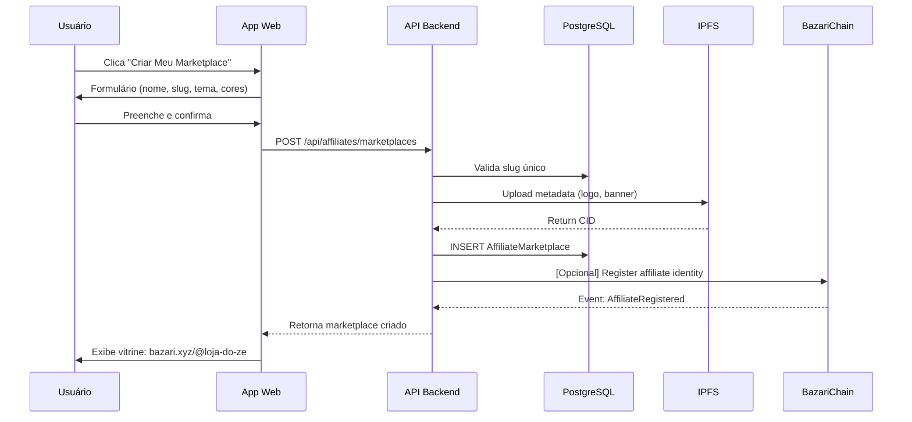
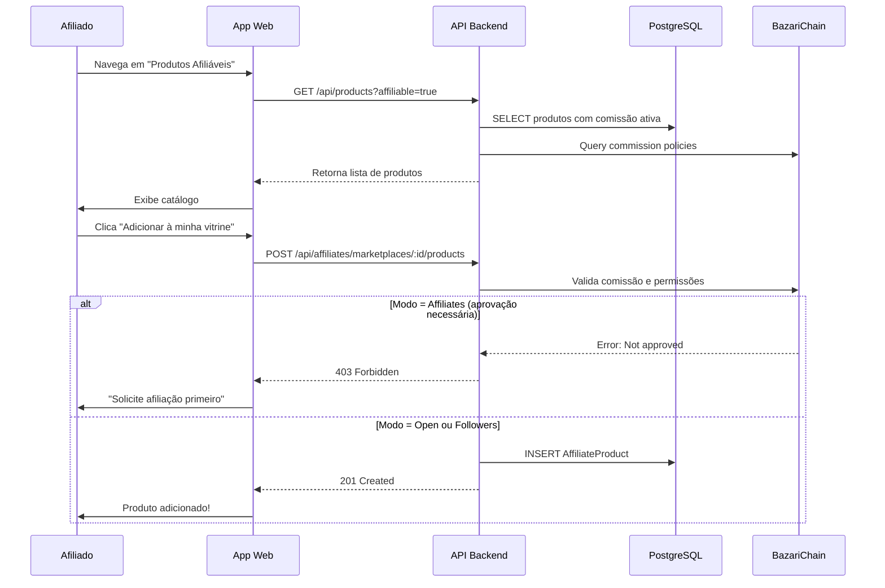
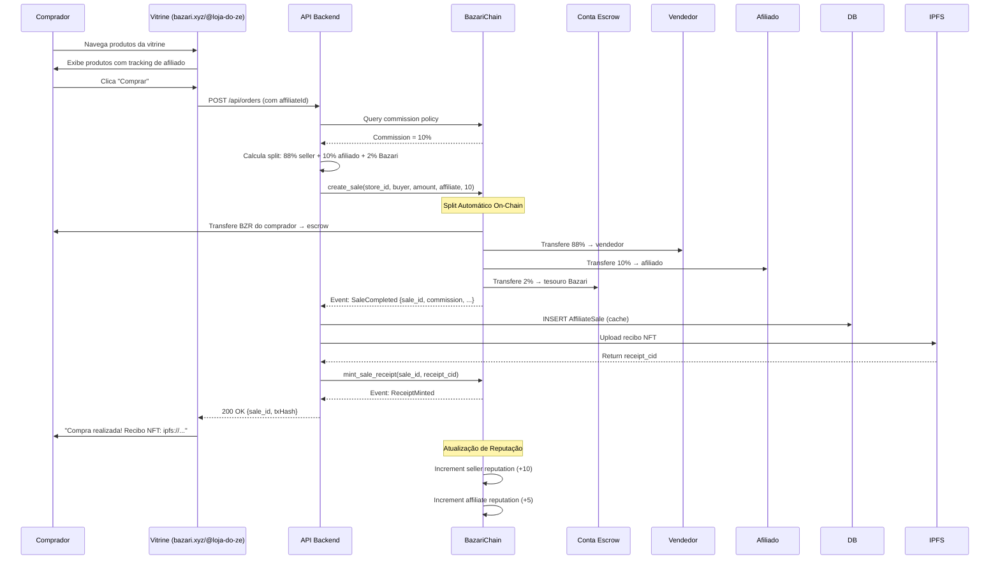
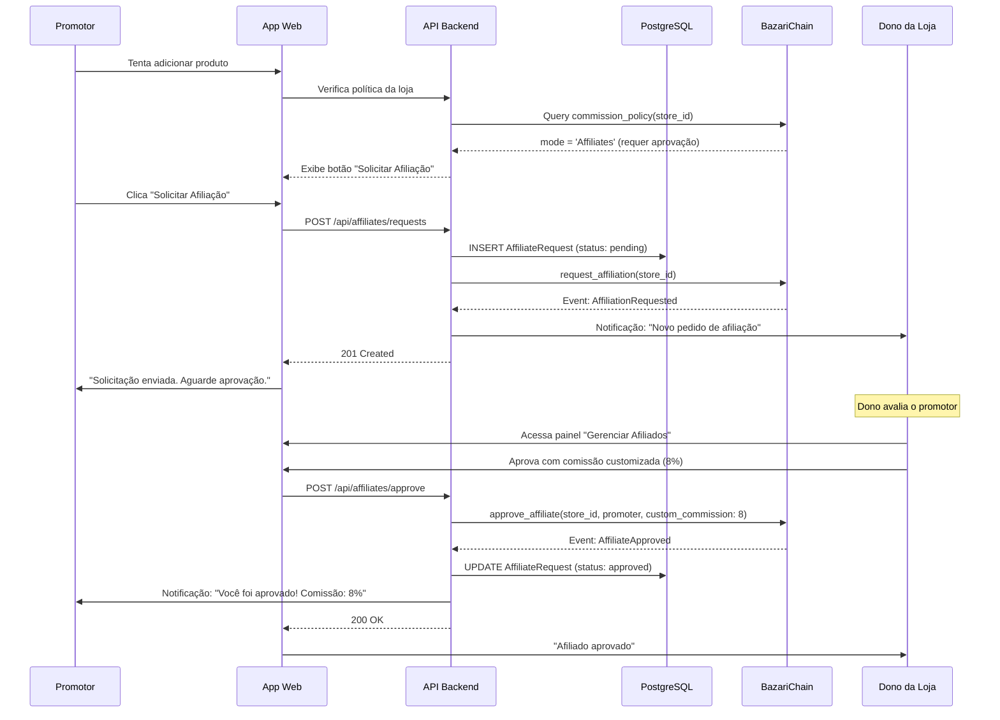

# 📋 Sistema de Marketplace do Afiliado - Especificação Funcional

**Versão**: 1.0.0
**Data**: 2025-10-15
**Arquitetura**: Híbrida Descentralizada (BazariChain + Apps/API)
**Repositórios**: `~/bazari-chain` (blockchain) + `~/bazari` (apps)

---

## 🎯 Visão Geral

### Conceito Central

Transformar cada cidadão em **dono do seu próprio marketplace personalizado**, onde pode:

- Criar sua própria vitrine com nome, URL e identidade visual própria
- Selecionar produtos de múltiplas lojas parceiras já cadastradas na Bazari
- Ganhar comissões automáticas em BZR por cada venda realizada
- Construir reputação on-chain como curador/promotor

**Diferencial**: Diferente de marketplaces centralizados (Shopee, Mercado Livre), cada afiliado tem **autonomia total**, **marca própria** e **participação direta na economia descentralizada**.

### Slogan

> "Cada pessoa, uma vitrine. Cada venda, um passo para a liberdade."

---

## 🏗️ Arquitetura Híbrida Descentralizada

### Camada 1: BazariChain (On-Chain)

**Responsabilidades:**
- ✅ Registro de afiliados (identidade descentralizada)
- ✅ Políticas de comissão por loja
- ✅ Split automático de pagamentos (lojista/afiliado/tesouro)
- ✅ Registro imutável de vendas (recibo NFT)
- ✅ Reputação de afiliados (score público)
- ✅ Eventos de venda para tracking

**Pallets Necessários:**
- `bazari-commerce` (NOVO) - Split de pagamentos e comissões
- `bazari-identity` (EXISTENTE) - Reputação de afiliados
- `stores` (EXISTENTE) - Lojas NFT

### Camada 2: Apps/API (Off-Chain)

**Responsabilidades:**
- ✅ Catálogo de produtos afiliáveis (PostgreSQL + IPFS)
- ✅ Vitrine personalizada do afiliado (layout, cores, logo)
- ✅ Sistema de busca e descoberta de produtos
- ✅ Analytics e estatísticas de vendas
- ✅ Notificações e comunicação (BazChat integrado)
- ✅ Cache de dados on-chain

**Tecnologias:**
- Backend: Fastify + Prisma + PostgreSQL
- Frontend: React + Vite + TypeScript + shadcn/ui
- Storage: IPFS (metadados) + S3 (imagens)
- Blockchain: Polkadot.js + BazariChain

### Camada 3: IPFS (Storage Descentralizado)

**Armazenamento:**
- Metadados da vitrine (nome, descrição, tema)
- Imagens de produtos
- Recibos NFT de vendas
- Avaliações e reviews

---

## 📊 Modelo de Dados

### 1. BazariChain (On-Chain)

#### Pallet: `bazari-commerce`

```rust
/// Política de comissão da loja
pub struct CommissionPolicy {
    pub mode: CommissionMode,
    pub percent: u8,              // 0-20%
    pub min_reputation: Option<i32>,
    pub daily_cap: Option<Balance>,
}

pub enum CommissionMode {
    Open,        // Qualquer um pode promover
    Followers,   // Apenas seguidores da loja
    Affiliates,  // Lista aprovada (requer aprovação manual)
}

/// Registro de afiliado aprovado
pub struct AffiliateApproval<AccountId> {
    pub store_id: u64,
    pub affiliate_id: AccountId,
    pub custom_commission: Option<u8>,
    pub monthly_cap: Option<Balance>,
    pub status: ApprovalStatus,
    pub approved_at: BlockNumber,
}

pub enum ApprovalStatus {
    Pending,
    Approved,
    Rejected,
    Suspended,
}

/// Registro de venda com split automático
pub struct Sale<AccountId, Balance, BlockNumber> {
    pub sale_id: u64,
    pub store_id: u64,
    pub buyer: AccountId,
    pub seller: AccountId,
    pub affiliate: Option<AccountId>,
    pub amount: Balance,
    pub commission_percent: u8,
    pub commission_amount: Balance,
    pub bazari_fee: Balance,
    pub seller_amount: Balance,
    pub status: SaleStatus,
    pub created_at: BlockNumber,
    pub receipt_cid: Option<Vec<u8>>,
}

pub enum SaleStatus {
    Pending,
    Completed,
    Disputed,
    Reversed,
}

/// Estatísticas de afiliado (on-chain)
pub struct AffiliateStats<Balance> {
    pub total_sales: u64,
    pub total_volume: Balance,
    pub total_commission: Balance,
    pub reputation_score: i32,
    pub trust_level: TrustLevel,
}

pub enum TrustLevel {
    None,
    Bronze,   // 10+ vendas, 90%+ feedback positivo
    Silver,   // 50+ vendas, 95%+ feedback positivo
    Gold,     // 200+ vendas, 98%+ feedback positivo
    Platinum, // 1000+ vendas, 99%+ feedback positivo
}
```

#### Storage

```rust
/// Políticas de comissão por loja
pub type CommissionPolicies<T> = StorageMap<_, Blake2_128Concat, u64, CommissionPolicy<T>>;

/// Afiliados aprovados
pub type AffiliateApprovals<T> = StorageDoubleMap<
    _,
    Blake2_128Concat, u64,           // store_id
    Blake2_128Concat, T::AccountId,  // affiliate_id
    AffiliateApproval<T::AccountId, T::BlockNumber>
>;

/// Registro de vendas
pub type Sales<T> = StorageMap<_, Blake2_128Concat, u64, Sale<T>>;

/// Estatísticas de afiliados
pub type AffiliateStatsMap<T> = StorageMap<_, Blake2_128Concat, T::AccountId, AffiliateStats<T>>;

/// Contador de vendas
pub type NextSaleId<T> = StorageValue<_, u64, ValueQuery>;
```

#### Extrinsics

```rust
#[pallet::call]
impl<T: Config> Pallet<T> {
    /// Definir política de comissão (apenas dono da loja)
    pub fn set_commission_policy(
        origin: OriginFor<T>,
        store_id: u64,
        mode: CommissionMode,
        percent: u8,
        min_reputation: Option<i32>,
        daily_cap: Option<BalanceOf<T>>,
    ) -> DispatchResult;

    /// Solicitar afiliação (modo 'Affiliates')
    pub fn request_affiliation(
        origin: OriginFor<T>,
        store_id: u64,
    ) -> DispatchResult;

    /// Aprovar afiliado (apenas dono da loja)
    pub fn approve_affiliate(
        origin: OriginFor<T>,
        store_id: u64,
        affiliate_id: T::AccountId,
        custom_commission: Option<u8>,
        monthly_cap: Option<BalanceOf<T>>,
    ) -> DispatchResult;

    /// Rejeitar afiliado
    pub fn reject_affiliate(
        origin: OriginFor<T>,
        store_id: u64,
        affiliate_id: T::AccountId,
    ) -> DispatchResult;

    /// Criar venda com split automático
    pub fn create_sale(
        origin: OriginFor<T>,
        store_id: u64,
        buyer: T::AccountId,
        amount: BalanceOf<T>,
        affiliate: Option<T::AccountId>,
        commission_percent: u8,
    ) -> DispatchResult;

    /// Mint recibo NFT
    pub fn mint_sale_receipt(
        origin: OriginFor<T>,
        sale_id: u64,
        receipt_cid: Vec<u8>,
    ) -> DispatchResult;

    /// Disputar venda
    pub fn dispute_sale(
        origin: OriginFor<T>,
        sale_id: u64,
        reason: Vec<u8>,
    ) -> DispatchResult;
}
```

#### Events

```rust
#[pallet::event]
pub enum Event<T: Config> {
    /// Política de comissão atualizada
    CommissionPolicySet {
        store_id: u64,
        mode: CommissionMode,
        percent: u8,
    },

    /// Solicitação de afiliação
    AffiliationRequested {
        store_id: u64,
        affiliate_id: T::AccountId,
    },

    /// Afiliado aprovado
    AffiliateApproved {
        store_id: u64,
        affiliate_id: T::AccountId,
        commission: u8,
    },

    /// Venda completada com split
    SaleCompleted {
        sale_id: u64,
        store_id: u64,
        buyer: T::AccountId,
        seller: T::AccountId,
        affiliate: Option<T::AccountId>,
        amount: BalanceOf<T>,
        commission: BalanceOf<T>,
        bazari_fee: BalanceOf<T>,
    },

    /// Recibo NFT mintado
    ReceiptMinted {
        sale_id: u64,
        receipt_cid: Vec<u8>,
    },

    /// Venda disputada
    SaleDisputed {
        sale_id: u64,
        disputer: T::AccountId,
        reason: Vec<u8>,
    },
}
```

### 2. Apps/API (Off-Chain)

#### Schema Prisma

```prisma
// Marketplace do Afiliado
model AffiliateMarketplace {
  id                String   @id @default(uuid())
  ownerId           String   // profileId do afiliado
  owner             Profile  @relation(fields: [ownerId], references: [id])

  // Branding
  name              String   // "Loja do Zé", "Vitrine da Maria"
  slug              String   @unique // "loja-do-ze", "vitrine-maria"
  description       String?  @db.Text
  logoUrl           String?
  bannerUrl         String?
  theme             String   @default("bazari") // bazari, night, sandstone, etc
  primaryColor      String?
  secondaryColor    String?

  // Metadados IPFS
  metadataCid       String?

  // Estatísticas (cache off-chain)
  totalSales        Int      @default(0)
  totalRevenue      Decimal  @default(0) @db.Decimal(20, 8)
  totalCommission   Decimal  @default(0) @db.Decimal(20, 8)
  productCount      Int      @default(0)

  // Status
  isActive          Boolean  @default(true)
  isPublic          Boolean  @default(true)

  createdAt         BigInt
  updatedAt         BigInt

  products          AffiliateProduct[]
  sales             AffiliateSale[]

  @@index([ownerId])
  @@index([slug])
  @@index([isActive, isPublic])
}

// Produtos adicionados ao marketplace do afiliado
model AffiliateProduct {
  id                String              @id @default(uuid())
  marketplaceId     String
  marketplace       AffiliateMarketplace @relation(fields: [marketplaceId], references: [id])

  // Produto original
  storeId           BigInt              // ID on-chain da loja
  productId         String              // ID do produto off-chain
  productName       String
  productImageUrl   String?
  productPrice      Decimal             @db.Decimal(20, 8)

  // Comissão
  commissionPercent Int                 // 0-20

  // Customizações do afiliado (opcional)
  customDescription String?             @db.Text
  customImageUrl    String?
  featured          Boolean             @default(false)

  // Tracking
  viewCount         Int                 @default(0)
  clickCount        Int                 @default(0)

  addedAt           BigInt
  updatedAt         BigInt

  @@unique([marketplaceId, storeId, productId])
  @@index([marketplaceId])
  @@index([storeId])
}

// Cache de vendas (sincronizado com on-chain)
model AffiliateSale {
  id                String              @id @default(uuid())
  onChainSaleId     BigInt              @unique // ID da venda on-chain

  marketplaceId     String?
  marketplace       AffiliateMarketplace? @relation(fields: [marketplaceId], references: [id])

  // Participantes
  storeId           BigInt
  buyerAddress      String
  sellerAddress     String
  affiliateAddress  String?

  // Valores
  amount            Decimal             @db.Decimal(20, 8)
  commissionPercent Int
  commissionAmount  Decimal             @db.Decimal(20, 8)
  bazariFee         Decimal             @db.Decimal(20, 8)
  sellerAmount      Decimal             @db.Decimal(20, 8)

  // Status
  status            String              // pending, completed, disputed, reversed
  txHash            String?

  // Recibo NFT
  receiptCid        String?

  createdAt         BigInt
  updatedAt         BigInt

  @@index([marketplaceId])
  @@index([storeId])
  @@index([affiliateAddress])
  @@index([status])
}

// Políticas de comissão (cache off-chain)
model StoreCommissionPolicy {
  id                String   @id @default(uuid())
  storeId           BigInt   @unique

  mode              String   // open, followers, affiliates
  percent           Int      // 0-20
  minReputation     Int?
  dailyCap          Decimal? @db.Decimal(20, 8)

  // Sincronização on-chain
  onChainSynced     Boolean  @default(false)
  lastSyncedAt      BigInt?

  createdAt         BigInt
  updatedAt         BigInt

  @@index([storeId, mode])
}

// Solicitações de afiliação (modo 'affiliates')
model AffiliateRequest {
  id                String   @id @default(uuid())
  storeId           BigInt
  affiliateId       String   // profileId
  affiliate         Profile  @relation(fields: [affiliateId], references: [id])

  status            String   @default("pending") // pending, approved, rejected
  message           String?  @db.Text

  // Configuração aprovada
  customCommission  Int?
  monthlyCap        Decimal? @db.Decimal(20, 8)

  requestedAt       BigInt
  approvedAt        BigInt?
  rejectedAt        BigInt?

  @@unique([storeId, affiliateId])
  @@index([affiliateId, status])
  @@index([storeId, status])
}

// Rankings e gamificação
model AffiliateRanking {
  id                String   @id @default(uuid())
  affiliateId       String   @unique
  affiliate         Profile  @relation(fields: [affiliateId], references: [id])

  // Período
  period            String   // weekly, monthly, all-time
  periodStart       BigInt
  periodEnd         BigInt

  // Métricas
  rank              Int
  totalSales        Int
  totalRevenue      Decimal  @db.Decimal(20, 8)
  totalCommission   Decimal  @db.Decimal(20, 8)

  // Badge
  badgeLevel        String?  // bronze, silver, gold, platinum

  createdAt         BigInt
  updatedAt         BigInt

  @@unique([affiliateId, period, periodStart])
  @@index([period, rank])
}
```

---

## 🔄 Fluxo de Funcionamento

### Fluxo 1: Criação do Marketplace Afiliado



### Fluxo 2: Adicionando Produtos à Vitrine



### Fluxo 3: Compra via Marketplace do Afiliado



### Fluxo 4: Solicitação de Afiliação (Modo 'Affiliates')



---

## 🎨 Interface do Usuário

### 1. Página Pública da Vitrine

**URL**: `bazari.xyz/@{slug}`

**Componentes:**
- Header personalizado (logo, nome, descrição)
- Grid de produtos (com imagens, preços, botão "Comprar")
- Footer com branding do afiliado
- Badge de confiança (bronze/silver/gold/platinum)
- Estatísticas públicas (vendas, avaliações)

**Exemplo:**
```
┌───────────────────────────────────────────┐
│  [Logo]  Loja do Zé                       │
│  "Os melhores produtos da quebrada"       │
│  ⭐ Afiliado Gold • 234 vendas            │
└───────────────────────────────────────────┘

┌─────────┐  ┌─────────┐  ┌─────────┐
│ Produto │  │ Produto │  │ Produto │
│  150 BZR│  │  89 BZR │  │  320 BZR│
│ [Comprar]│  │[Comprar]│  │[Comprar]│
└─────────┘  └─────────┘  └─────────┘

┌─────────┐  ┌─────────┐  ┌─────────┐
│ Produto │  │ Produto │  │ Produto │
│  75 BZR │  │  200 BZR│  │  45 BZR │
│ [Comprar]│  │[Comprar]│  │[Comprar]│
└─────────┘  └─────────┘  └─────────┘
```

### 2. Painel do Afiliado

**URL**: `/app/affiliate/dashboard`

**Seções:**
- **Visão Geral**: Vendas, comissões, visitantes
- **Meus Produtos**: Gerenciar produtos da vitrine
- **Adicionar Produtos**: Buscar produtos afiliáveis
- **Estatísticas**: Gráficos de vendas, top produtos
- **Configurações**: Editar nome, cores, logo
- **Afiliações**: Status de solicitações pendentes

**Exemplo:**
```
┌─────────────────────────────────────────────┐
│  Dashboard - Loja do Zé                     │
├─────────────────────────────────────────────┤
│  📊 Este Mês                                │
│  ┌──────────┐ ┌──────────┐ ┌──────────┐   │
│  │ 45 vendas│ │ 1.2k BZR │ │ 120 BZR  │   │
│  │          │ │ volume   │ │ comissão │   │
│  └──────────┘ └──────────┘ └──────────┘   │
├─────────────────────────────────────────────┤
│  🏆 Ranking                                 │
│  Você está em #23 dos afiliados do mês     │
│  Badge atual: 🥈 Silver                     │
├─────────────────────────────────────────────┤
│  📦 Produtos (12)                           │
│  [+ Adicionar Produtos]                     │
│  ┌──────────────────────────────────────┐  │
│  │ Produto A - 15 vendas - 45 BZR      │  │
│  │ Produto B - 8 vendas - 32 BZR       │  │
│  │ Produto C - 22 vendas - 110 BZR     │  │
│  └──────────────────────────────────────┘  │
└─────────────────────────────────────────────┘
```

### 3. Painel do Lojista (Gerenciar Afiliados)

**URL**: `/app/seller/affiliates`

**Seções:**
- **Política de Comissão**: Definir modo (open/followers/affiliates) e %
- **Solicitações Pendentes**: Aprovar/Rejeitar afiliados
- **Afiliados Ativos**: Ver performance, suspender, editar comissão
- **Top Afiliados**: Ranking por vendas

**Exemplo:**
```
┌─────────────────────────────────────────────┐
│  Gerenciar Afiliados - Minha Loja          │
├─────────────────────────────────────────────┤
│  ⚙️ Política de Comissão                    │
│  Modo: ○ Aberto  ○ Seguidores  ● Afiliados │
│  Comissão padrão: [10] %                    │
│  Reputação mínima: [50]                     │
│  [Salvar Configurações]                     │
├─────────────────────────────────────────────┤
│  📬 Solicitações Pendentes (3)              │
│  ┌──────────────────────────────────────┐  │
│  │ @maria_promotora                     │  │
│  │ Reputação: 120 • 45 vendas           │  │
│  │ [Aprovar] [Rejeitar]                 │  │
│  └──────────────────────────────────────┘  │
│  ┌──────────────────────────────────────┐  │
│  │ @joao_afiliado                       │  │
│  │ Reputação: 85 • 28 vendas            │  │
│  │ [Aprovar] [Rejeitar]                 │  │
│  └──────────────────────────────────────┘  │
├─────────────────────────────────────────────┤
│  ✅ Afiliados Ativos (12)                   │
│  ┌──────────────────────────────────────┐  │
│  │ @ana_vendas - 10% comissão           │  │
│  │ 89 vendas • 4.5k BZR gerados         │  │
│  │ [Editar] [Suspender]                 │  │
│  └──────────────────────────────────────┘  │
└─────────────────────────────────────────────┘
```

---

## 📡 API Endpoints

### Afiliados (Promotores)

#### `POST /api/affiliates/marketplaces`
Criar marketplace do afiliado

**Body:**
```json
{
  "name": "Loja do Zé",
  "slug": "loja-do-ze",
  "description": "Os melhores produtos da quebrada",
  "theme": "bazari",
  "primaryColor": "#D84315",
  "secondaryColor": "#FFB300"
}
```

**Response:**
```json
{
  "id": "uuid",
  "name": "Loja do Zé",
  "slug": "loja-do-ze",
  "url": "https://bazari.xyz/@loja-do-ze",
  "createdAt": 1697328000000
}
```

#### `GET /api/affiliates/marketplaces/:slug`
Obter marketplace público

#### `PUT /api/affiliates/marketplaces/:id`
Atualizar marketplace

#### `POST /api/affiliates/marketplaces/:id/products`
Adicionar produto à vitrine

**Body:**
```json
{
  "storeId": 123,
  "productId": "prod-abc-123",
  "customDescription": "Descrição customizada (opcional)",
  "featured": false
}
```

#### `DELETE /api/affiliates/marketplaces/:id/products/:productId`
Remover produto da vitrine

#### `GET /api/affiliates/marketplaces/:id/analytics`
Obter estatísticas do marketplace

**Response:**
```json
{
  "period": "monthly",
  "sales": 45,
  "revenue": "1250.50",
  "commission": "125.05",
  "visitors": 1234,
  "conversionRate": 3.6,
  "topProducts": [
    {
      "productId": "prod-1",
      "name": "Produto A",
      "sales": 15,
      "commission": "45.00"
    }
  ]
}
```

#### `POST /api/affiliates/requests`
Solicitar afiliação a uma loja

**Body:**
```json
{
  "storeId": 123,
  "message": "Olá! Gostaria de promover seus produtos."
}
```

#### `GET /api/affiliates/requests/me`
Listar minhas solicitações de afiliação

### Lojistas (Donos de Loja)

#### `POST /api/stores/:id/commission-policy`
Definir política de comissão

**Body:**
```json
{
  "mode": "affiliates",
  "percent": 10,
  "minReputation": 50,
  "dailyCap": "1000.00"
}
```

#### `GET /api/stores/:id/affiliates`
Listar afiliados da loja

**Query:**
- `status=pending|approved|rejected`

#### `POST /api/stores/:id/affiliates/approve`
Aprovar afiliado

**Body:**
```json
{
  "affiliateId": "profile-id",
  "customCommission": 8,
  "monthlyCap": "5000.00"
}
```

#### `POST /api/stores/:id/affiliates/reject`
Rejeitar afiliado

#### `PUT /api/stores/:id/affiliates/:affiliateId`
Atualizar configuração de afiliado

### Produtos

#### `GET /api/products?affiliable=true`
Listar produtos afiliáveis

**Query:**
- `category`
- `minCommission`
- `maxCommission`
- `storeId`

**Response:**
```json
{
  "products": [
    {
      "id": "prod-1",
      "storeId": 123,
      "storeName": "Loja Oficial",
      "name": "Produto A",
      "price": "150.00",
      "imageUrl": "ipfs://...",
      "commission": {
        "mode": "open",
        "percent": 10
      }
    }
  ]
}
```

### Rankings

#### `GET /api/affiliates/rankings`
Obter ranking de afiliados

**Query:**
- `period=weekly|monthly|all-time`
- `limit=10`

**Response:**
```json
{
  "period": "monthly",
  "rankings": [
    {
      "rank": 1,
      "affiliateId": "profile-1",
      "handle": "@ana_vendas",
      "sales": 234,
      "revenue": "12500.00",
      "commission": "1250.00",
      "badgeLevel": "gold"
    }
  ]
}
```

---

## ⚙️ Implementação na BazariChain

### Pallet: `bazari-commerce`

**Localização**: `~/bazari-chain/pallets/bazari-commerce/src/lib.rs`

**Tamanho Estimado**: ~600 linhas

**Implementação:**

```rust
// Import necessários
use frame_support::{
    decl_error, decl_event, decl_module, decl_storage,
    dispatch::DispatchResult,
    ensure,
    traits::{Currency, ExistenceRequirement, Get},
};
use frame_system::ensure_signed;
use sp_runtime::traits::Zero;
use sp_std::vec::Vec;

// Configuração do pallet
pub trait Config: frame_system::Config + pallet_stores::Config {
    type Event: From<Event<Self>> + Into<<Self as frame_system::Config>::Event>;
    type Currency: Currency<Self::AccountId>;
    type BazariFeePercent: Get<u8>;
    type TreasuryAccount: Get<Self::AccountId>;
}

// Storage - já definido acima

// Implementação dos extrinsics
decl_module! {
    pub struct Module<T: Config> for enum Call where origin: T::Origin {
        fn deposit_event() = default;

        /// Definir política de comissão
        #[weight = 10_000]
        pub fn set_commission_policy(
            origin,
            store_id: u64,
            mode: CommissionMode,
            percent: u8,
            min_reputation: Option<i32>,
            daily_cap: Option<BalanceOf<T>>,
        ) -> DispatchResult {
            let owner = ensure_signed(origin)?;

            // Verificar ownership da loja
            ensure!(
                pallet_stores::Module::<T>::is_store_owner(store_id, &owner),
                Error::<T>::NotStoreOwner
            );

            // Validar comissão (máx 20%)
            ensure!(percent <= 20, Error::<T>::CommissionTooHigh);

            let policy = CommissionPolicy {
                mode: mode.clone(),
                percent,
                min_reputation,
                daily_cap,
            };

            CommissionPolicies::<T>::insert(store_id, policy);

            Self::deposit_event(RawEvent::CommissionPolicySet(
                store_id,
                mode,
                percent,
            ));

            Ok(())
        }

        /// Solicitar afiliação
        #[weight = 10_000]
        pub fn request_affiliation(
            origin,
            store_id: u64,
        ) -> DispatchResult {
            let affiliate = ensure_signed(origin)?;

            // Verificar se loja existe
            ensure!(
                pallet_stores::Stores::<T>::contains_key(store_id),
                Error::<T>::StoreNotFound
            );

            // Verificar política
            let policy = CommissionPolicies::<T>::get(store_id)
                .ok_or(Error::<T>::CommissionPolicyNotSet)?;

            ensure!(
                policy.mode == CommissionMode::Affiliates,
                Error::<T>::AffiliationNotRequired
            );

            // Criar solicitação
            let approval = AffiliateApproval {
                store_id,
                affiliate_id: affiliate.clone(),
                custom_commission: None,
                monthly_cap: None,
                status: ApprovalStatus::Pending,
                approved_at: Zero::zero(),
            };

            AffiliateApprovals::<T>::insert(store_id, affiliate.clone(), approval);

            Self::deposit_event(RawEvent::AffiliationRequested(
                store_id,
                affiliate,
            ));

            Ok(())
        }

        /// Aprovar afiliado
        #[weight = 10_000]
        pub fn approve_affiliate(
            origin,
            store_id: u64,
            affiliate_id: T::AccountId,
            custom_commission: Option<u8>,
            monthly_cap: Option<BalanceOf<T>>,
        ) -> DispatchResult {
            let owner = ensure_signed(origin)?;

            // Verificar ownership
            ensure!(
                pallet_stores::Module::<T>::is_store_owner(store_id, &owner),
                Error::<T>::NotStoreOwner
            );

            // Validar comissão customizada
            if let Some(commission) = custom_commission {
                ensure!(commission <= 20, Error::<T>::CommissionTooHigh);
            }

            // Atualizar status
            AffiliateApprovals::<T>::try_mutate(
                store_id,
                affiliate_id.clone(),
                |maybe_approval| -> DispatchResult {
                    let approval = maybe_approval.as_mut()
                        .ok_or(Error::<T>::AffiliationNotFound)?;

                    approval.status = ApprovalStatus::Approved;
                    approval.custom_commission = custom_commission;
                    approval.monthly_cap = monthly_cap;
                    approval.approved_at = <frame_system::Module<T>>::block_number();

                    Ok(())
                }
            )?;

            let commission = custom_commission.unwrap_or_else(|| {
                CommissionPolicies::<T>::get(store_id)
                    .map(|p| p.percent)
                    .unwrap_or(0)
            });

            Self::deposit_event(RawEvent::AffiliateApproved(
                store_id,
                affiliate_id,
                commission,
            ));

            Ok(())
        }

        /// Criar venda com split automático
        #[weight = 10_000]
        pub fn create_sale(
            origin,
            store_id: u64,
            buyer: T::AccountId,
            amount: BalanceOf<T>,
            affiliate: Option<T::AccountId>,
            commission_percent: u8,
        ) -> DispatchResult {
            let _seller = ensure_signed(origin)?;

            // Validações
            ensure!(!amount.is_zero(), Error::<T>::InvalidAmount);
            ensure!(commission_percent <= 20, Error::<T>::CommissionTooHigh);

            // Buscar loja
            let store = pallet_stores::Stores::<T>::get(store_id)
                .ok_or(Error::<T>::StoreNotFound)?;

            let seller = store.owner;

            // Calcular split
            let commission = amount * commission_percent.into() / 100u32.into();
            let bazari_fee = amount * T::BazariFeePercent::get().into() / 100u32.into();
            let seller_amount = amount - commission - bazari_fee;

            // Transferir fundos
            T::Currency::transfer(
                &buyer,
                &seller,
                seller_amount,
                ExistenceRequirement::KeepAlive,
            )?;

            if let Some(affiliate_acc) = affiliate.clone() {
                T::Currency::transfer(
                    &buyer,
                    &affiliate_acc,
                    commission,
                    ExistenceRequirement::KeepAlive,
                )?;
            }

            T::Currency::transfer(
                &buyer,
                &T::TreasuryAccount::get(),
                bazari_fee,
                ExistenceRequirement::KeepAlive,
            )?;

            // Registrar venda
            let sale_id = NextSaleId::<T>::get();
            let sale = Sale {
                sale_id,
                store_id,
                buyer: buyer.clone(),
                seller: seller.clone(),
                affiliate: affiliate.clone(),
                amount,
                commission_percent,
                commission_amount: commission,
                bazari_fee,
                seller_amount,
                status: SaleStatus::Completed,
                created_at: <frame_system::Module<T>>::block_number(),
                receipt_cid: None,
            };

            Sales::<T>::insert(sale_id, sale);
            NextSaleId::<T>::put(sale_id + 1);

            // Atualizar estatísticas de afiliado
            if let Some(affiliate_acc) = affiliate.clone() {
                AffiliateStatsMap::<T>::mutate(&affiliate_acc, |stats| {
                    stats.total_sales += 1;
                    stats.total_volume += amount;
                    stats.total_commission += commission;
                });
            }

            // Incrementar reputação
            // TODO: Integrar com pallet_bazari_identity

            Self::deposit_event(RawEvent::SaleCompleted(
                sale_id,
                store_id,
                buyer,
                seller,
                affiliate,
                amount,
                commission,
                bazari_fee,
            ));

            Ok(())
        }

        /// Mint recibo NFT
        #[weight = 10_000]
        pub fn mint_sale_receipt(
            origin,
            sale_id: u64,
            receipt_cid: Vec<u8>,
        ) -> DispatchResult {
            // Apenas origem autorizada (backend)
            // TODO: Implementar EnsureOrigin customizado

            Sales::<T>::try_mutate(sale_id, |maybe_sale| -> DispatchResult {
                let sale = maybe_sale.as_mut()
                    .ok_or(Error::<T>::SaleNotFound)?;

                sale.receipt_cid = Some(receipt_cid.clone());
                Ok(())
            })?;

            Self::deposit_event(RawEvent::ReceiptMinted(
                sale_id,
                receipt_cid,
            ));

            Ok(())
        }

        /// Disputar venda
        #[weight = 10_000]
        pub fn dispute_sale(
            origin,
            sale_id: u64,
            reason: Vec<u8>,
        ) -> DispatchResult {
            let disputer = ensure_signed(origin)?;

            Sales::<T>::try_mutate(sale_id, |maybe_sale| -> DispatchResult {
                let sale = maybe_sale.as_mut()
                    .ok_or(Error::<T>::SaleNotFound)?;

                // Apenas buyer ou seller
                ensure!(
                    disputer == sale.buyer || disputer == sale.seller,
                    Error::<T>::NotAuthorized
                );

                sale.status = SaleStatus::Disputed;
                Ok(())
            })?;

            Self::deposit_event(RawEvent::SaleDisputed(
                sale_id,
                disputer,
                reason,
            ));

            Ok(())
        }
    }
}

// Erros
decl_error! {
    pub enum Error for Module<T: Config> {
        CommissionTooHigh,
        NotStoreOwner,
        StoreNotFound,
        SaleNotFound,
        NotAuthorized,
        InvalidAmount,
        CommissionPolicyNotSet,
        AffiliationNotRequired,
        AffiliationNotFound,
        InsufficientBalance,
    }
}

// Events - já definido acima
```

### Integração no Runtime

**Arquivo**: `~/bazari-chain/runtime/src/lib.rs`

```rust
// Adicionar configuração do pallet
impl bazari_commerce::Config for Runtime {
    type Event = Event;
    type Currency = Balances;
    type BazariFeePercent = BazariFeePercent;
    type TreasuryAccount = TreasuryAccount;
}

// Adicionar ao construct_runtime!
construct_runtime!(
    pub enum Runtime where
        Block = Block,
        NodeBlock = opaque::Block,
        UncheckedExtrinsic = UncheckedExtrinsic
    {
        // ... outros pallets
        Stores: pallet_stores,
        BazariIdentity: pallet_bazari_identity,
        BazariCommerce: bazari_commerce, // NOVO
    }
);

// Constantes
parameter_types! {
    pub const BazariFeePercent: u8 = 2; // 2%
    pub const TreasuryAccount: AccountId = AccountId::from([0u8; 32]); // Placeholder
}
```

---

## 🧪 Testes

### Testes Unitários (BazariChain)

**Arquivo**: `~/bazari-chain/pallets/bazari-commerce/src/tests.rs`

```rust
#[test]
fn set_commission_policy_works() {
    new_test_ext().execute_with(|| {
        // Criar loja
        let store_id = 1;
        let owner = account(1);

        // Definir política
        assert_ok!(BazariCommerce::set_commission_policy(
            Origin::signed(owner),
            store_id,
            CommissionMode::Open,
            10,
            None,
            None,
        ));

        // Verificar storage
        let policy = CommissionPolicies::<Test>::get(store_id).unwrap();
        assert_eq!(policy.percent, 10);
        assert_eq!(policy.mode, CommissionMode::Open);

        // Verificar evento
        assert!(System::events().iter().any(|e| {
            matches!(e.event, Event::BazariCommerce(
                RawEvent::CommissionPolicySet(1, CommissionMode::Open, 10)
            ))
        }));
    });
}

#[test]
fn create_sale_with_split_works() {
    new_test_ext().execute_with(|| {
        let store_id = 1;
        let buyer = account(1);
        let seller = account(2);
        let affiliate = account(3);
        let amount = 1000;

        // Configurar saldos
        let _ = Balances::deposit_creating(&buyer, 10000);

        // Criar venda
        assert_ok!(BazariCommerce::create_sale(
            Origin::signed(seller),
            store_id,
            buyer.clone(),
            amount,
            Some(affiliate.clone()),
            10, // 10% comissão
        ));

        // Verificar split
        // Seller: 880 (88%)
        // Affiliate: 100 (10%)
        // Treasury: 20 (2%)
        assert_eq!(Balances::free_balance(&seller), 880);
        assert_eq!(Balances::free_balance(&affiliate), 100);
        assert_eq!(Balances::free_balance(&TreasuryAccount::get()), 20);

        // Verificar venda registrada
        let sale = Sales::<Test>::get(1).unwrap();
        assert_eq!(sale.amount, amount);
        assert_eq!(sale.commission_amount, 100);
        assert_eq!(sale.status, SaleStatus::Completed);
    });
}

#[test]
fn affiliate_approval_workflow() {
    new_test_ext().execute_with(|| {
        let store_id = 1;
        let owner = account(1);
        let affiliate = account(2);

        // Definir política (modo Affiliates)
        assert_ok!(BazariCommerce::set_commission_policy(
            Origin::signed(owner),
            store_id,
            CommissionMode::Affiliates,
            10,
            None,
            None,
        ));

        // Solicitar afiliação
        assert_ok!(BazariCommerce::request_affiliation(
            Origin::signed(affiliate.clone()),
            store_id,
        ));

        // Verificar status pendente
        let approval = AffiliateApprovals::<Test>::get(store_id, affiliate.clone()).unwrap();
        assert_eq!(approval.status, ApprovalStatus::Pending);

        // Aprovar afiliado
        assert_ok!(BazariCommerce::approve_affiliate(
            Origin::signed(owner),
            store_id,
            affiliate.clone(),
            Some(8), // Comissão customizada
            None,
        ));

        // Verificar aprovação
        let approval = AffiliateApprovals::<Test>::get(store_id, affiliate).unwrap();
        assert_eq!(approval.status, ApprovalStatus::Approved);
        assert_eq!(approval.custom_commission, Some(8));
    });
}

#[test]
fn commission_too_high_fails() {
    new_test_ext().execute_with(|| {
        let store_id = 1;
        let owner = account(1);

        // Tentar definir comissão > 20%
        assert_noop!(
            BazariCommerce::set_commission_policy(
                Origin::signed(owner),
                store_id,
                CommissionMode::Open,
                25, // ERRO: > 20%
                None,
                None,
            ),
            Error::<Test>::CommissionTooHigh
        );
    });
}
```

### Testes E2E (Apps/API)

**Arquivo**: `~/bazari/apps/api/src/__tests__/affiliates.test.ts`

```typescript
import { test } from 'tap';
import { buildServer } from '../server';

test('Criar marketplace do afiliado', async (t) => {
  const app = await buildServer();

  const response = await app.inject({
    method: 'POST',
    url: '/api/affiliates/marketplaces',
    headers: {
      authorization: 'Bearer valid-token',
    },
    payload: {
      name: 'Loja do Teste',
      slug: 'loja-teste',
      description: 'Marketplace de teste',
      theme: 'bazari',
    },
  });

  t.equal(response.statusCode, 201);
  const body = JSON.parse(response.body);
  t.ok(body.id);
  t.equal(body.slug, 'loja-teste');
  t.match(body.url, /bazari\.xyz\/@loja-teste/);
});

test('Adicionar produto à vitrine', async (t) => {
  const app = await buildServer();

  // Criar marketplace primeiro
  const marketplace = await createTestMarketplace(app);

  const response = await app.inject({
    method: 'POST',
    url: `/api/affiliates/marketplaces/${marketplace.id}/products`,
    headers: {
      authorization: 'Bearer valid-token',
    },
    payload: {
      storeId: 123,
      productId: 'prod-abc',
      featured: true,
    },
  });

  t.equal(response.statusCode, 201);
  const body = JSON.parse(response.body);
  t.equal(body.storeId, 123);
  t.equal(body.productId, 'prod-abc');
});

test('Fluxo completo de venda com afiliado', async (t) => {
  const app = await buildServer();

  // Setup
  const marketplace = await createTestMarketplace(app);
  const product = await addProductToMarketplace(app, marketplace.id);

  // Simular compra
  const response = await app.inject({
    method: 'POST',
    url: '/api/orders',
    headers: {
      authorization: 'Bearer buyer-token',
    },
    payload: {
      storeId: 123,
      productId: product.productId,
      affiliateId: marketplace.ownerId,
      amount: '1000',
    },
  });

  t.equal(response.statusCode, 201);
  const order = JSON.parse(response.body);

  // Verificar split
  t.equal(order.sellerAmount, '880'); // 88%
  t.equal(order.commissionAmount, '100'); // 10%
  t.equal(order.bazariFee, '20'); // 2%

  // Verificar venda registrada
  const sale = await app.inject({
    method: 'GET',
    url: `/api/affiliates/marketplaces/${marketplace.id}/sales/${order.saleId}`,
    headers: {
      authorization: 'Bearer valid-token',
    },
  });

  t.equal(sale.statusCode, 200);
  const saleData = JSON.parse(sale.body);
  t.equal(saleData.status, 'completed');
});

test('Solicitar afiliação - modo Affiliates', async (t) => {
  const app = await buildServer();

  // Loja com modo 'affiliates'
  const storeId = 123;

  const response = await app.inject({
    method: 'POST',
    url: '/api/affiliates/requests',
    headers: {
      authorization: 'Bearer affiliate-token',
    },
    payload: {
      storeId,
      message: 'Gostaria de promover seus produtos',
    },
  });

  t.equal(response.statusCode, 201);
  const request = JSON.parse(response.body);
  t.equal(request.status, 'pending');
  t.equal(request.storeId, storeId);
});

test('Aprovar afiliado', async (t) => {
  const app = await buildServer();

  const storeId = 123;
  const requestId = 'req-abc';

  const response = await app.inject({
    method: 'POST',
    url: `/api/stores/${storeId}/affiliates/approve`,
    headers: {
      authorization: 'Bearer store-owner-token',
    },
    payload: {
      requestId,
      customCommission: 8,
      monthlyCap: '5000',
    },
  });

  t.equal(response.statusCode, 200);
  const approval = JSON.parse(response.body);
  t.equal(approval.status, 'approved');
  t.equal(approval.customCommission, 8);
});
```

---

## 📈 Modelo Econômico

### Fluxo de Valor (BZR)

```
Cliente paga 1000 BZR
          │
          ├─ 880 BZR (88%) → Vendedor/Lojista
          ├─ 100 BZR (10%) → Afiliado/Promotor
          └─  20 BZR (2%)  → Tesouro Bazari
```

### Taxas e Comissões

| Participante | Percentual | Configurável? |
|-------------|-----------|---------------|
| **Vendedor** | 88-98% | Não (depende da comissão) |
| **Afiliado** | 0-20% | Sim (lojista define) |
| **Bazari** | 2% | Não (fixo) |

**Regras:**
- Comissão mínima: 0% (loja sem afiliados)
- Comissão máxima: 20%
- Taxa Bazari: 2% (fixa, não negociável)
- Total: seller% + affiliate% + 2% = 100%

### Cenários de Comissão

#### Cenário 1: Modo Open (Comissão 10%)
- Qualquer pessoa pode promover
- Compra de 1000 BZR:
  - Vendedor: 880 BZR
  - Afiliado: 100 BZR
  - Bazari: 20 BZR

#### Cenário 2: Modo Affiliates (Comissão customizada 8%)
- Apenas afiliados aprovados
- Compra de 1000 BZR:
  - Vendedor: 900 BZR
  - Afiliado: 80 BZR
  - Bazari: 20 BZR

#### Cenário 3: Venda direta (sem afiliado)
- Compra de 1000 BZR:
  - Vendedor: 980 BZR
  - Bazari: 20 BZR

### Incentivos de Crescimento

#### Para Afiliados:
- ✅ Comissões automáticas em BZR
- ✅ Reputação on-chain (ranking público)
- ✅ Badges de confiança (Bronze/Silver/Gold/Platinum)
- ✅ Autonomia total (marca própria)
- ✅ Sem custo de entrada

#### Para Lojistas:
- ✅ Marketing distribuído (exército de promotores)
- ✅ Custo de aquisição zero (paga apenas por venda)
- ✅ Controle total (aprovar afiliados, definir comissões)
- ✅ Aumento de visibilidade orgânica

#### Para o Ecossistema:
- ✅ Crescimento viral (efeito de rede geométrico)
- ✅ Circulação de BZR (economia real)
- ✅ Descentralização de poder (cada pessoa é dono)
- ✅ Sustentabilidade (taxa de 2% mantém infraestrutura)

---

## 🎮 Gamificação e Ranking

### Sistema de Badges

| Badge | Critérios | Benefícios |
|-------|----------|-----------|
| **Bronze** | 10+ vendas, 90%+ feedback positivo | Badge no perfil |
| **Silver** | 50+ vendas, 95%+ feedback positivo | Badge + prioridade em destaque |
| **Gold** | 200+ vendas, 98%+ feedback positivo | Badge + comissões maiores disponíveis |
| **Platinum** | 1000+ vendas, 99%+ feedback positivo | Badge + acesso a produtos exclusivos |

### Ranking Mensal

**Critérios de ordenação:**
1. Volume de vendas (BZR)
2. Quantidade de vendas
3. Taxa de conversão
4. Avaliação média

**Prêmios:**
- Top 10: Destaque na homepage
- Top 3: Bônus em BZR (do tesouro)
- Top 1: Selo especial "Afiliado do Mês"

### Missões (Fase 5 - Futuro)

**Exemplos:**
- "Primeira venda": +50 BZR
- "10 vendas em um mês": +200 BZR
- "Compartilhar produto no WhatsApp": +10 BZR
- "Receber avaliação 5 estrelas": +25 BZR

---

## 🚀 Roadmap de Implementação

### Fase 1: MVP Básico (4-6 semanas)

**Blockchain:**
- [ ] Implementar pallet `bazari-commerce`
- [ ] Extrinsics: `set_commission_policy`, `create_sale`
- [ ] Storage e eventos
- [ ] Testes unitários
- [ ] Integração no runtime

**Backend:**
- [ ] Schema Prisma (AffiliateMarketplace, AffiliateProduct)
- [ ] Endpoints: criar marketplace, adicionar produtos
- [ ] Serviço de integração com blockchain
- [ ] Worker de sincronização de eventos

**Frontend:**
- [ ] Página pública da vitrine (/@slug)
- [ ] Painel do afiliado (dashboard)
- [ ] Busca de produtos afiliáveis
- [ ] Checkout com tracking de afiliado

**Funcionalidades:**
- ✅ Criar marketplace personalizado
- ✅ Adicionar produtos à vitrine (modo Open)
- ✅ Compra com split automático on-chain
- ✅ Estatísticas básicas

### Fase 2: Aprovação de Afiliados (2-3 semanas)

**Blockchain:**
- [ ] Extrinsics: `request_affiliation`, `approve_affiliate`
- [ ] Storage: `AffiliateApprovals`

**Backend:**
- [ ] Tabela `AffiliateRequest`
- [ ] Endpoints: solicitar, aprovar, rejeitar

**Frontend:**
- [ ] Painel do lojista (gerenciar afiliados)
- [ ] Fluxo de solicitação de afiliação
- [ ] Notificações de aprovação/rejeição

**Funcionalidades:**
- ✅ Modo "Affiliates" (aprovação manual)
- ✅ Comissões customizadas por afiliado
- ✅ Limites mensais

### Fase 3: Gamificação e Ranking (2-3 semanas)

**Blockchain:**
- [ ] Estender `bazari-identity` (TrustBadge)
- [ ] Storage: `AffiliateStatsMap`

**Backend:**
- [ ] Tabela `AffiliateRanking`
- [ ] Worker de cálculo de rankings
- [ ] Endpoints de rankings e badges

**Frontend:**
- [ ] Página de rankings
- [ ] Badges no perfil
- [ ] Conquistas e progresso

**Funcionalidades:**
- ✅ Badges automáticos (Bronze/Silver/Gold/Platinum)
- ✅ Ranking mensal
- ✅ Estatísticas públicas

### Fase 4: Avançado (4-6 semanas)

**Funcionalidades:**
- ✅ Recibo NFT de vendas (IPFS)
- ✅ Sistema de disputas
- ✅ Analytics avançado (gráficos, conversão)
- ✅ Integração com WhatsApp (compartilhar vitrine)
- ✅ Integração com BazChat (vender via chat)
- ✅ Modo "Followers" (comissão para seguidores)

### Fase 5: Monetização Avançada (Futuro)

**Pallet `bazari-rewards`:**
- ✅ Cashback LIVO
- ✅ Missões on-chain
- ✅ Subafiliados (2 níveis)

### Fase 6: Tokenização (Futuro)

**Funcionalidades:**
- ✅ NFT do marketplace (transferível)
- ✅ Royalties on-chain
- ✅ Venda do marketplace

---

## 🔐 Segurança e Governança

### Prevenção de Abuso

**Dumping de comissões:**
- Limite máximo: 20%
- Validação on-chain

**Spam de afiliados:**
- Modo "Affiliates" (aprovação manual)
- Reputação mínima configurável

**Marketplaces de baixa qualidade:**
- Sistema de avaliação pública
- Denúncias descentralizadas (Fase 7)

**Disputas:**
- Extrinsic `dispute_sale`
- Sistema de votação DAO-light (futuro)

### Governança

**Parâmetros ajustáveis:**
- Taxa Bazari (via governança on-chain)
- Limites de comissão
- Critérios de badges

**Moderação:**
- Denúncias descentralizadas (pallet `bazari-moderation`)
- Votação por reputação
- Penalidades automáticas

---

## 📊 Métricas de Sucesso

### KPIs Principais

**Crescimento:**
- Número de marketplaces criados
- Taxa de conversão (visitante → comprador)
- Crescimento mês a mês

**Engajamento:**
- Produtos adicionados por afiliado
- Vendas por afiliado
- Taxa de retenção

**Economia:**
- Volume total transacionado (BZR)
- Comissões pagas aos afiliados
- Circulação de BZR

**Social:**
- Reputação média dos afiliados
- Taxa de aprovação de solicitações
- Número de badges emitidos

### Metas (12 meses)

- **1000** marketplaces ativos
- **50000** vendas via afiliados
- **1M BZR** em comissões pagas
- **100** afiliados com badge Gold ou superior

---

## 🌍 Impacto Social

### Democratização do Comércio

- ✅ Qualquer pessoa pode ter seu próprio marketplace
- ✅ Sem necessidade de estoque ou capital inicial
- ✅ Renda descentralizada (sem intermediários)

### Economia Popular

- ✅ Circulação local de BZR
- ✅ Empreendedorismo acessível
- ✅ Recompensa por engajamento comunitário

### Descentralização de Poder

- ✅ Controle total sobre a marca própria
- ✅ Autonomia nas decisões (curadoria)
- ✅ Participação direta na economia on-chain

---

## 📝 Conclusão

O **Sistema de Marketplace do Afiliado** é uma das funcionalidades mais estratégicas e transformadoras do ecossistema Bazari. Ele:

1. **Cria um exército descentralizado de promotores** que divulgam produtos organicamente
2. **Gera crescimento viral** sem custo de mídia paga
3. **Aumenta a demanda por BZR** (moeda circulante real)
4. **Reforça o propósito social** de dar poder econômico ao povo
5. **É tecnicamente viável** com a arquitetura híbrida descentralizada existente

### Próximos Passos

1. **Aprovar especificação** com stakeholders
2. **Iniciar Fase 1** (MVP Básico)
3. **Implementar pallet `bazari-commerce`** (blockchain)
4. **Desenvolver backend e frontend** em paralelo
5. **Testar em testnet** antes de deploy em produção
6. **Lançar MVP** para primeiros usuários beta
7. **Iterar** baseado em feedback

---

**Versão**: 1.0.0
**Autores**: Equipe Bazari
**Última atualização**: 2025-10-15

---

**"Cada pessoa, uma vitrine. Cada venda, um passo para a liberdade."**
