# 📋 Governance - Análise Completa de Pendências de Implementação

## 🎯 Objetivo

Este documento mapeia **TODAS** as pendências necessárias para implementar o fluxo correto de governança no frontend, respeitando as regras do runtime sem usar sudo.

---

## 📊 Status Atual por Tipo de Proposta

### ✅ DEMOCRACY - Funcionando Corretamente

**Status**: ✅ **COMPLETO**

**Fluxo Implementado**:
1. ✅ Frontend: Formulário de criação (`/app/governance/proposals/new`)
2. ✅ Backend: `POST /api/governance/democracy/propose`
3. ✅ Blockchain: `democracy.propose()` - Qualquer usuário pode criar
4. ✅ Apoio: Usuários podem dar "second" na proposta
5. ✅ Referendum: Transição automática após LaunchPeriod
6. ✅ Votação: Frontend permite votar Aye/Nay com conviction

**Telas Existentes**:
- ✅ `/app/governance/proposals/new?type=democracy` - Criar proposta
- ✅ `/app/governance/proposals/democracy/:id` - Detalhes
- ✅ Modal de votação implementado

**Nada a fazer** - Democracy está completo.

---

### 🔴 TREASURY - NÃO IMPLEMENTADO CORRETAMENTE

**Status**: ❌ **BLOQUEADO - REQUER IMPLEMENTAÇÃO COMPLETA**

#### Problema Atual

```typescript
// ❌ NÃO FUNCIONA: Endpoint tenta chamar spendLocal diretamente
POST /api/governance/treasury/propose
→ api.tx.treasury.spendLocal()
→ Erro: BadOrigin (nenhuma conta pode chamar diretamente)
```

#### Fluxo CORRETO Necessário

```mermaid
sequenceDiagram
    participant User as Usuário
    participant FE as Frontend
    participant API as Backend API
    participant DB as Database
    participant Council as Council Member
    participant Chain as Blockchain

    User->>FE: Cria solicitação de fundos
    FE->>API: POST /api/governance/treasury/request
    API->>DB: Salva request (status: PENDING_REVIEW)
    API-->>FE: { requestId: 123 }
    FE-->>User: "Solicitação enviada para análise do Council"

    Council->>FE: Acessa painel de requests pendentes
    FE->>API: GET /api/governance/treasury/requests?status=pending
    API->>DB: Lista requests pendentes
    API-->>FE: [ { id: 123, title, value, beneficiary } ]

    Council->>FE: Clica "Criar Motion para Aprovar"
    FE->>Chain: council.propose(spendLocal(value, beneficiary))
    Chain-->>FE: Motion criado (hash: 0xabc...)
    FE->>API: POST /api/governance/treasury/requests/123/link-motion
    API->>DB: Atualiza request { motionHash: 0xabc, status: IN_VOTING }

    Council->>FE: Outros members votam no motion
    FE->>Chain: council.vote(hash, index, aye/nay)

    Council->>FE: Threshold atingido, fecha motion
    FE->>Chain: council.close(hash, index, ...)
    Chain-->>Chain: Executa spendLocal automaticamente
    Chain-->>Chain: Emite treasury.SpendApproved

    API->>Chain: Escuta evento SpendApproved
    API->>DB: Atualiza request { status: APPROVED, spendId }
```



---

## 🛠️ PENDÊNCIAS DETALHADAS - TREASURY

### 1. 🗄️ DATABASE - Novas Tabelas

#### Tabela: `governance_treasury_requests`

```sql
CREATE TABLE governance_treasury_requests (
  id SERIAL PRIMARY KEY,

  -- Dados da solicitação
  title VARCHAR(255) NOT NULL,
  description TEXT NOT NULL,
  value NUMERIC(30, 0) NOT NULL, -- em planck
  beneficiary VARCHAR(66) NOT NULL,
  proposer VARCHAR(66) NOT NULL,

  -- Status e tracking
  status VARCHAR(50) NOT NULL DEFAULT 'PENDING_REVIEW',
  -- Status possíveis:
  -- PENDING_REVIEW: Aguardando council analisar
  -- REJECTED: Council rejeitou (motion voted NAY)
  -- IN_VOTING: Motion criado, aguardando votos
  -- APPROVED: Motion aprovado, spend executado
  -- PAID_OUT: Pagamento realizado

  -- Linkagem com blockchain
  council_motion_hash VARCHAR(66), -- Hash do motion criado
  council_motion_index INTEGER,    -- Índice do motion
  spend_id INTEGER,                -- ID do spend aprovado
  tx_hash VARCHAR(66),             -- Hash da tx de aprovação
  block_number INTEGER,            -- Bloco de aprovação

  -- Metadados
  created_at TIMESTAMP NOT NULL DEFAULT NOW(),
  reviewed_at TIMESTAMP,
  approved_at TIMESTAMP,
  paid_out_at TIMESTAMP,

  -- Assinatura para validação
  signature TEXT NOT NULL,

  -- Índices
  INDEX idx_status (status),
  INDEX idx_proposer (proposer),
  INDEX idx_motion_hash (council_motion_hash),
  INDEX idx_created_at (created_at DESC)
);
```

#### Tabela: `governance_council_votes`

```sql
CREATE TABLE governance_council_votes (
  id SERIAL PRIMARY KEY,

  motion_hash VARCHAR(66) NOT NULL,
  motion_index INTEGER NOT NULL,
  voter VARCHAR(66) NOT NULL,
  vote BOOLEAN NOT NULL, -- true = aye, false = nay

  tx_hash VARCHAR(66) NOT NULL,
  block_number INTEGER NOT NULL,
  timestamp TIMESTAMP NOT NULL DEFAULT NOW(),

  UNIQUE(motion_hash, voter),
  INDEX idx_motion (motion_hash, motion_index)
);
```

---

### 2. 🔌 BACKEND API - Novos Endpoints

#### Endpoint 1: Criar Solicitação de Fundos

```typescript
/**
 * POST /api/governance/treasury/requests
 *
 * Cria uma solicitação de fundos que será analisada pelo Council.
 * NÃO cria proposta on-chain ainda.
 */
app.post('/api/governance/treasury/requests', {
  onRequest: authOnRequest,
  schema: {
    body: {
      type: 'object',
      required: ['title', 'description', 'value', 'beneficiary', 'signature'],
      properties: {
        title: { type: 'string', minLength: 1, maxLength: 255 },
        description: { type: 'string', minLength: 1, maxLength: 5000 },
        value: { type: 'string' }, // em planck ou BZR
        beneficiary: { type: 'string' },
        signature: { type: 'string' },
      }
    }
  }
}, async (request, reply) => {
  const { title, description, value, beneficiary, signature } = request.body;
  const authUser = (request as any).authUser;

  // 1. Validar assinatura
  const messageData = JSON.stringify({ type: 'treasury', title, description, value, beneficiary, proposer: authUser.address });
  if (!GovernanceService.verifySignature(messageData, signature, authUser.address)) {
    return reply.status(400).send({ success: false, error: 'Invalid signature' });
  }

  // 2. Converter valor para planck se necessário
  const valueInPlanck = value.includes('.')
    ? BigInt(parseFloat(value) * 1e12).toString()
    : value;

  // 3. Salvar no banco de dados
  const result = await prisma.governanceTreasuryRequest.create({
    data: {
      title,
      description,
      value: valueInPlanck,
      beneficiary,
      proposer: authUser.address,
      status: 'PENDING_REVIEW',
      signature,
    }
  });

  return reply.status(201).send({
    success: true,
    data: {
      id: result.id,
      title: result.title,
      description: result.description,
      value: result.value,
      beneficiary: result.beneficiary,
      status: result.status,
      createdAt: result.createdAt,
    },
    message: 'Treasury request created successfully. Council will review it.'
  });
});
```

#### Endpoint 2: Listar Solicitações Pendentes

```typescript
/**
 * GET /api/governance/treasury/requests
 *
 * Lista solicitações de fundos com filtros.
 */
app.get('/api/governance/treasury/requests', {
  schema: {
    querystring: {
      type: 'object',
      properties: {
        status: { type: 'string' },
        proposer: { type: 'string' },
        limit: { type: 'number', default: 50 },
        offset: { type: 'number', default: 0 },
      }
    }
  }
}, async (request, reply) => {
  const { status, proposer, limit, offset } = request.query;

  const where: any = {};
  if (status) where.status = status;
  if (proposer) where.proposer = proposer;

  const [requests, total] = await Promise.all([
    prisma.governanceTreasuryRequest.findMany({
      where,
      orderBy: { createdAt: 'desc' },
      take: limit,
      skip: offset,
    }),
    prisma.governanceTreasuryRequest.count({ where }),
  ]);

  return reply.send({
    success: true,
    data: requests,
    pagination: {
      total,
      limit,
      offset,
      hasMore: offset + requests.length < total,
    }
  });
});
```

#### Endpoint 3: Detalhes de uma Solicitação

```typescript
/**
 * GET /api/governance/treasury/requests/:id
 */
app.get('/api/governance/treasury/requests/:id', async (request, reply) => {
  const { id } = request.params;

  const request = await prisma.governanceTreasuryRequest.findUnique({
    where: { id: parseInt(id) }
  });

  if (!request) {
    return reply.status(404).send({ success: false, error: 'Request not found' });
  }

  // Se tem motion associado, buscar votos
  let votes = [];
  if (request.councilMotionHash) {
    votes = await prisma.governanceCouncilVote.findMany({
      where: { motionHash: request.councilMotionHash },
      orderBy: { timestamp: 'asc' }
    });
  }

  return reply.send({
    success: true,
    data: {
      ...request,
      votes,
    }
  });
});
```

#### Endpoint 4: Linkar Motion ao Request

```typescript
/**
 * POST /api/governance/treasury/requests/:id/link-motion
 *
 * Após council member criar motion on-chain, linkamos ao request.
 */
app.post('/api/governance/treasury/requests/:id/link-motion', {
  onRequest: authOnRequest,
  schema: {
    body: {
      type: 'object',
      required: ['motionHash', 'motionIndex'],
      properties: {
        motionHash: { type: 'string' },
        motionIndex: { type: 'number' },
        txHash: { type: 'string' },
        blockNumber: { type: 'number' },
      }
    }
  }
}, async (request, reply) => {
  const { id } = request.params;
  const { motionHash, motionIndex, txHash, blockNumber } = request.body;
  const authUser = (request as any).authUser;

  // 1. Verificar se usuário é council member
  const api = await getSubstrateApi();
  const councilMembers = await api.query.council.members();
  const isMember = councilMembers.some((m: any) => m.toString() === authUser.address);

  if (!isMember) {
    return reply.status(403).send({
      success: false,
      error: 'Only council members can link motions'
    });
  }

  // 2. Atualizar request
  const updated = await prisma.governanceTreasuryRequest.update({
    where: { id: parseInt(id) },
    data: {
      councilMotionHash: motionHash,
      councilMotionIndex: motionIndex,
      status: 'IN_VOTING',
      reviewedAt: new Date(),
    }
  });

  return reply.send({
    success: true,
    data: updated,
    message: 'Motion linked successfully'
  });
});
```

#### Endpoint 5: Registrar Voto do Council

```typescript
/**
 * POST /api/governance/council/votes
 *
 * Registra voto de council member após tx on-chain.
 */
app.post('/api/governance/council/votes', {
  onRequest: authOnRequest,
  schema: {
    body: {
      type: 'object',
      required: ['motionHash', 'motionIndex', 'vote', 'txHash', 'blockNumber'],
      properties: {
        motionHash: { type: 'string' },
        motionIndex: { type: 'number' },
        vote: { type: 'boolean' },
        txHash: { type: 'string' },
        blockNumber: { type: 'number' },
      }
    }
  }
}, async (request, reply) => {
  const { motionHash, motionIndex, vote, txHash, blockNumber } = request.body;
  const authUser = (request as any).authUser;

  // Salvar voto
  const voteRecord = await prisma.governanceCouncilVote.create({
    data: {
      motionHash,
      motionIndex,
      voter: authUser.address,
      vote,
      txHash,
      blockNumber,
    }
  });

  return reply.status(201).send({
    success: true,
    data: voteRecord
  });
});
```

---

### 3. 🎨 FRONTEND - Novas Telas e Componentes

#### Tela 1: Criar Solicitação de Fundos

**Arquivo**: `/apps/web/src/modules/governance/pages/CreateTreasuryRequestPage.tsx`

```tsx
/**
 * Tela para usuários comuns criarem solicitações de fundos.
 * NÃO cria proposta on-chain, apenas salva no banco.
 */
export function CreateTreasuryRequestPage() {
  const [formData, setFormData] = useState({
    title: '',
    description: '',
    value: '',
    beneficiary: '',
  });

  const handleSubmit = async () => {
    // 1. Assinar dados com wallet do usuário
    const signature = await signMessage(JSON.stringify(formData));

    // 2. Enviar para backend
    const response = await fetch('/api/governance/treasury/requests', {
      method: 'POST',
      headers: { 'Content-Type': 'application/json' },
      body: JSON.stringify({ ...formData, signature }),
    });

    if (response.ok) {
      toast.success('Solicitação enviada para análise do Council!');
      navigate('/app/governance/treasury/requests');
    }
  };

  return (
    <Card>
      <CardHeader>
        <CardTitle>Solicitar Fundos do Tesouro</CardTitle>
        <p className="text-muted-foreground">
          Sua solicitação será analisada pelo Council. Se aprovada,
          os fundos serão transferidos após o período de pagamento.
        </p>
      </CardHeader>
      <CardContent>
        <form onSubmit={handleSubmit}>
          <Input
            label="Título"
            value={formData.title}
            onChange={(e) => setFormData({...formData, title: e.target.value})}
          />
          <Textarea
            label="Descrição Detalhada"
            placeholder="Explique como os fundos serão utilizados..."
            value={formData.description}
            onChange={(e) => setFormData({...formData, description: e.target.value})}
          />
          <Input
            label="Valor (BZR)"
            type="number"
            value={formData.value}
            onChange={(e) => setFormData({...formData, value: e.target.value})}
          />
          <Input
            label="Beneficiário (Endereço)"
            value={formData.beneficiary}
            onChange={(e) => setFormData({...formData, beneficiary: e.target.value})}
          />
          <Button type="submit">Enviar Solicitação</Button>
        </form>
      </CardContent>
    </Card>
  );
}
```

#### Tela 2: Painel de Solicitações Pendentes (Council)

**Arquivo**: `/apps/web/src/modules/governance/pages/TreasuryRequestsPage.tsx`

```tsx
/**
 * Lista todas as solicitações de fundos.
 * Council members podem criar motions para aprovar.
 */
export function TreasuryRequestsPage() {
  const [requests, setRequests] = useState([]);
  const [filter, setFilter] = useState('PENDING_REVIEW');
  const { isCouncilMember } = useCouncilStatus();

  useEffect(() => {
    fetch(`/api/governance/treasury/requests?status=${filter}`)
      .then(res => res.json())
      .then(data => setRequests(data.data));
  }, [filter]);

  return (
    <div>
      <h1>Solicitações de Fundos do Tesouro</h1>

      {/* Filtros */}
      <Tabs value={filter} onValueChange={setFilter}>
        <TabsList>
          <TabsTrigger value="PENDING_REVIEW">
            Pendentes ({requests.filter(r => r.status === 'PENDING_REVIEW').length})
          </TabsTrigger>
          <TabsTrigger value="IN_VOTING">
            Em Votação ({requests.filter(r => r.status === 'IN_VOTING').length})
          </TabsTrigger>
          <TabsTrigger value="APPROVED">
            Aprovadas ({requests.filter(r => r.status === 'APPROVED').length})
          </TabsTrigger>
          <TabsTrigger value="REJECTED">
            Rejeitadas ({requests.filter(r => r.status === 'REJECTED').length})
          </TabsTrigger>
        </TabsList>
      </Tabs>

      {/* Lista de Requests */}
      <div className="grid gap-4 mt-6">
        {requests.map(request => (
          <TreasuryRequestCard
            key={request.id}
            request={request}
            isCouncilMember={isCouncilMember}
          />
        ))}
      </div>
    </div>
  );
}
```

#### Componente: Card de Solicitação

**Arquivo**: `/apps/web/src/modules/governance/components/TreasuryRequestCard.tsx`

```tsx
export function TreasuryRequestCard({ request, isCouncilMember }) {
  const [showCreateMotion, setShowCreateMotion] = useState(false);

  return (
    <Card>
      <CardHeader>
        <div className="flex items-start justify-between">
          <div>
            <CardTitle>{request.title}</CardTitle>
            <p className="text-sm text-muted-foreground">
              Por {shortenAddress(request.proposer)} • {formatDate(request.createdAt)}
            </p>
          </div>
          <StatusBadge status={request.status} />
        </div>
      </CardHeader>
      <CardContent>
        <p className="mb-4">{request.description}</p>

        <div className="grid grid-cols-2 gap-4 text-sm">
          <div>
            <span className="font-medium">Valor:</span> {formatBalance(request.value)} BZR
          </div>
          <div>
            <span className="font-medium">Beneficiário:</span> {shortenAddress(request.beneficiary)}
          </div>
        </div>

        {/* Actions para Council */}
        {isCouncilMember && request.status === 'PENDING_REVIEW' && (
          <div className="mt-4 flex gap-2">
            <Button onClick={() => setShowCreateMotion(true)}>
              <CheckCircle className="mr-2 h-4 w-4" />
              Criar Motion para Aprovar
            </Button>
            <Button variant="outline">
              <XCircle className="mr-2 h-4 w-4" />
              Rejeitar
            </Button>
          </div>
        )}

        {/* Link para motion se existir */}
        {request.councilMotionHash && (
          <div className="mt-4">
            <Link to={`/app/governance/council/motions/${request.councilMotionHash}`}>
              <Button variant="outline" size="sm">
                <ExternalLink className="mr-2 h-4 w-4" />
                Ver Motion no Council
              </Button>
            </Link>
          </div>
        )}
      </CardContent>

      {/* Modal para criar motion */}
      {showCreateMotion && (
        <CreateMotionModal
          request={request}
          onClose={() => setShowCreateMotion(false)}
        />
      )}
    </Card>
  );
}
```

#### Modal: Criar Motion

**Arquivo**: `/apps/web/src/modules/governance/components/CreateMotionModal.tsx`

```tsx
/**
 * Modal para council member criar motion on-chain.
 */
export function CreateMotionModal({ request, onClose }) {
  const [loading, setLoading] = useState(false);
  const { api } = usePolkadotApi();
  const { account } = useVaultAccounts();

  const handleCreateMotion = async () => {
    setLoading(true);

    try {
      // 1. Criar call para spendLocal
      const value = api.createType('Balance', request.value);
      const spendCall = api.tx.treasury.spendLocal(value, request.beneficiary);

      // 2. Criar motion do council
      const threshold = 4; // Ou buscar de config
      const proposeTx = api.tx.council.propose(
        threshold,
        spendCall,
        spendCall.encodedLength
      );

      // 3. Assinar e enviar
      const result = await new Promise((resolve, reject) => {
        let motionHash = null;
        let motionIndex = null;
        let txHash = null;
        let blockNumber = null;

        proposeTx.signAndSend(account.pair, ({ status, events, txHash: hash }) => {
          if (status.isInBlock) {
            txHash = hash.toHex();

            events.forEach(({ event }) => {
              if (event.section === 'council' && event.method === 'Proposed') {
                motionHash = event.data[2].toHex();
                motionIndex = event.data[1].toNumber();
              }
            });
          }

          if (status.isFinalized) {
            api.rpc.chain.getHeader(status.asFinalized).then(header => {
              blockNumber = header.number.toNumber();
              resolve({ motionHash, motionIndex, txHash, blockNumber });
            });
          }
        }).catch(reject);
      });

      // 4. Linkar motion ao request no backend
      await fetch(`/api/governance/treasury/requests/${request.id}/link-motion`, {
        method: 'POST',
        headers: { 'Content-Type': 'application/json' },
        body: JSON.stringify(result),
      });

      toast.success('Motion criado com sucesso!');
      onClose();
    } catch (error) {
      toast.error('Erro ao criar motion: ' + error.message);
    } finally {
      setLoading(false);
    }
  };

  return (
    <Dialog open onOpenChange={onClose}>
      <DialogContent>
        <DialogHeader>
          <DialogTitle>Criar Motion para Aprovar</DialogTitle>
        </DialogHeader>

        <div className="space-y-4">
          <Alert>
            <AlertDescription>
              Você está criando um motion do Council para aprovar esta solicitação.
              Será necessário {4} votos para aprovação.
            </AlertDescription>
          </Alert>

          <div className="space-y-2">
            <p><strong>Título:</strong> {request.title}</p>
            <p><strong>Valor:</strong> {formatBalance(request.value)} BZR</p>
            <p><strong>Beneficiário:</strong> {request.beneficiary}</p>
          </div>

          <div className="flex gap-2">
            <Button onClick={handleCreateMotion} disabled={loading}>
              {loading ? 'Criando...' : 'Confirmar e Criar Motion'}
            </Button>
            <Button variant="outline" onClick={onClose}>Cancelar</Button>
          </div>
        </div>
      </DialogContent>
    </Dialog>
  );
}
```

#### Tela 3: Detalhes do Motion (Council)

**Arquivo**: `/apps/web/src/modules/governance/pages/CouncilMotionDetailPage.tsx`

```tsx
/**
 * Mostra detalhes de um motion do council.
 * Permite members votarem.
 */
export function CouncilMotionDetailPage() {
  const { hash } = useParams();
  const [motion, setMotion] = useState(null);
  const [votes, setVotes] = useState([]);
  const [treasuryRequest, setTreasuryRequest] = useState(null);
  const { isCouncilMember, account } = useCouncilStatus();

  useEffect(() => {
    // Buscar dados do motion on-chain
    fetchMotionFromChain(hash).then(setMotion);

    // Buscar votos do banco
    fetch(`/api/governance/council/votes?motionHash=${hash}`)
      .then(res => res.json())
      .then(data => setVotes(data.data));

    // Buscar treasury request associado
    fetch(`/api/governance/treasury/requests?motionHash=${hash}`)
      .then(res => res.json())
      .then(data => setTreasuryRequest(data.data[0]));
  }, [hash]);

  const handleVote = async (aye: boolean) => {
    // 1. Votar on-chain
    const voteTx = api.tx.council.vote(hash, motion.index, aye);
    const result = await voteTx.signAndSend(account.pair);

    // 2. Registrar voto no backend
    await fetch('/api/governance/council/votes', {
      method: 'POST',
      body: JSON.stringify({
        motionHash: hash,
        motionIndex: motion.index,
        vote: aye,
        txHash: result.txHash,
        blockNumber: result.blockNumber,
      })
    });

    toast.success('Voto registrado!');
  };

  return (
    <div>
      <h1>Council Motion #{motion?.index}</h1>

      {/* Contexto do Treasury Request */}
      {treasuryRequest && (
        <Card className="mb-6">
          <CardHeader>
            <CardTitle>Solicitação de Fundos</CardTitle>
          </CardHeader>
          <CardContent>
            <p><strong>{treasuryRequest.title}</strong></p>
            <p className="text-sm text-muted-foreground">{treasuryRequest.description}</p>
            <p className="mt-2">
              <strong>Valor:</strong> {formatBalance(treasuryRequest.value)} BZR
            </p>
          </CardContent>
        </Card>
      )}

      {/* Status da Votação */}
      <Card>
        <CardHeader>
          <CardTitle>Votação do Council</CardTitle>
        </CardHeader>
        <CardContent>
          <div className="mb-4">
            <p>Threshold: {motion.threshold}</p>
            <p>Votos Aye: {votes.filter(v => v.vote).length}</p>
            <p>Votos Nay: {votes.filter(v => !v.vote).length}</p>
          </div>

          {/* Lista de Votos */}
          <div className="space-y-2">
            {votes.map(vote => (
              <div key={vote.voter} className="flex items-center justify-between">
                <span>{shortenAddress(vote.voter)}</span>
                <Badge variant={vote.vote ? 'success' : 'destructive'}>
                  {vote.vote ? 'AYE' : 'NAY'}
                </Badge>
              </div>
            ))}
          </div>

          {/* Actions */}
          {isCouncilMember && !votes.some(v => v.voter === account.address) && (
            <div className="flex gap-2 mt-4">
              <Button onClick={() => handleVote(true)}>
                <ThumbsUp className="mr-2 h-4 w-4" />
                Votar AYE
              </Button>
              <Button variant="outline" onClick={() => handleVote(false)}>
                <ThumbsDown className="mr-2 h-4 w-4" />
                Votar NAY
              </Button>
            </div>
          )}

          {/* Close Motion */}
          {votes.filter(v => v.vote).length >= motion.threshold && (
            <Button onClick={handleCloseMotion} className="w-full mt-4">
              Fechar e Executar Motion
            </Button>
          )}
        </CardContent>
      </Card>
    </div>
  );
}
```

---

### 4. 🎣 FRONTEND - Novos Hooks

#### Hook: useCouncilStatus

**Arquivo**: `/apps/web/src/modules/governance/hooks/useCouncilStatus.ts`

```typescript
/**
 * Hook para verificar se usuário atual é council member.
 */
export function useCouncilStatus() {
  const { account } = useVaultAccounts();
  const [isCouncilMember, setIsCouncilMember] = useState(false);
  const [councilMembers, setCouncilMembers] = useState<string[]>([]);

  useEffect(() => {
    if (!account) return;

    // Buscar members do council
    fetch('/api/governance/council/members')
      .then(res => res.json())
      .then(data => {
        setCouncilMembers(data.data);
        setIsCouncilMember(data.data.includes(account.address));
      });
  }, [account]);

  return { isCouncilMember, councilMembers };
}
```

---

### 5. 🔄 BACKEND - Event Listener (Opcional mas Recomendado)

**Arquivo**: `/apps/api/src/services/governance/governance-listener.ts`

```typescript
/**
 * Escuta eventos da blockchain e atualiza banco de dados.
 */
export class GovernanceListener {
  private api: ApiPromise;

  async start() {
    this.api = await getSubstrateApi();

    // Escutar aprovações de treasury
    this.api.query.system.events((events) => {
      events.forEach((record) => {
        const { event } = record;

        // Treasury spend aprovado
        if (event.section === 'treasury' && event.method === 'SpendApproved') {
          const spendId = event.data[0].toNumber();
          const amount = event.data[1].toString();
          const beneficiary = event.data[2].toString();

          this.handleSpendApproved(spendId, amount, beneficiary);
        }

        // Council motion executado
        if (event.section === 'council' && event.method === 'Executed') {
          const motionHash = event.data[0].toHex();
          const result = event.data[1];

          this.handleMotionExecuted(motionHash, result.isOk);
        }
      });
    });
  }

  private async handleSpendApproved(spendId: number, amount: string, beneficiary: string) {
    // Atualizar request correspondente
    await prisma.governanceTreasuryRequest.updateMany({
      where: { beneficiary, value: amount, status: 'IN_VOTING' },
      data: {
        status: 'APPROVED',
        spendId,
        approvedAt: new Date(),
      }
    });
  }

  private async handleMotionExecuted(motionHash: string, success: boolean) {
    // Atualizar request correspondente
    await prisma.governanceTreasuryRequest.updateMany({
      where: { councilMotionHash: motionHash },
      data: {
        status: success ? 'APPROVED' : 'REJECTED',
      }
    });
  }
}
```

---

## 📝 RESUMO DAS PENDÊNCIAS

### Database
- [ ] Criar tabela `governance_treasury_requests`
- [ ] Criar tabela `governance_council_votes`
- [ ] Criar migration Prisma

### Backend API (5 endpoints)
- [ ] `POST /api/governance/treasury/requests` - Criar solicitação
- [ ] `GET /api/governance/treasury/requests` - Listar solicitações
- [ ] `GET /api/governance/treasury/requests/:id` - Detalhes
- [ ] `POST /api/governance/treasury/requests/:id/link-motion` - Linkar motion
- [ ] `POST /api/governance/council/votes` - Registrar voto
- [ ] Event Listener (opcional)

### Frontend (3 páginas + 3 componentes)
**Páginas**:
- [ ] `CreateTreasuryRequestPage` - Criar solicitação
- [ ] `TreasuryRequestsPage` - Listar solicitações
- [ ] `CouncilMotionDetailPage` - Detalhes do motion

**Componentes**:
- [ ] `TreasuryRequestCard` - Card de solicitação
- [ ] `CreateMotionModal` - Modal para criar motion
- [ ] `CouncilVoteButton` - Botão de voto

**Hooks**:
- [ ] `useCouncilStatus` - Verificar se é council member
- [ ] `useTreasuryRequests` - Buscar solicitações
- [ ] `useCouncilMotion` - Buscar motion on-chain

### Rotas
- [ ] `/app/governance/treasury/request/new` - Criar solicitação
- [ ] `/app/governance/treasury/requests` - Listar
- [ ] `/app/governance/treasury/requests/:id` - Detalhes
- [ ] `/app/governance/council/motions/:hash` - Motion detail

---

## 🚀 PLANO DE IMPLEMENTAÇÃO SUGERIDO

### Fase 1: Backend (2-3 dias)
1. Criar migrations do banco
2. Implementar 5 endpoints da API
3. Testar com Postman/curl

### Fase 2: Frontend Core (3-4 dias)
1. Criar página de solicitação
2. Criar página de listagem
3. Implementar hook useCouncilStatus

### Fase 3: Council Interface (2-3 dias)
1. Modal de criar motion
2. Página de votação
3. Integração com blockchain

### Fase 4: Event Listener (1-2 dias)
1. Implementar listener de eventos
2. Testar sincronização automática

### Fase 5: Testes E2E (2 dias)
1. Testar fluxo completo
2. Corrigir bugs
3. Deploy

**Total Estimado**: 10-14 dias de desenvolvimento

---

## ✅ VALIDAÇÃO DO FLUXO CORRETO

```bash
# 1. Usuário cria solicitação
POST /api/governance/treasury/requests
→ Salvo no DB com status PENDING_REVIEW

# 2. Council member vê lista
GET /api/governance/treasury/requests?status=PENDING_REVIEW
→ Retorna request #123

# 3. Council member cria motion on-chain
api.tx.council.propose(4, spendCall, len).signAndSend()
→ Evento: council.Proposed
→ POST /api/governance/treasury/requests/123/link-motion
→ DB: status = IN_VOTING

# 4. Outros members votam
api.tx.council.vote(hash, index, true).signAndSend()
→ POST /api/governance/council/votes
→ DB: voto registrado

# 5. Threshold atingido, alguém fecha
api.tx.council.close(hash, index, ...).signAndSend()
→ Evento: council.Executed
→ Evento: treasury.SpendApproved
→ Listener atualiza DB: status = APPROVED

# ✅ FLUXO COMPLETO SEM USAR SUDO
```

---

**CONCLUSÃO**:
- Treasury requer **implementação completa** com ~15 arquivos novos
- Não há atalho que respeite as regras de governança
- Alternativa: Configurar SpendOrigin no runtime para aceitar outro mecanismo
