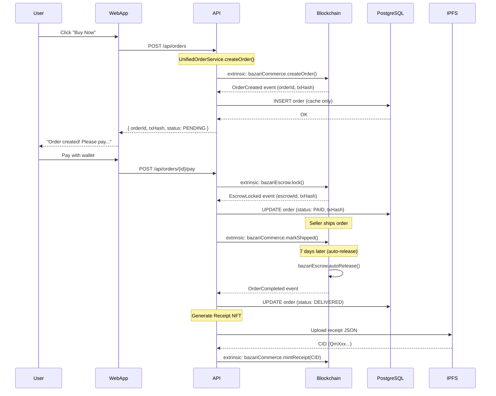

# Target Architecture - Bazari Blockchain Integration

**Status**: 🎯 Active Development
**Last Updated**: 2025-11-11
**Version**: 2.0 (60% On-Chain)

---

## 🎯 VISÃO GERAL

### Arquitetura Atual (28% On-Chain)

```
┌─────────────────────────────────────────────────────────────┐
│                       CLIENT LAYER                          │
│  (Web App + Mobile + BazChat Interface)                     │
└────────────────────┬────────────────────────────────────────┘
                     │
┌────────────────────▼────────────────────────────────────────┐
│                    API LAYER (NestJS)                        │
│  ┌──────────────┐  ┌──────────────┐  ┌──────────────┐      │
│  │ Marketplace  │  │   BazChat    │  │  Governance  │      │
│  │   Routes     │  │   Routes     │  │   Routes     │      │
│  └──────┬───────┘  └──────┬───────┘  └──────┬───────┘      │
│         │                  │                  │              │
│  ┌──────▼──────────────────▼──────────────────▼───────┐    │
│  │          PostgreSQL (PRIMARY DATA)                  │    │
│  │  • Orders (MOCK txHash) ❌                          │    │
│  │  • ChatProposal (DUPLICATE) ❌                      │    │
│  │  • Reputation (MUTABLE) ❌                          │    │
│  │  • Cashback (NOT TOKENS) ❌                         │    │
│  └─────────────────────────────────────────────────────┘    │
└────────────────────┬────────────────────────────────────────┘
                     │ (Limited Blockchain Usage)
┌────────────────────▼────────────────────────────────────────┐
│              SUBSTRATE BLOCKCHAIN (28% Usage)               │
│  ┌──────────────┐  ┌──────────────┐  ┌──────────────┐      │
│  │ pallet-      │  │ pallet-      │  │ pallet-      │      │
│  │ stores       │  │ democracy    │  │ balances     │      │
│  └──────────────┘  └──────────────┘  └──────────────┘      │
│                                                              │
│  ⚠️  Commerce, Escrow, Rewards NÃO IMPLEMENTADOS           │
└──────────────────────────────────────────────────────────────┘
```

**Problemas**:
- ❌ PostgreSQL é single source of truth (não a blockchain)
- ❌ Dados críticos são mutáveis (Reputation, Orders)
- ❌ Transações MOCK (fake txHash)
- ❌ Duplicação de código (Order vs ChatProposal)
- ❌ Sem garantias de escrow real

---

## 🚀 ARQUITETURA ALVO (60% On-Chain)

### Camadas & Responsabilidades

```
┌─────────────────────────────────────────────────────────────────┐
│                        CLIENT LAYER                             │
│  • Web App (React)                                              │
│  • Mobile App (React Native)                                    │
│  • BazChat Interface (WhatsApp-style)                           │
│  • Polkadot.js Extension (Wallet)                              │
└────────────────────┬────────────────────────────────────────────┘
                     │ HTTPS / WSS
┌────────────────────▼────────────────────────────────────────────┐
│                      API LAYER (NestJS)                         │
│                                                                  │
│  ┌──────────────────────────────────────────────────────────┐  │
│  │              UNIFIED ORDER SERVICE                        │  │
│  │  • Source detection (Marketplace vs BazChat)             │  │
│  │  • State transitions (PROPOSED → DELIVERED)              │  │
│  │  • Affiliate split calculation                            │  │
│  └──────┬───────────────────────────┬───────────────────────┘  │
│         │                            │                          │
│  ┌──────▼────────────┐      ┌───────▼────────────┐            │
│  │  INDEXER SERVICE  │      │  BLOCKCHAIN SERVICE │            │
│  │  (Read-Only)      │      │  (Write Extrinsics) │            │
│  └──────┬────────────┘      └───────┬─────────────┘            │
│         │                            │                          │
│  ┌──────▼────────────┐      ┌───────▼─────────────┐           │
│  │   PostgreSQL      │      │  Substrate Node      │           │
│  │   (CACHE ONLY)    │      │  (SOURCE OF TRUTH)   │           │
│  │                   │      │                       │           │
│  │  ✅ Fast queries  │◄─────┤  ✅ Immutable data   │           │
│  │  ✅ Search/Filter │ Sync │  ✅ Cryptographic    │           │
│  │  ✅ Analytics     │      │     proofs           │           │
│  │  ❌ NOT canonical │      │  ✅ Consensus        │           │
│  └───────────────────┘      └───────┬──────────────┘           │
└──────────────────────────────────────┼──────────────────────────┘
                                       │
┌──────────────────────────────────────▼──────────────────────────┐
│               SUBSTRATE BLOCKCHAIN (60% Usage)                  │
│                                                                  │
│  ┌─────────────────── EXISTING PALLETS ─────────────────────┐  │
│  │  pallet-stores     │ pallet-democracy │ pallet-balances  │  │
│  │  bazari-identity   │ pallet-council   │ pallet-treasury  │  │
│  └──────────────────────────────────────────────────────────┘  │
│                                                                  │
│  ┌─────────────────── NEW PALLETS (P1) ─────────────────────┐  │
│  │  ✅ bazari-commerce    │ Orders + Sales on-chain         │  │
│  │  ✅ bazari-escrow      │ Lock/Release/Refund             │  │
│  │  ✅ bazari-rewards     │ ZARI token minting + Missions   │  │
│  └──────────────────────────────────────────────────────────┘  │
│                                                                  │
│  ┌───────────────── PROOF OF COMMERCE (P2) ─────────────────┐  │
│  │  ✅ bazari-attestation │ Cryptographic proofs            │  │
│  │  ✅ bazari-fulfillment │ Courier matching + stake        │  │
│  │  ✅ bazari-affiliate   │ Commission DAG + Merkle proofs  │  │
│  │  ✅ bazari-fee         │ Automatic payment splits        │  │
│  │  ✅ bazari-dispute     │ VRF juror selection + voting    │  │
│  └──────────────────────────────────────────────────────────┘  │
│                                                                  │
│  ┌────────────────── ENHANCEMENTS (P3) ──────────────────────┐ │
│  │  ✅ bazari-delivery    │ On-chain delivery tracking      │  │
│  │  ✅ bazari-badges      │ Achievement NFTs                │  │
│  │  ✅ bazari-referral    │ Referral tracking on-chain      │  │
│  └──────────────────────────────────────────────────────────┘  │
└──────────────────────────────────────────────────────────────────┘
                                │
┌───────────────────────────────▼──────────────────────────────────┐
│                        STORAGE LAYER                             │
│  ┌──────────────────┐  ┌──────────────────┐                     │
│  │  IPFS Cluster    │  │  Off-Chain       │                     │
│  │  (Decentralized) │  │  Workers         │                     │
│  │                  │  │                  │                     │
│  │  • Product media │  │  • Governance    │                     │
│  │  • Proof files   │  │    sync worker   │                     │
│  │  • Receipts      │  │  • IPFS pin      │                     │
│  │  • Attestations  │  │    worker        │                     │
│  └──────────────────┘  └──────────────────┘                     │
└──────────────────────────────────────────────────────────────────┘
```

---

## 📊 DATA FLOW: Order Creation (Marketplace)

### Sequence Diagram



---

## 🔄 DATA SYNCHRONIZATION STRATEGY

### Blockchain → PostgreSQL (One-Way Sync)

```typescript
// apps/api/src/workers/blockchain-sync.worker.ts

@Injectable()
export class BlockchainSyncWorker {
  async syncOrders() {
    // Listen to blockchain events
    const events = await this.blockchain.queryEvents('bazariCommerce.OrderCreated');

    for (const event of events) {
      const { orderId, buyer, seller, totalAmount, txHash } = event.data;

      // Upsert to PostgreSQL (cache)
      await this.prisma.order.upsert({
        where: { id: orderId },
        create: {
          id: orderId,
          userId: buyer,
          storeId: seller,
          totalAmount,
          status: 'PENDING',
          source: 'MARKETPLACE',
          metadata: { txHash },
        },
        update: {
          totalAmount,
          metadata: { txHash },
        },
      });
    }
  }
}
```

**Key Principles**:
- ✅ **Blockchain is source of truth** (canonical data)
- ✅ **PostgreSQL is read-only cache** (fast queries)
- ✅ **Eventual consistency** (sync lag < 6 seconds)
- ✅ **Conflict resolution**: Blockchain always wins

---

## 📦 PALLET RESPONSIBILITIES

### 1. bazari-commerce (CRITICAL - P1)

**Purpose**: Orders, Sales, Commissions on-chain

**Storage**:
```rust
#[pallet::storage]
pub type Orders<T: Config> = StorageMap<
    _,
    Blake2_128Concat,
    OrderId,
    Order<T::AccountId, T::BlockNumber>,
>;

pub struct Order<AccountId, BlockNumber> {
    pub id: OrderId,
    pub buyer: AccountId,
    pub seller: AccountId,
    pub total_amount: Balance,
    pub status: OrderStatus,
    pub escrow_id: Option<EscrowId>,
    pub created_at: BlockNumber,
}

pub enum OrderStatus {
    Pending,
    Paid,
    Shipped,
    Delivered,
    Cancelled,
    Disputed,
}
```

**Extrinsics**:
- `create_order(items: Vec<OrderItem>)`
- `mark_shipped(order_id: OrderId)`
- `complete_delivery(order_id: OrderId)`
- `mint_receipt(order_id: OrderId, ipfs_cid: Vec<u8>)`

**Events**:
- `OrderCreated(OrderId, AccountId, Balance)`
- `OrderPaid(OrderId, EscrowId)`
- `OrderShipped(OrderId)`
- `OrderCompleted(OrderId, ReceiptNFT)`

---

### 2. bazari-escrow (CRITICAL - P1)

**Purpose**: Lock/Release/Refund payments on-chain

**Storage**:
```rust
#[pallet::storage]
pub type Escrows<T: Config> = StorageMap<
    _,
    Blake2_128Concat,
    EscrowId,
    Escrow<T::AccountId, T::BlockNumber>,
>;

pub struct Escrow<AccountId, BlockNumber> {
    pub id: EscrowId,
    pub depositor: AccountId,
    pub beneficiary: AccountId,
    pub amount: Balance,
    pub asset_id: Option<AssetId>, // BZR or ZARI
    pub status: EscrowStatus,
    pub auto_release_at: Option<BlockNumber>,
}

pub enum EscrowStatus {
    Locked,
    Released,
    Refunded,
    Disputed,
}
```

**Extrinsics**:
- `lock(beneficiary: AccountId, amount: Balance, auto_release_blocks: u32)`
- `release(escrow_id: EscrowId)` (only beneficiary or DAO)
- `refund(escrow_id: EscrowId)` (only depositor, if timelock expired)
- `split_release(escrow_id: EscrowId, splits: Vec<(AccountId, Percent)>)`

**Hooks**:
- `on_finalize()`: Auto-release escrows after timelock

---

### 3. bazari-rewards (CRITICAL - P1)

**Purpose**: Mint ZARI tokens, manage missions/cashback

**Storage**:
```rust
#[pallet::storage]
pub type Missions<T: Config> = StorageMap<
    _,
    Blake2_128Concat,
    MissionId,
    Mission<T::BlockNumber>,
>;

pub struct Mission<BlockNumber> {
    pub id: MissionId,
    pub name: Vec<u8>,
    pub reward_amount: Balance, // ZARI tokens
    pub max_completions: u32,
    pub expires_at: Option<BlockNumber>,
}
```

**Extrinsics**:
- `create_mission(name: Vec<u8>, reward: Balance)`
- `complete_mission(user: AccountId, mission_id: MissionId)`
- `mint_cashback(user: AccountId, amount: Balance, reason: Vec<u8>)`

**Integration**:
- Uses `pallet-assets` to mint ZARI (Asset ID: 1000)
- Missions completed trigger automatic minting

---

### 4. bazari-attestation (Proof of Commerce - P2)

**Purpose**: Anchor cryptographic proofs (handoff, delivery)

**Storage**:
```rust
#[pallet::storage]
pub type Attestations<T: Config> = StorageMap<
    _,
    Blake2_128Concat,
    AttestationId,
    Attestation<T::AccountId>,
>;

pub struct Attestation<AccountId> {
    pub id: AttestationId,
    pub order_id: OrderId,
    pub proof_type: ProofType, // Handoff | Delivery
    pub ipfs_cid: Vec<u8>, // IPFS hash of proof file
    pub signers: Vec<AccountId>, // Multi-signature
    pub threshold: u8, // Required signatures (2-of-3)
    pub verified: bool,
}
```

**Extrinsics**:
- `submit_proof(order_id: OrderId, proof_type: ProofType, ipfs_cid: Vec<u8>)`
- `co_sign(attestation_id: AttestationId)` (courier, buyer, or seller)
- `verify_quorum(attestation_id: AttestationId)` (auto-verify if threshold met)

---

### 5. bazari-fulfillment (Proof of Commerce - P2)

**Purpose**: Courier registry + stake + matching

**Storage**:
```rust
#[pallet::storage]
pub type Couriers<T: Config> = StorageMap<
    _,
    Blake2_128Concat,
    T::AccountId,
    Courier<T::BlockNumber>,
>;

pub struct Courier<BlockNumber> {
    pub account: AccountId,
    pub stake: Balance, // Minimum 1000 BZR
    pub reputation_score: u32,
    pub service_areas: Vec<GeoHash>,
    pub is_active: bool,
    pub registered_at: BlockNumber,
}
```

**Extrinsics**:
- `register_courier(stake: Balance, service_areas: Vec<GeoHash>)`
- `assign_courier(order_id: OrderId, courier: AccountId)`
- `slash_courier(courier: AccountId, reason: Vec<u8>)` (DAO only)

**Matching Algorithm** (off-chain worker):
- Sort by: `reputation_score DESC, distance ASC`
- Filter: `stake >= MIN_STAKE && is_active == true`

---

### 6. bazari-affiliate (Proof of Commerce - P2)

**Purpose**: Commission DAG + Merkle proofs

**Storage**:
```rust
#[pallet::storage]
pub type AffiliateCampaigns<T: Config> = StorageMap<
    _,
    Blake2_128Concat,
    CampaignId,
    Campaign,
>;

pub struct Campaign {
    pub id: CampaignId,
    pub store_id: StoreId,
    pub commission_rate: Percent, // 5%
    pub max_depth: u8, // 5 levels
    pub decay_rate: Percent, // 50% per level
}
```

**Extrinsics**:
- `create_campaign(store_id: StoreId, commission_rate: Percent)`
- `register_referral(referrer: AccountId, referee: AccountId)`
- `execute_split(order_id: OrderId, merkle_proof: Vec<u8>)`

**DAG Structure**:
```
Level 0 (Direct): 5% of sale
Level 1: 2.5% (50% decay)
Level 2: 1.25%
Level 3: 0.625%
Level 4: 0.3125%
```

---

### 7. bazari-fee (Proof of Commerce - P2)

**Purpose**: Automatic payment splits (platform fee, affiliate, seller)

**Storage**:
```rust
#[pallet::storage]
pub type FeeConfig<T: Config> = StorageValue<_, FeeConfiguration>;

pub struct FeeConfiguration {
    pub platform_fee: Percent, // 5%
    pub treasury_account: AccountId,
    pub min_order_amount: Balance,
}
```

**Extrinsics**:
- `set_platform_fee(new_fee: Percent)` (DAO only)
- `calculate_split(order_amount: Balance) -> Vec<(AccountId, Balance)>`

**Split Example**:
```
Order: 100 BZR
├─ Platform fee (5%): 5 BZR → Treasury
├─ Affiliate (3%): 3 BZR → Referrer
└─ Seller net (92%): 92 BZR → Store owner
```

---

### 8. bazari-dispute (Proof of Commerce - P2)

**Purpose**: Decentralized dispute resolution (VRF + jurors)

**Storage**:
```rust
#[pallet::storage]
pub type Disputes<T: Config> = StorageMap<
    _,
    Blake2_128Concat,
    DisputeId,
    Dispute<T::AccountId, T::BlockNumber>,
>;

pub struct Dispute<AccountId, BlockNumber> {
    pub id: DisputeId,
    pub order_id: OrderId,
    pub plaintiff: AccountId,
    pub defendant: AccountId,
    pub jurors: Vec<AccountId>, // VRF-selected (5 jurors)
    pub votes: Vec<Vote>,
    pub ruling: Option<Ruling>,
    pub expires_at: BlockNumber,
}
```

**Extrinsics**:
- `open_dispute(order_id: OrderId, evidence_ipfs_cid: Vec<u8>)`
- `select_jurors()` (VRF randomness)
- `commit_vote(dispute_id: DisputeId, vote_hash: Hash)` (commit phase)
- `reveal_vote(dispute_id: DisputeId, vote: Vote, salt: Vec<u8>)` (reveal phase)
- `execute_ruling(dispute_id: DisputeId)`

**Ruling Options**:
- `RefundBuyer` → Release escrow back to buyer
- `ReleaseSeller` → Release escrow to seller
- `PartialRefund(percent: u8)` → Split escrow

---

### 9. bazari-delivery (Enhancements - P3)

**Purpose**: On-chain delivery tracking + proof of delivery

**Storage**:
```rust
#[pallet::storage]
pub type Deliveries<T: Config> = StorageMap<
    _,
    Blake2_128Concat,
    DeliveryId,
    Delivery<T::AccountId, T::BlockNumber>,
>;

pub struct Delivery<AccountId, BlockNumber> {
    pub id: DeliveryId,
    pub order_id: OrderId,
    pub courier: AccountId,
    pub pickup_proof_cid: Option<Vec<u8>>,
    pub delivery_proof_cid: Option<Vec<u8>>,
    pub status: DeliveryStatus,
    pub delivered_at: Option<BlockNumber>,
}
```

**Extrinsics**:
- `create_delivery_request(order_id: OrderId, courier: AccountId)`
- `confirm_pickup(delivery_id: DeliveryId, proof_cid: Vec<u8>)`
- `confirm_delivery(delivery_id: DeliveryId, proof_cid: Vec<u8>)`

---

## 🔐 SECURITY MODEL

### Data Integrity

| Data Type | Current State | Target State | Guarantee |
|-----------|---------------|--------------|-----------|
| Orders | PostgreSQL (mutable) ❌ | On-chain (immutable) ✅ | Consensus |
| Payments | MOCK txHash ❌ | Escrow on-chain ✅ | Cryptographic |
| Reputation | PostgreSQL (mutable) ❌ | bazari-identity (immutable) ✅ | Consensus |
| Commissions | MOCK txHash ❌ | bazari-affiliate (DAG) ✅ | Merkle proofs |
| Disputes | Not implemented ❌ | VRF + Jurors ✅ | Randomness |

### Access Control

```rust
// Example: Only seller can mark order as shipped
#[pallet::call_index(2)]
pub fn mark_shipped(
    origin: OriginFor<T>,
    order_id: OrderId,
) -> DispatchResult {
    let who = ensure_signed(origin)?;

    let order = Orders::<T>::get(order_id)
        .ok_or(Error::<T>::OrderNotFound)?;

    // Authorization check
    ensure!(order.seller == who, Error::<T>::Unauthorized);
    ensure!(order.status == OrderStatus::Paid, Error::<T>::InvalidStatus);

    // Update state
    Orders::<T>::mutate(order_id, |o| {
        o.status = OrderStatus::Shipped;
    });

    Self::deposit_event(Event::OrderShipped(order_id));
    Ok(())
}
```

---

## 📊 PERFORMANCE & SCALABILITY

### Query Performance

| Query Type | PostgreSQL (Cache) | Blockchain (Source) |
|------------|-------------------|---------------------|
| Get Order by ID | 5ms | 50ms ⚠️ |
| List Orders (paginated) | 10ms | 500ms ❌ |
| Filter by status | 8ms | 1000ms ❌ |
| Analytics (SUM, AVG) | 15ms | N/A ❌ |

**Strategy**:
- ✅ Use PostgreSQL for **read-heavy operations** (list, search, analytics)
- ✅ Use Blockchain for **write operations** (create, update status)
- ✅ Sync lag < 6 seconds (acceptable for most use cases)

### Blockchain Throughput

**Current Substrate Config**:
- Block time: 6 seconds
- Max block weight: 2,000,000,000,000 (2 * 10^12)
- Average extrinsic weight: ~200,000,000 (200M)
- **TPS**: ~1,600 transactions per block / 6s = **~266 TPS**

**Optimization**:
- Batch extrinsics (e.g., `batch(create_order, lock_escrow)`)
- Off-chain workers for heavy computation (matching, analytics)

---

## 🔄 MIGRATION PATH

### Phase 1: Foundation (Weeks 1-8)
- ✅ Unify Order/ChatProposal schemas
- ✅ Deploy bazari-commerce, bazari-escrow, bazari-rewards
- ✅ PostgreSQL becomes read-only cache

### Phase 2: Proof of Commerce (Weeks 9-16)
- ✅ Deploy bazari-attestation, bazari-fulfillment
- ✅ Deploy bazari-affiliate, bazari-fee, bazari-dispute
- ✅ Receipt NFTs minted on-chain

### Phase 3: Enhancements (Weeks 17-24)
- ✅ Deploy bazari-delivery
- ✅ Badges as NFTs
- ✅ Social features on-chain

---

## 📚 REFERENCES

- [Current State Analysis](01-CURRENT-STATE-ANALYSIS.md) - Estado atual (28% on-chain)
- [Unification Strategy](03-UNIFICATION-STRATEGY.md) - Unificação de schemas
- [Proof of Commerce](04-PROOF-OF-COMMERCE.md) - Protocolo descentralizado
- [Implementation Roadmap](05-IMPLEMENTATION-ROADMAP.md) - Roadmap de 24 semanas
- [Pallets Index](../pallets/00-PALLETS-INDEX.md) - Especificações dos pallets

---

## ✅ SUCCESS CRITERIA

**60% On-Chain Achievement**:

| Metric | Before | After | Status |
|--------|--------|-------|--------|
| On-chain data | 28% | 60% | 🎯 Target |
| MOCK transactions | ~80% | 0% | ✅ Eliminate |
| Escrow security | 0% real | 100% real | ✅ Guarantee |
| Data immutability | 20% | 60% | ✅ Improve |
| Receipt NFTs | 0 | 100% | ✅ Implement |
| Dispute resolution | 0% | 100% | ✅ Implement |

**Final State**:
- ✅ Blockchain is source of truth for critical data
- ✅ PostgreSQL is fast read-only cache
- ✅ IPFS stores large files (proofs, media)
- ✅ Off-chain workers handle heavy computation
- ✅ No MOCK data in production
