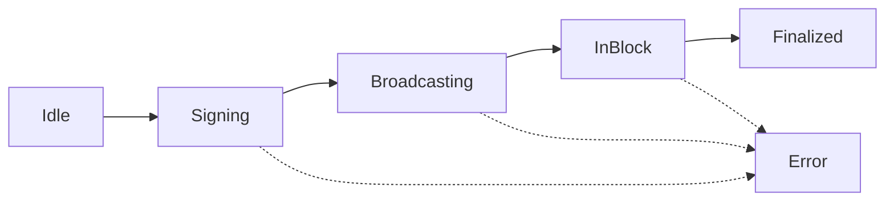

# Blockchain Integration Strategies

**Status**: Technical Guide
**Version**: 1.0
**Last Updated**: 2025-11-14
**Dependencies**: Polkadot.js 10.11+, React Query 4.36+, TypeScript 5.0+
**Maintainer**: Bazari Core Team

---

## Table of Contents

1. [Introduction](#introduction)
2. [Hook Patterns](#hook-patterns)
3. [Real-Time Updates (WebSocket)](#real-time-updates-websocket)
4. [State Management](#state-management)
5. [Cache Strategy](#cache-strategy)
6. [Error Handling](#error-handling)
7. [Loading States](#loading-states)
8. [Gas Estimation](#gas-estimation)
9. [Transaction Lifecycle](#transaction-lifecycle)
10. [IPFS Integration](#ipfs-integration)

---

## Introduction

This document defines **how frontend code integrates with blockchain** (Substrate/Polkadot) for the Bazari platform. It covers:

- Query patterns (read blockchain data)
- Mutation patterns (write blockchain data)
- WebSocket subscriptions (real-time events)
- State management (cache, optimistic updates)
- Error handling (blockchain-specific errors)
- Loading states (multi-step transactions)

### Architecture Overview

```
┌──────────────────────────────────────────────────┐
│              React Components                     │
│  (OrderPage, MissionsHub, DisputeDetail)         │
└─────────────────┬────────────────────────────────┘
                  │
                  ├─ useBlockchainQuery() ──┐
                  ├─ useBlockchainTx() ─────┤
                  └─ useBlockchainEvent() ───┤
                  │                          │
                  ▼                          ▼
        ┌──────────────────┐      ┌──────────────────┐
        │  React Query     │      │  WebSocket       │
        │  (Cache Layer)   │      │  (Event Stream)  │
        └────────┬─────────┘      └────────┬─────────┘
                 │                         │
                 └────────┬────────────────┘
                          │
                          ▼
                ┌──────────────────┐
                │  Polkadot.js API │
                │  (Blockchain)    │
                └──────────────────┘
                          │
                          ▼
                ┌──────────────────┐
                │  Substrate Node  │
                │  (bazari-chain)  │
                └──────────────────┘
```

---

## Hook Patterns

### Query Pattern (useBlockchainQuery)

**Purpose**: Read data from blockchain with automatic caching and refresh.

**File**: `/src/hooks/useBlockchainQuery.ts`

**Full Implementation**:
```typescript
import { useQuery, UseQueryOptions, useQueryClient } from '@tanstack/react-query';
import { ApiPromise } from '@polkadot/api';
import { getApi } from '@/services/polkadot';

/**
 * Generic blockchain query hook with caching
 *
 * @example
 * const { data: order } = useBlockchainQuery(
 *   ['order', orderId],
 *   async () => {
 *     const api = await getApi();
 *     return await api.query.bazariCommerce.orders(orderId);
 *   }
 * );
 */
export function useBlockchainQuery<T>(
  key: string[],
  queryFn: () => Promise<T>,
  options?: Omit<UseQueryOptions<T>, 'queryKey' | 'queryFn'>
) {
  return useQuery<T>({
    queryKey: ['blockchain', ...key],
    queryFn,
    staleTime: 10_000, // 10 seconds
    cacheTime: 5 * 60 * 1000, // 5 minutes
    refetchOnWindowFocus: true,
    refetchOnReconnect: true,
    retry: 3,
    retryDelay: (attemptIndex) => Math.min(1000 * 2 ** attemptIndex, 30000),
    ...options
  });
}

/**
 * Hook: Get single order by ID
 */
export function useBlockchainOrder(orderId: number) {
  return useBlockchainQuery(
    ['order', orderId],
    async () => {
      const api = await getApi();
      const order = await api.query.bazariCommerce.orders(orderId);

      if (order.isNone) {
        throw new Error('Order not found');
      }

      return order.unwrap().toJSON();
    },
    {
      enabled: orderId > 0
    }
  );
}

/**
 * Hook: Get all orders for an account
 */
export function useBlockchainOrders(accountId?: string) {
  return useBlockchainQuery(
    ['orders', accountId],
    async () => {
      const api = await getApi();

      // Get all order IDs
      const orderIds = await api.query.bazariCommerce.ordersByAccount(accountId);

      // Fetch all orders in parallel
      const orders = await Promise.all(
        orderIds.map(async (id) => {
          const order = await api.query.bazariCommerce.orders(id);
          return order.unwrap().toJSON();
        })
      );

      return orders;
    },
    {
      enabled: !!accountId,
      refetchInterval: 30_000 // Auto-refresh every 30s
    }
  );
}

/**
 * Hook: Get escrow details
 */
export function useEscrowDetails(orderId: number) {
  return useBlockchainQuery(
    ['escrow', orderId],
    async () => {
      const api = await getApi();
      const escrow = await api.query.bazariEscrow.escrows(orderId);

      if (escrow.isNone) {
        throw new Error('Escrow not found');
      }

      return escrow.unwrap().toJSON();
    },
    {
      enabled: orderId > 0
    }
  );
}

/**
 * Hook: Get all missions
 */
export function useMissions() {
  return useBlockchainQuery(
    ['missions'],
    async () => {
      const api = await getApi();
      const missionEntries = await api.query.bazariRewards.missions.entries();

      return missionEntries.map(([key, mission]) => ({
        id: key.args[0].toNumber(),
        ...mission.toJSON()
      }));
    }
  );
}

/**
 * Hook: Get user mission progress
 */
export function useUserMissionProgress(accountId?: string, missionId?: number) {
  return useBlockchainQuery(
    ['userMission', accountId, missionId],
    async () => {
      const api = await getApi();
      const progress = await api.query.bazariRewards.userMissions(accountId, missionId);

      if (progress.isNone) {
        return { current: 0, completed: false };
      }

      return progress.unwrap().toJSON();
    },
    {
      enabled: !!accountId && !!missionId
    }
  );
}

/**
 * Hook: Get dispute details
 */
export function useDisputeDetails(disputeId: number) {
  return useBlockchainQuery(
    ['dispute', disputeId],
    async () => {
      const api = await getApi();
      const dispute = await api.query.bazariDispute.disputes(disputeId);

      if (dispute.isNone) {
        throw new Error('Dispute not found');
      }

      return dispute.unwrap().toJSON();
    },
    {
      enabled: disputeId > 0,
      refetchInterval: 15_000 // Refresh every 15s (voting updates)
    }
  );
}

/**
 * Hook: Get proof details
 */
export function useProofDetails(proofId: number) {
  return useBlockchainQuery(
    ['proof', proofId],
    async () => {
      const api = await getApi();
      const proof = await api.query.bazariAttestation.attestations(proofId);

      if (proof.isNone) {
        throw new Error('Proof not found');
      }

      return proof.unwrap().toJSON();
    },
    {
      enabled: proofId > 0
    }
  );
}

/**
 * Hook: Get courier details
 */
export function useCourierDetails(courierAddress?: string) {
  return useBlockchainQuery(
    ['courier', courierAddress],
    async () => {
      const api = await getApi();
      const courier = await api.query.bazariFulfillment.couriers(courierAddress);

      if (courier.isNone) {
        throw new Error('Courier not found');
      }

      return courier.unwrap().toJSON();
    },
    {
      enabled: !!courierAddress
    }
  );
}

/**
 * Hook: Get referral tree
 */
export function useReferralTree(accountId?: string, depth: number = 5) {
  return useBlockchainQuery(
    ['referralTree', accountId, depth],
    async () => {
      const api = await getApi();

      // Recursive function to build tree
      const buildTree = async (address: string, currentDepth: number): Promise<any> => {
        if (currentDepth > depth) return null;

        const node = await api.query.bazariAffiliate.referralTree(address);

        if (node.isNone) {
          return { address, children: [] };
        }

        const nodeData = node.unwrap().toJSON();
        const children = await Promise.all(
          nodeData.children.map((child: string) => buildTree(child, currentDepth + 1))
        );

        return {
          address,
          level: currentDepth,
          children: children.filter(Boolean)
        };
      };

      return await buildTree(accountId!, 0);
    },
    {
      enabled: !!accountId,
      staleTime: 60_000 // 1 minute (tree doesn't change often)
    }
  );
}

/**
 * Hook: Invalidate blockchain cache
 */
export function useInvalidateBlockchainCache() {
  const queryClient = useQueryClient();

  return (keys?: string[]) => {
    if (keys) {
      keys.forEach(key => {
        queryClient.invalidateQueries(['blockchain', key]);
      });
    } else {
      // Invalidate all blockchain queries
      queryClient.invalidateQueries(['blockchain']);
    }
  };
}
```

**Usage Example**:
```tsx
// Component: OrderPage.tsx
const OrderPage = () => {
  const { orderId } = useParams();
  const { data: order, isLoading, error } = useBlockchainOrder(Number(orderId));

  if (isLoading) return <OrderSkeleton />;
  if (error) return <ErrorMessage error={error} />;

  return <OrderDetails order={order} />;
};
```

---

### Mutation Pattern (useBlockchainTx)

**Purpose**: Write data to blockchain (transactions/extrinsics).

**File**: `/src/hooks/useBlockchainTx.ts`

**Full Implementation**:
```typescript
import { useMutation, UseMutationOptions, useQueryClient } from '@tanstack/react-query';
import { ApiPromise } from '@polkadot/api';
import { web3FromAddress } from '@polkadot/extension-dapp';
import { getApi } from '@/services/polkadot';
import { useWalletStore } from '@/stores/wallet';
import { toast } from 'sonner';

interface TransactionResult {
  txHash: string;
  blockNumber: number;
  success: boolean;
  events: any[];
}

/**
 * Generic blockchain transaction hook
 *
 * @example
 * const { mutate: releaseEscrow } = useBlockchainTx(
 *   async (orderId: number) => {
 *     const api = await getApi();
 *     return await api.tx.bazariEscrow.releaseFunds(orderId);
 *   },
 *   {
 *     onSuccess: () => {
 *       toast.success('Funds released!');
 *     }
 *   }
 * );
 */
export function useBlockchainTx<TVariables>(
  txBuilder: (variables: TVariables) => Promise<any>,
  options?: UseMutationOptions<TransactionResult, Error, TVariables>
) {
  const { selectedAccount } = useWalletStore();
  const queryClient = useQueryClient();

  return useMutation<TransactionResult, Error, TVariables>({
    mutationFn: async (variables) => {
      if (!selectedAccount) {
        throw new Error('No wallet connected');
      }

      // Build transaction
      const tx = await txBuilder(variables);

      // Get signer from extension
      const injector = await web3FromAddress(selectedAccount.address);

      // Sign and send transaction
      return new Promise((resolve, reject) => {
        let txHash = '';

        tx.signAndSend(
          selectedAccount.address,
          { signer: injector.signer },
          ({ status, events, dispatchError }) => {
            // Transaction hash
            if (status.isInBlock) {
              txHash = tx.hash.toString();
            }

            // Transaction finalized
            if (status.isFinalized) {
              // Check for errors
              if (dispatchError) {
                if (dispatchError.isModule) {
                  const decoded = tx.registry.findMetaError(dispatchError.asModule);
                  reject(new Error(`${decoded.section}.${decoded.name}: ${decoded.docs.join(' ')}`));
                } else {
                  reject(new Error(dispatchError.toString()));
                }
                return;
              }

              // Success
              resolve({
                txHash,
                blockNumber: status.asFinalized.toNumber(),
                success: true,
                events: events.map(e => e.toHuman())
              });
            }

            // Transaction error
            if (status.isDropped || status.isInvalid || status.isUsurped) {
              reject(new Error(`Transaction ${status.type}`));
            }
          }
        ).catch(reject);
      });
    },
    ...options
  });
}

/**
 * Hook: Create order transaction
 */
export function useCreateOrder() {
  const invalidateCache = useInvalidateBlockchainCache();

  return useBlockchainTx(
    async (orderData: {
      storeId: number;
      items: any[];
      totalAmount: number;
      shippingAddress: string;
    }) => {
      const api = await getApi();
      return api.tx.bazariCommerce.createOrder(
        orderData.storeId,
        orderData.items,
        orderData.totalAmount,
        orderData.shippingAddress
      );
    },
    {
      onSuccess: (result) => {
        toast.success(`Order created! TX: ${result.txHash.slice(0, 10)}...`);
        invalidateCache(['orders']);
      },
      onError: (error) => {
        toast.error(`Failed to create order: ${error.message}`);
      }
    }
  );
}

/**
 * Hook: Release escrow funds
 */
export function useReleaseEscrow() {
  const invalidateCache = useInvalidateBlockchainCache();

  return useBlockchainTx(
    async (orderId: number) => {
      const api = await getApi();
      return api.tx.bazariEscrow.releaseFunds(orderId);
    },
    {
      onSuccess: (result, orderId) => {
        toast.success('Funds released to seller!');
        invalidateCache(['escrow', 'order']);
      },
      onError: (error) => {
        toast.error(`Failed to release funds: ${error.message}`);
      }
    }
  );
}

/**
 * Hook: Submit delivery proof
 */
export function useSubmitProof() {
  const invalidateCache = useInvalidateBlockchainCache();

  return useBlockchainTx(
    async (proofData: {
      orderId: number;
      proofType: 'HandoffProof' | 'DeliveryProof';
      ipfsCid: string;
      gpsLat?: number;
      gpsLng?: number;
    }) => {
      const api = await getApi();
      return api.tx.bazariAttestation.submitProof(
        proofData.orderId,
        proofData.proofType,
        proofData.ipfsCid,
        proofData.gpsLat,
        proofData.gpsLng
      );
    },
    {
      onSuccess: () => {
        toast.success('Proof submitted successfully!');
        invalidateCache(['proofs']);
      }
    }
  );
}

/**
 * Hook: Commit dispute vote
 */
export function useCommitVote() {
  const invalidateCache = useInvalidateBlockchainCache();

  return useBlockchainTx(
    async (voteData: {
      disputeId: number;
      voteHash: string; // Hash of (vote + salt)
    }) => {
      const api = await getApi();
      return api.tx.bazariDispute.commitVote(voteData.disputeId, voteData.voteHash);
    },
    {
      onSuccess: () => {
        toast.success('Vote committed! Remember to reveal in 24h.');
        invalidateCache(['dispute']);
      }
    }
  );
}

/**
 * Hook: Reveal dispute vote
 */
export function useRevealVote() {
  const invalidateCache = useInvalidateBlockchainCache();

  return useBlockchainTx(
    async (voteData: {
      disputeId: number;
      vote: 'RefundBuyer' | 'ReleaseSeller' | 'PartialRefund';
      salt: string;
    }) => {
      const api = await getApi();
      return api.tx.bazariDispute.revealVote(
        voteData.disputeId,
        voteData.vote,
        voteData.salt
      );
    },
    {
      onSuccess: () => {
        toast.success('Vote revealed!');
        invalidateCache(['dispute']);
      }
    }
  );
}

/**
 * Hook: Register courier
 */
export function useRegisterCourier() {
  const invalidateCache = useInvalidateBlockchainCache();

  return useBlockchainTx(
    async (courierData: {
      vehicleType: string;
      serviceRadius: number;
      stake: number; // 1000 BZR minimum
    }) => {
      const api = await getApi();
      return api.tx.bazariFulfillment.registerCourier(
        courierData.vehicleType,
        courierData.serviceRadius,
        courierData.stake
      );
    },
    {
      onSuccess: () => {
        toast.success('Registered as courier!');
        invalidateCache(['courier']);
      }
    }
  );
}

/**
 * Hook: Claim mission reward
 */
export function useClaimReward() {
  const invalidateCache = useInvalidateBlockchainCache();

  return useBlockchainTx(
    async (missionId: number) => {
      const api = await getApi();
      return api.tx.bazariRewards.claimReward(missionId);
    },
    {
      onSuccess: (result, missionId) => {
        toast.success('Reward claimed! 🎉');
        invalidateCache(['missions', 'userMission']);
      }
    }
  );
}
```

**Usage Example**:
```tsx
// Component: EscrowActions.tsx
const EscrowActions = ({ orderId, escrow }) => {
  const { mutate: releaseEscrow, isLoading } = useReleaseEscrow();

  const handleRelease = () => {
    releaseEscrow(orderId);
  };

  return (
    <Button
      onClick={handleRelease}
      disabled={isLoading || escrow.status !== 'Locked'}
    >
      {isLoading ? 'Releasing...' : 'Release Funds'}
    </Button>
  );
};
```

---

### Subscription Pattern (WebSocket Events)

**Purpose**: Listen to blockchain events in real-time.

**File**: `/src/hooks/useBlockchainEvent.ts`

**Full Implementation**:
```typescript
import { useEffect } from 'react';
import { getApi } from '@/services/polkadot';
import { useQueryClient } from '@tanstack/react-query';

/**
 * Subscribe to blockchain events
 *
 * @example
 * useBlockchainEvent('bazariCommerce', 'OrderCreated', (event) => {
 *   console.log('New order:', event.data);
 * });
 */
export function useBlockchainEvent(
  pallet: string,
  eventName: string,
  callback: (event: any) => void,
  filter?: (event: any) => boolean
) {
  useEffect(() => {
    let unsubscribe: (() => void) | undefined;

    const subscribe = async () => {
      const api = await getApi();

      unsubscribe = await api.query.system.events((events) => {
        events.forEach((record) => {
          const { event } = record;

          // Match pallet and event name
          if (
            event.section === pallet &&
            event.method === eventName
          ) {
            // Apply filter if provided
            if (filter && !filter(event)) {
              return;
            }

            // Call callback
            callback(event.data.toJSON());
          }
        });
      });
    };

    subscribe();

    return () => {
      if (unsubscribe) {
        unsubscribe();
      }
    };
  }, [pallet, eventName, callback, filter]);
}

/**
 * Hook: Listen to CommissionRecorded events
 */
export function useCommissionEvents(recipientAddress?: string) {
  const queryClient = useQueryClient();

  useBlockchainEvent(
    'bazariCommerce',
    'CommissionRecorded',
    (eventData) => {
      // Invalidate commission cache
      queryClient.invalidateQueries(['commissions']);

      // Show notification
      toast.success(`Commission received: ${eventData.amount} BZR`);
    },
    // Filter by recipient
    (event) => {
      if (!recipientAddress) return true;
      return event.data[1].toString() === recipientAddress;
    }
  );
}

/**
 * Hook: Listen to MissionCompleted events
 */
export function useMissionCompletionEvents(accountId?: string) {
  const queryClient = useQueryClient();

  useBlockchainEvent(
    'bazariRewards',
    'MissionCompleted',
    (eventData) => {
      // Invalidate missions cache
      queryClient.invalidateQueries(['missions', 'userMission']);

      // Show toast with reward
      toast.success(
        `🎉 Mission Complete! You earned ${eventData.reward} ZARI`,
        {
          duration: 5000,
          action: {
            label: 'View Missions',
            onClick: () => window.location.href = '/app/rewards/missions'
          }
        }
      );
    },
    (event) => {
      if (!accountId) return true;
      return event.data[0].toString() === accountId;
    }
  );
}

/**
 * Hook: Listen to DisputeOpened events
 */
export function useDisputeEvents() {
  const queryClient = useQueryClient();

  useBlockchainEvent(
    'bazariDispute',
    'DisputeOpened',
    (eventData) => {
      queryClient.invalidateQueries(['disputes']);
      toast.info(`Dispute opened for Order #${eventData.orderId}`);
    }
  );

  useBlockchainEvent(
    'bazariDispute',
    'VotingEnded',
    (eventData) => {
      queryClient.invalidateQueries(['dispute']);
      toast.success(`Dispute #${eventData.disputeId} resolved: ${eventData.ruling}`);
    }
  );
}

/**
 * Hook: Listen to all events for debugging
 */
export function useDebugEvents() {
  useEffect(() => {
    let unsubscribe: (() => void) | undefined;

    const subscribe = async () => {
      const api = await getApi();

      unsubscribe = await api.query.system.events((events) => {
        events.forEach((record) => {
          console.log('Event:', {
            pallet: record.event.section,
            method: record.event.method,
            data: record.event.data.toJSON()
          });
        });
      });
    };

    subscribe();

    return () => {
      if (unsubscribe) {
        unsubscribe();
      }
    };
  }, []);
}
```

**Usage Example**:
```tsx
// Component: MissionsDashboard.tsx
const MissionsDashboard = () => {
  const { address } = useWalletStore();

  // Auto-refresh when missions complete
  useMissionCompletionEvents(address);

  const { data: missions } = useMissions();

  return <MissionsList missions={missions} />;
};
```

---

## Real-Time Updates (WebSocket)

### Events to Subscribe

| Pallet | Event | Trigger | Cache Invalidation |
|--------|-------|---------|-------------------|
| **bazariCommerce** | OrderCreated | New order | `orders` |
| **bazariCommerce** | CommissionRecorded | Commission paid | `commissions`, `sales` |
| **bazariEscrow** | EscrowLocked | Payment locked | `escrow`, `order` |
| **bazariEscrow** | FundsReleased | Payment released | `escrow`, `order` |
| **bazariRewards** | MissionCompleted | Mission done | `missions`, `userMission` |
| **bazariRewards** | CashbackMinted | Cashback issued | `cashback` |
| **bazariAttestation** | ProofSubmitted | Proof uploaded | `proofs` |
| **bazariAttestation** | AttestationVerified | Quorum reached | `proofs`, `order` |
| **bazariDispute** | DisputeOpened | Dispute created | `disputes`, `order` |
| **bazariDispute** | VoteCommitted | Juror voted | `dispute` |
| **bazariDispute** | VotingEnded | Ruling executed | `dispute`, `escrow` |
| **bazariFulfillment** | CourierAssigned | Courier assigned | `delivery`, `order` |

### Cache Invalidation Strategy

**Rule**: Invalidate cache immediately when relevant event fires.

**Implementation**:
```tsx
// services/blockchain-events.service.ts
import { QueryClient } from '@tanstack/react-query';

export class BlockchainEventsService {
  private queryClient: QueryClient;

  constructor(queryClient: QueryClient) {
    this.queryClient = queryClient;
  }

  async startListening() {
    const api = await getApi();

    api.query.system.events((events) => {
      events.forEach((record) => {
        const { section, method, data } = record.event;

        // Route to appropriate handler
        this.handleEvent(section, method, data.toJSON());
      });
    });
  }

  private handleEvent(pallet: string, event: string, data: any) {
    const handler = this.eventHandlers[`${pallet}.${event}`];
    if (handler) {
      handler(data);
    }
  }

  private eventHandlers = {
    'bazariCommerce.OrderCreated': (data: any) => {
      this.queryClient.invalidateQueries(['blockchain', 'orders']);
      this.queryClient.invalidateQueries(['blockchain', 'order', data.orderId]);
    },

    'bazariEscrow.FundsReleased': (data: any) => {
      this.queryClient.invalidateQueries(['blockchain', 'escrow', data.orderId]);
      this.queryClient.invalidateQueries(['blockchain', 'order', data.orderId]);
      toast.success('Payment released!');
    },

    'bazariRewards.MissionCompleted': (data: any) => {
      this.queryClient.invalidateQueries(['blockchain', 'missions']);
      this.queryClient.invalidateQueries(['blockchain', 'userMission']);
      toast.success(`🎉 Mission complete! +${data.reward} ZARI`);
    },

    'bazariDispute.DisputeOpened': (data: any) => {
      this.queryClient.invalidateQueries(['blockchain', 'disputes']);
      toast.info(`Dispute opened for Order #${data.orderId}`);
    }
  };
}
```

---

## State Management

### Blockchain Data (React Query Cache)

**Storage Location**: React Query cache (in-memory)

**Cache Keys Convention**:
```typescript
// Pattern: ['blockchain', entity, ...identifiers]

['blockchain', 'order', orderId]
['blockchain', 'orders', accountId]
['blockchain', 'escrow', orderId]
['blockchain', 'missions']
['blockchain', 'userMission', accountId, missionId]
['blockchain', 'dispute', disputeId]
['blockchain', 'proof', proofId]
['blockchain', 'courier', courierAddress]
['blockchain', 'referralTree', accountId]
```

**Stale Time Defaults**:
```typescript
const STALE_TIMES = {
  // Frequently changing (10s)
  order: 10_000,
  escrow: 10_000,
  dispute: 10_000, // Voting in progress

  // Moderate (30s)
  missions: 30_000,
  proofs: 30_000,

  // Rarely changing (1m)
  courier: 60_000,
  referralTree: 60_000,

  // Static (5m)
  campaigns: 300_000
};
```

---

### UI State (useState, useReducer)

**Use for**: Component-level state (modals, forms, toggles)

**Example**:
```tsx
const [isModalOpen, setIsModalOpen] = useState(false);
const [formData, setFormData] = useState({ amount: 0, recipient: '' });
```

---

### Global State (Zustand)

**Use for**: Cross-component state (cart, auth, wallet)

**Example**:
```tsx
// stores/wallet.ts
export const useWalletStore = create((set) => ({
  selectedAccount: null,
  accounts: [],
  setSelectedAccount: (account) => set({ selectedAccount: account })
}));
```

---

### URL State (useSearchParams)

**Use for**: Filters, pagination, search

**Example**:
```tsx
const [searchParams, setSearchParams] = useSearchParams();
const status = searchParams.get('status') || 'all';
```

---

## Cache Strategy

### Cache Keys Convention

**Pattern**: `['blockchain', entity, ...identifiers]`

**Examples**:
```typescript
['blockchain', 'order', 123]
['blockchain', 'orders', '0xAlice']
['blockchain', 'escrow', 456]
['blockchain', 'missions']
['blockchain', 'userMission', '0xBob', 7]
```

### Stale Time Defaults

| Entity | Stale Time | Rationale |
|--------|------------|-----------|
| order, escrow, dispute | 10s | Frequently updating |
| missions, proofs | 30s | Moderate updates |
| courier, referralTree | 1m | Rarely changes |
| campaigns | 5m | Static |

### Refetch Intervals

**Auto-refresh for critical data**:
```typescript
useBlockchainQuery(['dispute', disputeId], fetchDispute, {
  refetchInterval: 15_000 // Refresh every 15s during voting
});
```

### Invalidation Triggers

**Manual Invalidation**:
```tsx
const invalidateCache = useInvalidateBlockchainCache();

// After mutation
onSuccess: () => {
  invalidateCache(['orders', 'order']);
}
```

**WebSocket Invalidation**:
```tsx
useBlockchainEvent('bazariEscrow', 'FundsReleased', () => {
  queryClient.invalidateQueries(['blockchain', 'escrow']);
});
```

---

## Error Handling

### Error Categories

| Category | Example | User Action | Recovery |
|----------|---------|-------------|----------|
| **Network** | API timeout | Retry button | Exponential backoff |
| **Blockchain** | Insufficient balance | Buy tokens | Show balance + link |
| **Transaction** | TX reverted | Show txHash | Support contact |
| **IPFS** | Upload failed | Retry upload | Fallback gateway |

### Error UI Patterns

**Network Error**:
```tsx
{error?.message.includes('network') && (
  <Alert variant="warning">
    <AlertTitle>Network Error</AlertTitle>
    <AlertDescription>
      Failed to connect to blockchain. Please check your internet connection.
    </AlertDescription>
    <Button onClick={() => refetch()}>Retry</Button>
  </Alert>
)}
```

**Blockchain Error**:
```tsx
{error?.message.includes('InsufficientBalance') && (
  <Alert variant="destructive">
    <AlertTitle>Insufficient Balance</AlertTitle>
    <AlertDescription>
      You need 1000 BZR to stake as a courier, but you have {balance} BZR.
    </AlertDescription>
    <div className="flex gap-2 mt-2">
      <Button onClick={() => navigate('/p2p')}>Buy BZR</Button>
      <Button variant="ghost" asChild>
        <a href="https://docs.bazari.xyz/staking">Learn More</a>
      </Button>
    </div>
  </Alert>
)}
```

**Transaction Error**:
```tsx
{error && txHash && (
  <Alert variant="destructive">
    <AlertTitle>Transaction Failed</AlertTitle>
    <AlertDescription>
      {error.message}
    </AlertDescription>
    <TransactionHash hash={txHash} label="Failed TX" />
    <Button variant="ghost" asChild>
      <a href="https://support.bazari.xyz">Contact Support</a>
    </Button>
  </Alert>
)}
```

---

## Loading States

### Multi-Step Transaction Flow

**Example**: Create Order → Lock Escrow → Emit Event

```tsx
const [txStatus, setTxStatus] = useState<
  'idle' | 'signing' | 'broadcasting' | 'confirming' | 'finalized' | 'error'
>('idle');

const { mutate: createOrder } = useBlockchainTx(
  async (orderData) => {
    setTxStatus('signing');
    // ... build tx

    setTxStatus('broadcasting');
    // ... sign and send

    setTxStatus('confirming');
    // ... wait for inclusion

    setTxStatus('finalized');
    // ... wait for finalization
  }
);

// UI
<TransactionProgress
  steps={[
    { label: 'Sign Transaction', status: txStatus === 'signing' ? 'active' : 'complete' },
    { label: 'Broadcasting', status: txStatus === 'broadcasting' ? 'active' : txStatus === 'idle' ? 'pending' : 'complete' },
    { label: 'Confirming', status: txStatus === 'confirming' ? 'active' : txStatus === 'finalized' ? 'complete' : 'pending' },
    { label: 'Finalized', status: txStatus === 'finalized' ? 'complete' : 'pending' }
  ]}
/>
```

---

## Gas Estimation

**Hook**: `useGasEstimate`

```typescript
export function useGasEstimate(tx: any) {
  return useQuery(
    ['gasEstimate', tx?.hash],
    async () => {
      if (!tx) return null;

      const { address } = useWalletStore.getState().selectedAccount;
      const paymentInfo = await tx.paymentInfo(address);

      return {
        partialFee: paymentInfo.partialFee.toHuman(),
        weight: paymentInfo.weight.toHuman()
      };
    },
    { enabled: !!tx }
  );
}
```

**Usage**:
```tsx
const { data: gasEstimate } = useGasEstimate(tx);

<div className="text-sm text-gray-600">
  Estimated gas: {gasEstimate?.partialFee}
</div>
```

---

## Transaction Lifecycle

**States**: Idle → Signing → Broadcasting → InBlock → Finalized



**Visual Feedback**:
```tsx
<TransactionStatus status={txStatus} />
```

---

## IPFS Integration

### Upload Flow

```typescript
export async function uploadToIPFS(file: File): Promise<string> {
  const formData = new FormData();
  formData.append('file', file);

  const response = await fetch('/api/ipfs/upload', {
    method: 'POST',
    body: formData
  });

  const { cid } = await response.json();
  return cid;
}
```

### Preview Generation

```tsx
<IPFSPreview cid={proof.ipfsCid} />
```

### Gateway Fallback

```typescript
const IPFS_GATEWAYS = [
  'https://ipfs.io/ipfs/',
  'https://cloudflare-ipfs.com/ipfs/',
  'https://gateway.pinata.cloud/ipfs/'
];
```

---

**Document Version**: 1.0
**Next Review**: After Phase 1 implementation
**Status**: Complete - Ready for integration
