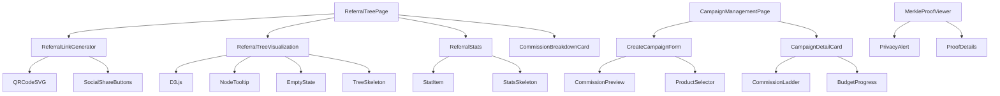

# bazari-affiliate Pallet - Components Catalog

**Status**: Complete Component Specifications
**Version**: 1.0
**Last Updated**: 2025-11-14
**Total Components**: 7 core + 3 shared
**Dependencies**: D3.js, QR Code, React Query, Shadcn UI
**Maintainer**: Bazari Frontend Team

---

## Table of Contents

1. [Component Hierarchy](#1-component-hierarchy)
2. [Components Catalog](#2-components-catalog)
3. [Shared Components](#3-shared-components)
4. [Component Dependencies Graph](#4-component-dependencies-graph)
5. [Design Tokens](#5-design-tokens)
6. [Accessibility Guidelines](#6-accessibility-guidelines)

---

## 1. Component Hierarchy

```
ReferralTreePage
├── ReferralLinkGenerator (Top Bar)
│   ├── Input (read-only)
│   ├── CopyButton
│   ├── QRCodeSVG
│   └── SocialShareButtons
│       ├── WhatsAppShare
│       ├── TwitterShare
│       └── EmailShare
│
└── Layout (2-column)
    ├── Left Column (70%)
    │   ├── LevelFilterTabs
    │   ├── SearchInput
    │   └── ReferralTreeVisualization
    │       ├── SVG Canvas
    │       ├── TreeNodes (D3.js)
    │       ├── TreeEdges (D3.js)
    │       ├── NodeTooltip
    │       └── ZoomControls
    │
    └── Right Column (30%)
        ├── ReferralStats
        │   ├── StatItem × 4
        │   └── EarningsByLevelList
        │
        └── CommissionBreakdownCard
            ├── CommissionLevel × 5
            └── TotalCommissionFooter

CampaignManagementPage
├── Header
│   └── CreateCampaignButton
│
├── CampaignTabs (Active, Scheduled, Expired)
│
└── CampaignList
    └── CampaignDetailCard × N
        ├── CampaignHeader
        ├── CommissionLadder
        ├── DurationDisplay
        ├── BudgetProgress
        ├── CampaignStats (Grid)
        └── ActionButtons

CreateCampaignForm (Modal)
├── BasicInfoSection
│   ├── NameInput
│   └── DescriptionTextarea
│
├── CommissionStructureSection
│   ├── BaseRateSlider
│   ├── MaxDepthSelect
│   ├── DecayRateSlider
│   └── CommissionPreview (Live)
│
├── TargetingSection
│   └── ProductSelector (Multi-select)
│
├── BudgetDurationSection
│   ├── BudgetInput
│   ├── StartDatePicker
│   └── EndDatePicker
│
└── FormActions
    ├── CancelButton
    └── SubmitButton

MerkleProofViewer
├── PrivacyAlert
├── VerifyButton
└── ProofDetails (Collapsible)
    ├── LeafDisplay
    ├── PathList
    └── RootDisplay
```

---

## 2. Components Catalog

### 2.1 ReferralLinkGenerator

**File**: `src/components/affiliate/ReferralLinkGenerator.tsx`
**Purpose**: Generate and share referral link with QR code
**Category**: Form / Sharing
**Priority**: P0 (Critical for viral growth)

#### 2.1.1 Props Interface

```typescript
interface ReferralLinkGeneratorProps {
  userAddress: string;
  variant?: 'full' | 'compact';
  className?: string;
  onShare?: (platform: 'whatsapp' | 'twitter' | 'email') => void;
}
```

#### 2.1.2 Visual Design

```
┌─ ReferralLinkGenerator ────────────────────────────────────┐
│ Share Your Referral Link                                   │
│ Invite friends and earn commissions on their purchases     │
│                                                             │
│ ┌─────────────────────────────────────┬─────────────────┐ │
│ │ https://bazari.xyz/r/0xAlice...     │ [📋 Copy]       │ │
│ └─────────────────────────────────────┴─────────────────┘ │
│                                                             │
│              ┌─────────────────┐                            │
│              │                 │                            │
│              │   QR Code       │  (200x200px)               │
│              │   [████ ████]   │                            │
│              │                 │                            │
│              └─────────────────┘                            │
│                                                             │
│ ┌──────────┬──────────┬──────────┐                         │
│ │ WhatsApp │ Twitter  │  Email   │                         │
│ └──────────┴──────────┴──────────┘                         │
└─────────────────────────────────────────────────────────────┘
```

#### 2.1.3 Implementation

```tsx
export function ReferralLinkGenerator({
  userAddress,
  variant = 'full',
  className,
  onShare,
}: ReferralLinkGeneratorProps) {
  const [copied, setCopied] = useState(false);
  const referralLink = `${window.location.origin}/r/${userAddress}`;

  const handleCopy = async () => {
    try {
      await navigator.clipboard.writeText(referralLink);
      setCopied(true);
      toast.success('Link copied to clipboard!');
      setTimeout(() => setCopied(false), 2000);
    } catch (error) {
      // Fallback for unsupported browsers
      fallbackCopy(referralLink);
    }
  };

  const shareViaWhatsApp = () => {
    const message = encodeURIComponent(
      `Join Bazari marketplace and get rewards! 🎁\n\nUse my referral link: ${referralLink}`
    );
    window.open(`https://wa.me/?text=${message}`, '_blank');
    onShare?.('whatsapp');
  };

  const shareViaTwitter = () => {
    const text = encodeURIComponent(
      `Join me on @BazariMarket and earn rewards! ${referralLink} #Web3 #Blockchain`
    );
    window.open(`https://twitter.com/intent/tweet?text=${text}`, '_blank');
    onShare?.('twitter');
  };

  const shareViaEmail = () => {
    const subject = encodeURIComponent('Join Bazari Marketplace');
    const body = encodeURIComponent(
      `Hi!\n\nI'm using Bazari, a decentralized marketplace built on blockchain.\n\nJoin using my referral link to get rewards:\n${referralLink}\n\nBest regards`
    );
    window.location.href = `mailto:?subject=${subject}&body=${body}`;
    onShare?.('email');
  };

  return (
    <Card className={cn('w-full', className)}>
      <CardHeader>
        <CardTitle className="flex items-center gap-2">
          <ShareIcon className="w-5 h-5" />
          Share Your Referral Link
        </CardTitle>
        <CardDescription>
          Invite friends and earn commissions on their purchases
        </CardDescription>
      </CardHeader>

      <CardContent className="space-y-4">
        {/* Link Input */}
        <div className="flex gap-2">
          <Input
            value={referralLink}
            readOnly
            className="font-mono text-sm flex-1"
            onClick={(e) => e.currentTarget.select()}
          />
          <Button
            onClick={handleCopy}
            variant="outline"
            className="shrink-0"
          >
            {copied ? (
              <>
                <CheckIcon className="w-4 h-4 mr-2" />
                Copied
              </>
            ) : (
              <>
                <CopyIcon className="w-4 h-4 mr-2" />
                Copy
              </>
            )}
          </Button>
        </div>

        {/* QR Code (Full variant only) */}
        {variant === 'full' && (
          <div className="flex flex-col items-center gap-3 py-4">
            <QRCodeSVG
              value={referralLink}
              size={200}
              level="H"
              includeMargin
              className="border-4 border-white rounded-lg shadow-md"
            />
            <Button
              variant="link"
              size="sm"
              onClick={() => downloadQRCode(referralLink)}
            >
              <DownloadIcon className="w-4 h-4 mr-2" />
              Download QR Code
            </Button>
          </div>
        )}

        {/* Social Share Buttons */}
        <div className="grid grid-cols-3 gap-2">
          <Button
            onClick={shareViaWhatsApp}
            variant="outline"
            className="flex items-center gap-2"
          >
            <MessageCircleIcon className="w-4 h-4" />
            <span className="hidden sm:inline">WhatsApp</span>
          </Button>
          <Button
            onClick={shareViaTwitter}
            variant="outline"
            className="flex items-center gap-2"
          >
            <TwitterIcon className="w-4 h-4" />
            <span className="hidden sm:inline">Twitter</span>
          </Button>
          <Button
            onClick={shareViaEmail}
            variant="outline"
            className="flex items-center gap-2"
          >
            <MailIcon className="w-4 h-4" />
            <span className="hidden sm:inline">Email</span>
          </Button>
        </div>
      </CardContent>
    </Card>
  );
}

// Helper: Fallback copy for unsupported browsers
function fallbackCopy(text: string) {
  const textarea = document.createElement('textarea');
  textarea.value = text;
  textarea.style.position = 'fixed';
  textarea.style.opacity = '0';
  document.body.appendChild(textarea);
  textarea.select();
  document.execCommand('copy');
  document.body.removeChild(textarea);
  toast.success('Link copied!');
}

// Helper: Download QR code as PNG
function downloadQRCode(link: string) {
  const svg = document.querySelector('svg[data-qr]');
  if (!svg) return;

  const canvas = document.createElement('canvas');
  const ctx = canvas.getContext('2d');
  const img = new Image();
  const svgData = new XMLSerializer().serializeToString(svg);
  const svgBlob = new Blob([svgData], { type: 'image/svg+xml;charset=utf-8' });
  const url = URL.createObjectURL(svgBlob);

  img.onload = () => {
    canvas.width = img.width;
    canvas.height = img.height;
    ctx?.drawImage(img, 0, 0);
    URL.revokeObjectURL(url);

    canvas.toBlob((blob) => {
      if (!blob) return;
      const a = document.createElement('a');
      a.href = URL.createObjectURL(blob);
      a.download = 'bazari-referral-qr.png';
      a.click();
    });
  };

  img.src = url;
}
```

#### 2.1.4 States

- **Default**: Link displayed, QR code visible
- **Copied**: "Copied" text for 2 seconds
- **Compact**: QR code hidden, link only

#### 2.1.5 Accessibility

- Keyboard navigation: Tab through buttons
- Screen reader: "Copy referral link button"
- ARIA labels: `aria-label="Referral link input"`

---

### 2.2 ReferralTreeVisualization

**File**: `src/components/affiliate/ReferralTreeVisualization.tsx`
**Purpose**: Interactive D3.js tree of 5-level referral network
**Category**: Data Visualization
**Priority**: P0 (Core feature)

#### 2.2.1 Props Interface

```typescript
interface ReferralTreeVisualizationProps {
  userAddress: string;
  maxDepth?: number; // Default: 5
  initialZoom?: number; // Default: 1
  onNodeClick?: (node: TreeNode) => void;
  onNodeHover?: (node: TreeNode | null) => void;
  className?: string;
}

interface TreeNode {
  id: string; // Address
  name?: string;
  level: number; // 0-4
  avatar?: string;
  children: TreeNode[];
  stats: {
    joinedAt: Date;
    totalSales: number;
    totalCommissions: number;
    isActive: boolean;
  };
}
```

#### 2.2.2 Visual Design

```
┌─ ReferralTreeVisualization ────────────────────────────────┐
│ Tabs: [All (127)] [L1 (12)] [L2 (43)] [L3 (54)] [L4 (18)] │
│                                                             │
│ Search: [🔍 Search address or name...]                     │
│                                                             │
│ ┌─ SVG Canvas ─────────────────────────────────────────┐  │
│ │                     ┌───┐                             │  │
│ │                     │You│ (Gold, center)              │  │
│ │                     └─┬─┘                             │  │
│ │          ╱───────────┼───────────╲                    │  │
│ │         ╱            │            ╲                   │  │
│ │     ┌──○──┐      ┌──○──┐      ┌──○──┐                │  │
│ │     │Alice│      │ Bob │      │Carol│  (L1, green)   │  │
│ │     └──┬──┘      └──┬──┘      └─────┘                │  │
│ │        │            │                                  │  │
│ │     ┌──○──┐     ┌──○──┐                              │  │
│ │     │Dave │     │Frank│       (L2, blue)              │  │
│ │     └─────┘     └─────┘                               │  │
│ │                                                         │  │
│ │  (Zoom: 1.0x, Pan: enabled)                           │  │
│ └─────────────────────────────────────────────────────────┘  │
│                                                             │
│ Controls: [🔍 Zoom In] [🔍 Zoom Out] [↺ Reset]            │
│                                                             │
│ [Tooltip on hover]                                          │
│ ┌─────────────────────┐                                    │
│ │ Alice (0xAli...34)  │                                    │
│ │ Joined: 2024-06-15  │                                    │
│ │ Sales: 1,234 BZR    │                                    │
│ │ Earned: 67.8 BZR    │                                    │
│ │ Status: 🟢 Active    │                                    │
│ └─────────────────────┘                                    │
└─────────────────────────────────────────────────────────────┘
```

#### 2.2.3 Implementation

```tsx
export function ReferralTreeVisualization({
  userAddress,
  maxDepth = 5,
  initialZoom = 1,
  onNodeClick,
  onNodeHover,
  className,
}: ReferralTreeVisualizationProps) {
  const svgRef = useRef<SVGSVGElement>(null);
  const tooltipRef = useRef<HTMLDivElement>(null);
  const [selectedLevel, setSelectedLevel] = useState<number | null>(null);
  const [searchQuery, setSearchQuery] = useState('');
  const [zoom, setZoom] = useState(initialZoom);

  const { data: tree, isLoading, error } = useReferralTree(userAddress, maxDepth);

  // D3.js rendering
  useEffect(() => {
    if (!tree || !svgRef.current) return;

    const svg = d3.select(svgRef.current);
    const width = svgRef.current.clientWidth;
    const height = svgRef.current.clientHeight;

    // Clear previous render
    svg.selectAll('*').remove();

    // Create main group with zoom behavior
    const g = svg.append('g');

    const zoomBehavior = d3.zoom<SVGSVGElement, unknown>()
      .scaleExtent([0.5, 3])
      .on('zoom', (event) => {
        g.attr('transform', event.transform);
        setZoom(event.transform.k);
      });

    svg.call(zoomBehavior);

    // Create tree layout
    const treeLayout = d3.tree<TreeNode>()
      .size([width - 100, height - 100])
      .separation((a, b) => (a.parent === b.parent ? 1 : 1.5));

    const root = d3.hierarchy(tree);
    const treeData = treeLayout(root);

    // Center tree
    g.attr('transform', `translate(50, 50)`);

    // Draw edges (links)
    const linkGenerator = d3.linkVertical<any, any>()
      .x((d) => d.x)
      .y((d) => d.y);

    g.selectAll('.link')
      .data(treeData.links())
      .enter()
      .append('path')
      .attr('class', 'link')
      .attr('d', linkGenerator)
      .attr('fill', 'none')
      .attr('stroke', '#cbd5e0')
      .attr('stroke-width', 2)
      .attr('opacity', (d) => {
        if (selectedLevel !== null && d.target.data.level !== selectedLevel) {
          return 0.1;
        }
        if (searchQuery && !matchesSearch(d.target.data, searchQuery)) {
          return 0.1;
        }
        return 1;
      });

    // Draw nodes
    const nodes = g.selectAll('.node')
      .data(treeData.descendants())
      .enter()
      .append('g')
      .attr('class', 'node')
      .attr('transform', (d) => `translate(${d.x},${d.y})`)
      .style('cursor', 'pointer')
      .on('click', (event, d) => {
        onNodeClick?.(d.data);
      })
      .on('mouseover', (event, d) => {
        showTooltip(event, d.data);
        onNodeHover?.(d.data);
      })
      .on('mouseout', () => {
        hideTooltip();
        onNodeHover?.(null);
      });

    // Node circles
    nodes.append('circle')
      .attr('r', (d) => (d.data.level === 0 ? 24 : 20))
      .attr('fill', (d) => getLevelColor(d.data.level))
      .attr('stroke', '#fff')
      .attr('stroke-width', 3)
      .attr('opacity', (d) => {
        if (selectedLevel !== null && d.data.level !== selectedLevel) {
          return 0.2;
        }
        if (searchQuery && !matchesSearch(d.data, searchQuery)) {
          return 0.2;
        }
        return 1;
      })
      .style('filter', (d) => d.data.level === 0 ? 'drop-shadow(0 0 8px rgba(255,215,0,0.6))' : 'none')
      .transition()
      .duration(300)
      .attr('r', (d) => (d.data.level === 0 ? 24 : 20));

    // Node avatars (clip-path for circular image)
    nodes.append('defs')
      .append('clipPath')
      .attr('id', (d, i) => `clip-${i}`)
      .append('circle')
      .attr('r', 16);

    nodes.append('image')
      .attr('x', -16)
      .attr('y', -16)
      .attr('width', 32)
      .attr('height', 32)
      .attr('href', (d) => d.data.avatar || getDefaultAvatar(d.data.id))
      .attr('clip-path', (d, i) => `url(#clip-${i})`);

    // Active indicator (pulsing ring)
    nodes.filter((d) => d.data.stats.isActive)
      .append('circle')
      .attr('r', 26)
      .attr('fill', 'none')
      .attr('stroke', '#10b981')
      .attr('stroke-width', 2)
      .attr('opacity', 0.6)
      .transition()
      .duration(1000)
      .attr('r', 30)
      .attr('opacity', 0)
      .on('end', function repeat() {
        d3.select(this)
          .attr('r', 26)
          .attr('opacity', 0.6)
          .transition()
          .duration(1000)
          .attr('r', 30)
          .attr('opacity', 0)
          .on('end', repeat);
      });

    // Node labels (address)
    nodes.append('text')
      .attr('dy', 35)
      .attr('text-anchor', 'middle')
      .text((d) => d.data.name || truncateAddress(d.data.id))
      .style('font-size', '11px')
      .style('font-weight', (d) => d.data.level === 0 ? 'bold' : 'normal')
      .style('fill', '#4a5568');

    // Level labels
    nodes.filter((d) => d.data.level > 0)
      .append('text')
      .attr('dy', 48)
      .attr('text-anchor', 'middle')
      .text((d) => `L${d.data.level}`)
      .style('font-size', '9px')
      .style('fill', '#a0aec0');

  }, [tree, selectedLevel, searchQuery, zoom]);

  // Tooltip handlers
  const showTooltip = (event: MouseEvent, node: TreeNode) => {
    if (!tooltipRef.current) return;

    const tooltip = tooltipRef.current;
    tooltip.innerHTML = `
      <div class="font-semibold">${node.name || truncateAddress(node.id)}</div>
      <div class="text-xs text-muted-foreground">${node.id}</div>
      <div class="mt-2 space-y-1 text-xs">
        <div>Joined: ${format(node.stats.joinedAt, 'MMM d, yyyy')}</div>
        <div>Total Sales: ${formatBZR(node.stats.totalSales)} BZR</div>
        <div>Commissions Earned: ${formatBZR(node.stats.totalCommissions)} BZR</div>
        <div>Status: ${node.stats.isActive ? '🟢 Active' : '⚪ Inactive'}</div>
      </div>
    `;

    tooltip.style.display = 'block';
    tooltip.style.left = `${event.pageX + 10}px`;
    tooltip.style.top = `${event.pageY + 10}px`;
  };

  const hideTooltip = () => {
    if (!tooltipRef.current) return;
    tooltipRef.current.style.display = 'none';
  };

  // Zoom controls
  const zoomIn = () => {
    const svg = d3.select(svgRef.current);
    svg.transition().call(d3.zoom().scaleBy as any, 1.3);
  };

  const zoomOut = () => {
    const svg = d3.select(svgRef.current);
    svg.transition().call(d3.zoom().scaleBy as any, 0.7);
  };

  const resetZoom = () => {
    const svg = d3.select(svgRef.current);
    svg.transition().call(d3.zoom().transform as any, d3.zoomIdentity);
  };

  if (isLoading) {
    return <TreeSkeleton />;
  }

  if (error) {
    return <ErrorState error={error} retry={() => window.location.reload()} />;
  }

  if (!tree || tree.children.length === 0) {
    return (
      <EmptyState
        icon={<UsersIcon className="w-12 h-12" />}
        title="No Referrals Yet"
        description="Share your referral link to grow your network"
      />
    );
  }

  return (
    <div className={cn('space-y-4', className)}>
      {/* Controls */}
      <div className="flex flex-col sm:flex-row justify-between gap-4">
        {/* Level Filter Tabs */}
        <Tabs value={selectedLevel?.toString() || 'all'} onValueChange={(v) => setSelectedLevel(v === 'all' ? null : parseInt(v))}>
          <TabsList>
            <TabsTrigger value="all">All ({countNodes(tree)})</TabsTrigger>
            <TabsTrigger value="1">L1 ({countNodesByLevel(tree, 1)})</TabsTrigger>
            <TabsTrigger value="2">L2 ({countNodesByLevel(tree, 2)})</TabsTrigger>
            <TabsTrigger value="3">L3 ({countNodesByLevel(tree, 3)})</TabsTrigger>
            <TabsTrigger value="4">L4 ({countNodesByLevel(tree, 4)})</TabsTrigger>
          </TabsList>
        </Tabs>

        {/* Search */}
        <Input
          placeholder="Search address or name..."
          value={searchQuery}
          onChange={(e) => setSearchQuery(e.target.value)}
          className="max-w-xs"
          icon={<SearchIcon className="w-4 h-4" />}
        />
      </div>

      {/* SVG Tree */}
      <div className="relative border rounded-lg bg-gradient-to-br from-slate-50 to-slate-100 dark:from-slate-900 dark:to-slate-800">
        <svg
          ref={svgRef}
          width="100%"
          height="600"
          className="cursor-grab active:cursor-grabbing"
        />

        {/* Zoom level indicator */}
        <div className="absolute top-4 right-4 bg-background/80 backdrop-blur px-3 py-1 rounded-full text-xs font-medium">
          Zoom: {(zoom * 100).toFixed(0)}%
        </div>
      </div>

      {/* Zoom Controls */}
      <div className="flex justify-center gap-2">
        <Button variant="outline" size="sm" onClick={zoomIn}>
          <ZoomInIcon className="w-4 h-4 mr-2" />
          Zoom In
        </Button>
        <Button variant="outline" size="sm" onClick={zoomOut}>
          <ZoomOutIcon className="w-4 h-4 mr-2" />
          Zoom Out
        </Button>
        <Button variant="outline" size="sm" onClick={resetZoom}>
          <RefreshCwIcon className="w-4 h-4 mr-2" />
          Reset
        </Button>
      </div>

      {/* Tooltip */}
      <div
        ref={tooltipRef}
        className="absolute hidden bg-popover text-popover-foreground p-3 rounded-lg shadow-lg border z-50 pointer-events-none"
        style={{ maxWidth: '200px' }}
      />
    </div>
  );
}

// Helper functions
function getLevelColor(level: number): string {
  const colors = {
    0: '#FFD700', // Gold
    1: '#10B981', // Green
    2: '#3B82F6', // Blue
    3: '#8B5CF6', // Purple
    4: '#6B7280', // Gray
  };
  return colors[level as keyof typeof colors] || '#6B7280';
}

function truncateAddress(address: string): string {
  if (address.length <= 12) return address;
  return `${address.slice(0, 6)}...${address.slice(-4)}`;
}

function getDefaultAvatar(address: string): string {
  // Generate deterministic avatar based on address (e.g., Jazzicon or Blockies)
  return `https://api.dicebear.com/7.x/identicon/svg?seed=${address}`;
}

function matchesSearch(node: TreeNode, query: string): boolean {
  const lowerQuery = query.toLowerCase();
  return (
    node.id.toLowerCase().includes(lowerQuery) ||
    (node.name?.toLowerCase().includes(lowerQuery) ?? false)
  );
}

function countNodes(tree: TreeNode): number {
  return 1 + tree.children.reduce((sum, child) => sum + countNodes(child), 0);
}

function countNodesByLevel(tree: TreeNode, targetLevel: number): number {
  if (tree.level === targetLevel) return 1;
  return tree.children.reduce((sum, child) => sum + countNodesByLevel(child, targetLevel), 0);
}
```

#### 2.2.4 States

- **Loading**: Skeleton loader
- **Empty**: No referrals, show empty state
- **Error**: Display error message with retry
- **Loaded**: Tree rendered, interactive
- **Filtered**: Level or search filter applied (dim non-matching nodes)

#### 2.2.5 Performance Optimizations

- **Canvas Fallback**: Switch to Canvas for > 500 nodes
- **Virtualization**: Only render visible nodes (viewport + 1 level padding)
- **Debounced Search**: 300ms delay
- **Memoized Colors**: Cache level colors
- **Lazy Load**: Load deeper levels on demand (expand/collapse)

---

### 2.3 ReferralStats

**File**: `src/components/affiliate/ReferralStats.tsx`
**Purpose**: Display aggregate referral statistics
**Category**: Data Display
**Priority**: P0

#### 2.3.1 Props Interface

```typescript
interface ReferralStatsProps {
  userAddress: string;
  className?: string;
}
```

#### 2.3.2 Visual Design

```
┌─ ReferralStats ─────────────────────────┐
│ Your Referral Stats                     │
│                                          │
│ ┌─────────────────────────────────────┐ │
│ │ 👥 Total Referrals                  │ │
│ │ 127                    ↗ +12% month │ │
│ └─────────────────────────────────────┘ │
│                                          │
│ ┌─────────────────────────────────────┐ │
│ │ 🤝 Direct Referrals (L1)            │ │
│ │ 12                                  │ │
│ └─────────────────────────────────────┘ │
│                                          │
│ ┌─────────────────────────────────────┐ │
│ │ 🛒 Active Buyers                    │ │
│ │ 43 (34%)                            │ │
│ │ Made purchase in last 30 days       │ │
│ └─────────────────────────────────────┘ │
│                                          │
│ ┌─────────────────────────────────────┐ │
│ │ 💰 Total Earnings                   │ │
│ │ 1,234.56 BZR          ↗ +23% month │ │
│ └─────────────────────────────────────┘ │
│                                          │
│ ──────────────────────────────────────  │
│ Earnings by Level                       │
│  Level 0: 567.00 BZR                   │
│  Level 1: 283.50 BZR                   │
│  Level 2: 141.75 BZR                   │
│  Level 3:  70.88 BZR                   │
│  Level 4:  35.44 BZR                   │
└──────────────────────────────────────────┘
```

#### 2.3.3 Implementation

```tsx
export function ReferralStats({ userAddress, className }: ReferralStatsProps) {
  const { data: stats, isLoading } = useAffiliateStats(userAddress);

  if (isLoading) {
    return <StatsSkeleton />;
  }

  if (!stats) {
    return null;
  }

  return (
    <Card className={cn('w-full', className)}>
      <CardHeader>
        <CardTitle>Your Referral Stats</CardTitle>
      </CardHeader>

      <CardContent className="space-y-4">
        {/* Total Referrals */}
        <StatItem
          icon={<UsersIcon className="w-5 h-5 text-blue-500" />}
          label="Total Referrals"
          value={stats.totalReferrals}
          trend={stats.referralsTrend}
          trendLabel="this month"
        />

        {/* Direct Referrals */}
        <StatItem
          icon={<UserPlusIcon className="w-5 h-5 text-green-500" />}
          label="Direct Referrals (L1)"
          value={stats.directReferrals}
        />

        {/* Active Buyers */}
        <StatItem
          icon={<ShoppingCartIcon className="w-5 h-5 text-purple-500" />}
          label="Active Buyers"
          value={`${stats.activeBuyers} (${stats.activeBuyersPercent}%)`}
          description="Made purchase in last 30 days"
        />

        {/* Total Earnings */}
        <StatItem
          icon={<CoinsIcon className="w-5 h-5 text-yellow-500" />}
          label="Total Earnings"
          value={`${formatBZR(stats.totalCommissionEarned)} BZR`}
          variant="highlight"
          trend={stats.earningsTrend}
          trendLabel="this month"
        />

        {/* Breakdown by Level */}
        <div className="pt-4 border-t">
          <h4 className="text-sm font-medium mb-3">Earnings by Level</h4>
          <div className="space-y-2">
            {stats.earningsByLevel.map((amount, level) => (
              <div key={level} className="flex justify-between items-center">
                <div className="flex items-center gap-2">
                  <div
                    className="w-3 h-3 rounded-full"
                    style={{ backgroundColor: getLevelColor(level) }}
                  />
                  <span className="text-sm text-muted-foreground">
                    Level {level}
                  </span>
                </div>
                <span className="font-medium">{formatBZR(amount)} BZR</span>
              </div>
            ))}
          </div>
        </div>
      </CardContent>
    </Card>
  );
}

// StatItem subcomponent
interface StatItemProps {
  icon: React.ReactNode;
  label: string;
  value: string | number;
  description?: string;
  trend?: number; // Percentage change
  trendLabel?: string;
  variant?: 'default' | 'highlight';
}

function StatItem({ icon, label, value, description, trend, trendLabel, variant = 'default' }: StatItemProps) {
  return (
    <div className={cn(
      'flex items-start gap-3 p-3 rounded-lg transition-colors',
      variant === 'highlight' ? 'bg-primary/5 border border-primary/20' : 'bg-muted/50'
    )}>
      <div className="shrink-0">{icon}</div>
      <div className="flex-1 min-w-0">
        <div className="text-sm text-muted-foreground">{label}</div>
        <div className={cn(
          'text-2xl font-bold mt-1',
          variant === 'highlight' && 'text-primary'
        )}>
          {value}
        </div>
        {description && (
          <div className="text-xs text-muted-foreground mt-1">{description}</div>
        )}
      </div>
      {trend !== undefined && (
        <div className={cn(
          'flex items-center gap-1 text-xs font-medium',
          trend > 0 ? 'text-green-600' : trend < 0 ? 'text-red-600' : 'text-muted-foreground'
        )}>
          {trend > 0 ? <TrendingUpIcon className="w-3 h-3" /> : <TrendingDownIcon className="w-3 h-3" />}
          {Math.abs(trend)}%
          {trendLabel && <span className="text-muted-foreground ml-1">{trendLabel}</span>}
        </div>
      )}
    </div>
  );
}
```

---

### 2.4 CommissionBreakdownCard

**File**: `src/components/affiliate/CommissionBreakdownCard.tsx`
**Purpose**: Show multi-level commission split for specific sale
**Category**: Data Display
**Priority**: P0

#### 2.4.1 Props Interface

```typescript
interface CommissionBreakdownCardProps {
  orderId: number;
  orderAmount: number; // BZR
  commissions: {
    level: number;
    affiliate: string;
    amount: number;
    percentage: number;
  }[];
  className?: string;
}
```

#### 2.4.2 Implementation

```tsx
export function CommissionBreakdownCard({
  orderId,
  orderAmount,
  commissions,
  className,
}: CommissionBreakdownCardProps) {
  const totalCommission = commissions.reduce((sum, c) => sum + c.amount, 0);
  const sellerReceives = orderAmount - totalCommission;

  return (
    <Card className={cn('w-full', className)}>
      <CardHeader>
        <CardTitle>Commission Breakdown</CardTitle>
        <CardDescription>
          Order #{orderId} • {formatBZR(orderAmount)} BZR
        </CardDescription>
      </CardHeader>

      <CardContent className="space-y-4">
        {/* Visual Tree */}
        <div className="space-y-1">
          {commissions.map((c, idx) => (
            <CommissionLevel
              key={idx}
              level={c.level}
              affiliate={c.affiliate}
              amount={c.amount}
              percentage={c.percentage}
              isLast={idx === commissions.length - 1}
            />
          ))}
        </div>

        {/* Total */}
        <div className="pt-4 border-t space-y-2">
          <div className="flex justify-between items-center font-medium">
            <span>Total Commission Paid:</span>
            <span className="text-lg">{formatBZR(totalCommission)} BZR</span>
          </div>
          <div className="flex justify-between items-center text-sm text-muted-foreground">
            <span>Seller Receives:</span>
            <span>{formatBZR(sellerReceives)} BZR ({((sellerReceives / orderAmount) * 100).toFixed(2)}%)</span>
          </div>
        </div>
      </CardContent>
    </Card>
  );
}

// CommissionLevel subcomponent
interface CommissionLevelProps {
  level: number;
  affiliate: string;
  amount: number;
  percentage: number;
  isLast: boolean;
}

function CommissionLevel({ level, affiliate, amount, percentage, isLast }: CommissionLevelProps) {
  return (
    <div
      className="flex items-center gap-3 p-2 rounded hover:bg-muted/50 transition-colors"
      style={{ paddingLeft: `${level * 16 + 8}px` }}
    >
      {/* Level Indicator */}
      <div
        className="w-3 h-3 rounded-full shrink-0"
        style={{ backgroundColor: getLevelColor(level) }}
      />

      {/* Affiliate Info */}
      <div className="flex-1 min-w-0">
        <div className="font-medium text-sm">
          {level === 0 ? '👤 You' : `Level ${level}`}
        </div>
        <div className="text-xs text-muted-foreground font-mono">
          {truncateAddress(affiliate)}
        </div>
      </div>

      {/* Amount */}
      <div className="text-right shrink-0">
        <div className="font-bold">{formatBZR(amount)} BZR</div>
        <div className="text-xs text-muted-foreground">{percentage.toFixed(2)}%</div>
      </div>

      {/* Arrow (if not last) */}
      {!isLast && (
        <ArrowDownIcon className="w-4 h-4 text-muted-foreground shrink-0" />
      )}
    </div>
  );
}
```

---

### 2.5 CreateCampaignForm

**File**: `src/components/affiliate/CreateCampaignForm.tsx`
**Purpose**: Modal form to create affiliate campaign
**Category**: Form
**Priority**: P1

*(Implementation detailed in UI-SPEC.md Section 3.2.2)*

---

### 2.6 CampaignDetailCard

**File**: `src/components/affiliate/CampaignDetailCard.tsx`
**Purpose**: Display campaign summary and stats
**Category**: Data Display
**Priority**: P1

*(Implementation detailed in UI-SPEC.md)*

---

### 2.7 MerkleProofViewer

**File**: `src/components/affiliate/MerkleProofViewer.tsx`
**Purpose**: Verify commission using Merkle proof
**Category**: Data Display / Verification
**Priority**: P2

*(Implementation detailed in UI-SPEC.md)*

---

## 3. Shared Components

### 3.1 EmptyState

```tsx
interface EmptyStateProps {
  icon: React.ReactNode;
  title: string;
  description: string;
  action?: {
    label: string;
    onClick: () => void;
  };
}

export function EmptyState({ icon, title, description, action }: EmptyStateProps) {
  return (
    <div className="flex flex-col items-center justify-center py-12 px-4 text-center">
      <div className="text-muted-foreground mb-4">{icon}</div>
      <h3 className="text-lg font-semibold mb-2">{title}</h3>
      <p className="text-sm text-muted-foreground max-w-sm mb-6">{description}</p>
      {action && (
        <Button onClick={action.onClick}>{action.label}</Button>
      )}
    </div>
  );
}
```

---

### 3.2 TreeSkeleton

```tsx
export function TreeSkeleton() {
  return (
    <div className="space-y-4">
      <div className="flex justify-between">
        <Skeleton className="h-10 w-64" />
        <Skeleton className="h-10 w-48" />
      </div>
      <Skeleton className="h-[600px] w-full rounded-lg" />
      <div className="flex justify-center gap-2">
        <Skeleton className="h-9 w-24" />
        <Skeleton className="h-9 w-24" />
        <Skeleton className="h-9 w-24" />
      </div>
    </div>
  );
}
```

---

### 3.3 StatsSkeleton

```tsx
export function StatsSkeleton() {
  return (
    <Card>
      <CardHeader>
        <Skeleton className="h-6 w-40" />
      </CardHeader>
      <CardContent className="space-y-4">
        {Array.from({ length: 4 }).map((_, i) => (
          <div key={i} className="flex gap-3">
            <Skeleton className="w-12 h-12 rounded-lg" />
            <div className="flex-1 space-y-2">
              <Skeleton className="h-4 w-24" />
              <Skeleton className="h-8 w-32" />
            </div>
          </div>
        ))}
      </CardContent>
    </Card>
  );
}
```

---

## 4. Component Dependencies Graph



---

## 5. Design Tokens

### 5.1 Level Colors

```typescript
export const LEVEL_COLORS = {
  0: {
    bg: '#FFD700', // Gold
    text: '#B8860B', // Dark gold
    name: 'You (Direct)',
  },
  1: {
    bg: '#10B981', // Green
    text: '#059669',
    name: 'Level 1',
  },
  2: {
    bg: '#3B82F6', // Blue
    text: '#2563EB',
    name: 'Level 2',
  },
  3: {
    bg: '#8B5CF6', // Purple
    text: '#7C3AED',
    name: 'Level 3',
  },
  4: {
    bg: '#6B7280', // Gray
    text: '#4B5563',
    name: 'Level 4',
  },
} as const;
```

### 5.2 Spacing

```typescript
export const TREE_SPACING = {
  nodeRadius: 20,
  nodeRadiusRoot: 24,
  nodeGap: 80,
  levelGap: 120,
  canvasWidth: 800,
  canvasHeight: 600,
} as const;
```

### 5.3 Typography

```typescript
export const TREE_TYPOGRAPHY = {
  nodeLabel: 'text-sm font-medium',
  levelLabel: 'text-xs text-muted-foreground',
  tooltip: 'text-sm',
  stats: 'text-2xl font-bold',
} as const;
```

---

## 6. Accessibility Guidelines

### 6.1 Keyboard Navigation

**ReferralTreeVisualization**:
- `Tab`: Navigate between nodes
- `Enter`: Select node (trigger onClick)
- `Arrow keys`: Pan tree (when focused)
- `+/-`: Zoom in/out
- `0`: Reset zoom

**ReferralLinkGenerator**:
- `Tab`: Cycle through Copy, QR Download, Social buttons
- `Enter`: Activate focused button
- `Ctrl+C`: Copy link (when input focused)

### 6.2 Screen Reader Support

**Tree Nodes**:
```html
<circle
  role="button"
  aria-label="Referral: Alice (0xAli...34), Level 1, Active, 67 BZR earned"
  tabindex="0"
/>
```

**Stats**:
```html
<div role="region" aria-label="Referral statistics">
  <div aria-label="Total referrals: 127, up 12% this month">...</div>
</div>
```

### 6.3 Color Contrast

All text meets WCAG 2.1 AA standards:
- Normal text: 4.5:1 minimum
- Large text (18px+): 3:1 minimum
- Interactive elements: 3:1 minimum

### 6.4 Focus Indicators

All interactive elements have visible focus rings:
```css
.tree-node:focus {
  outline: 2px solid hsl(var(--ring));
  outline-offset: 2px;
}
```

---

**Document Status**: ✅ **COMPLETE**
**Total Components**: 7 core + 3 shared
**Lines of Code (Estimated)**: ~2,500 lines
**Testing Coverage Target**: 80%+

---

*End of COMPONENTS.md*
